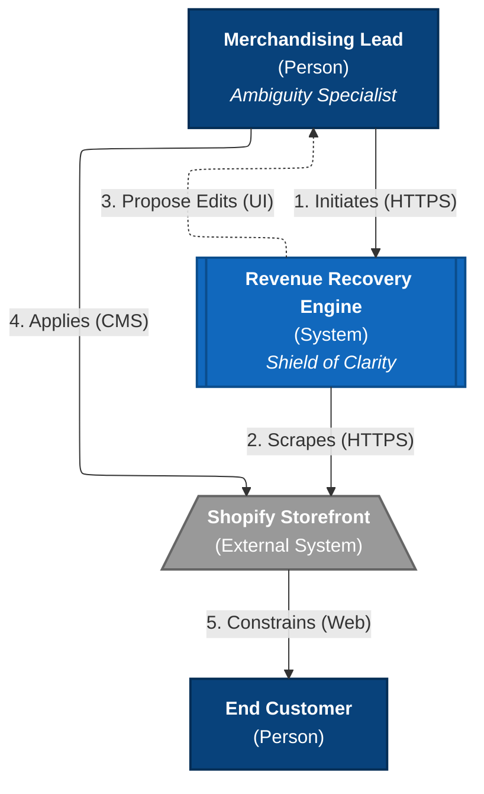
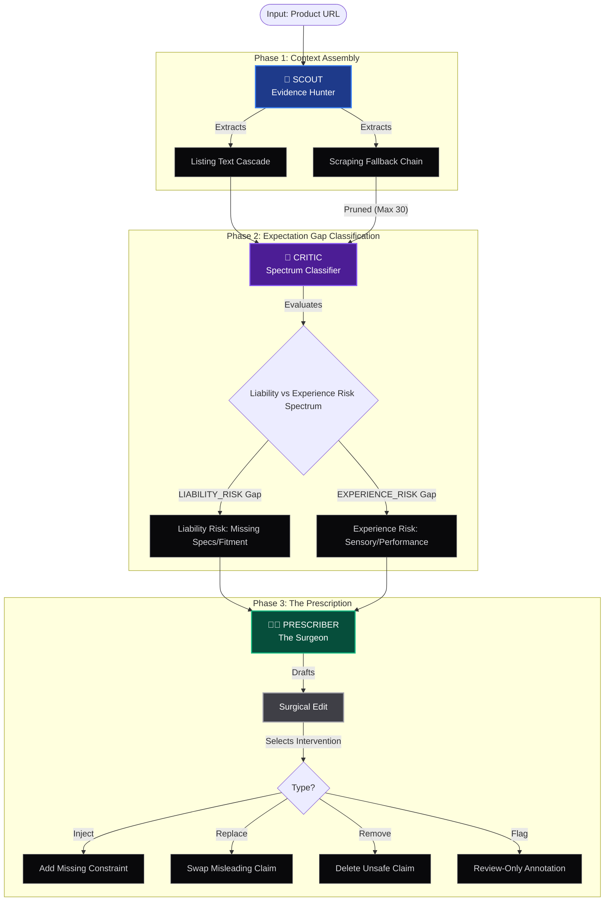
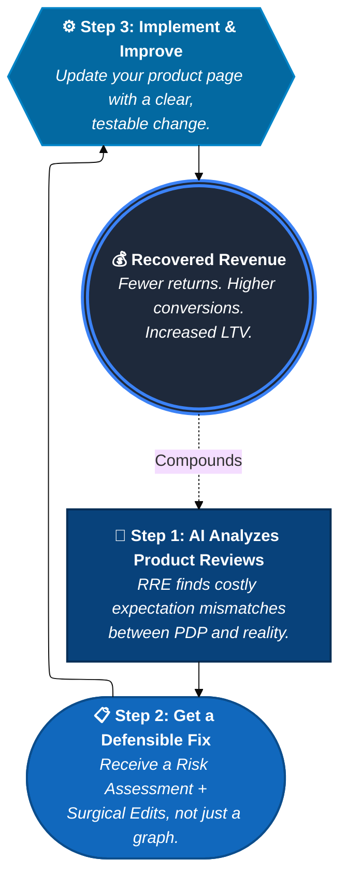
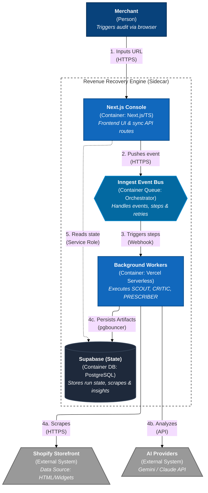
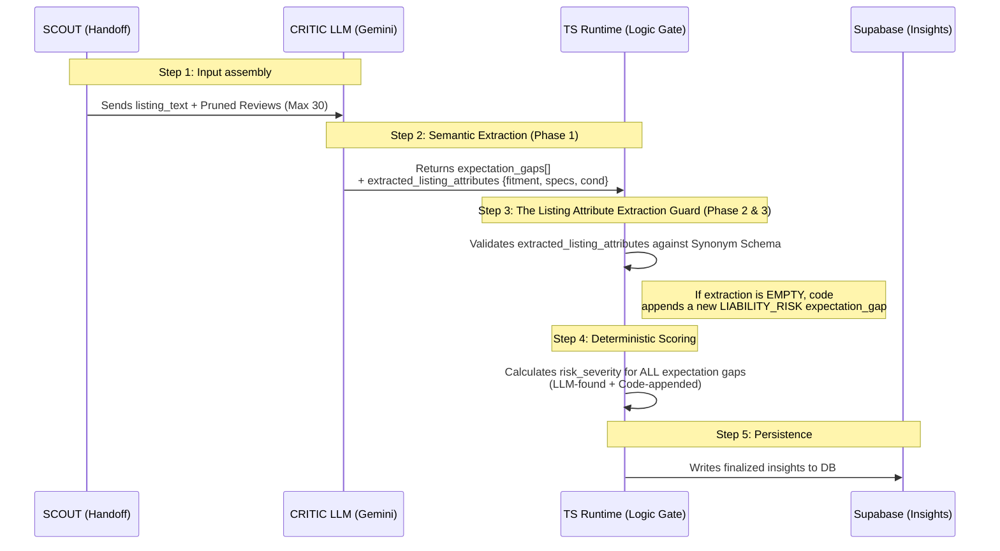
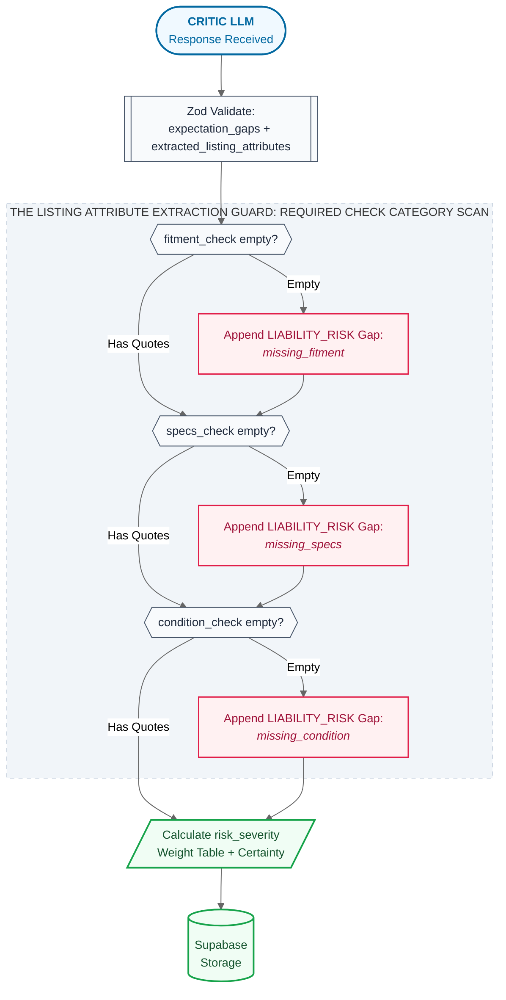
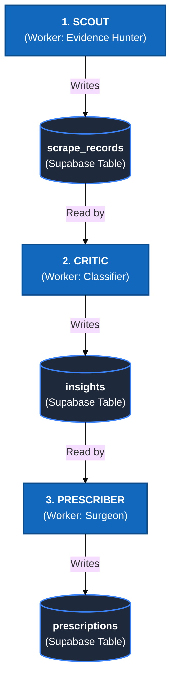
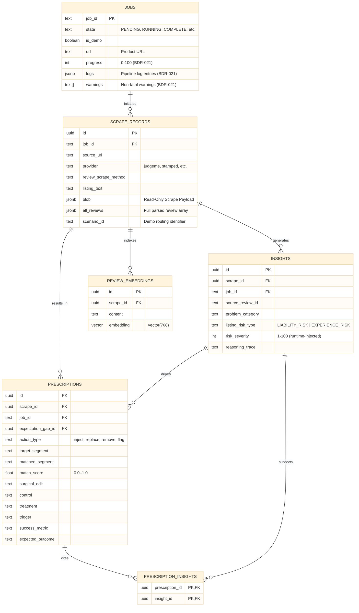
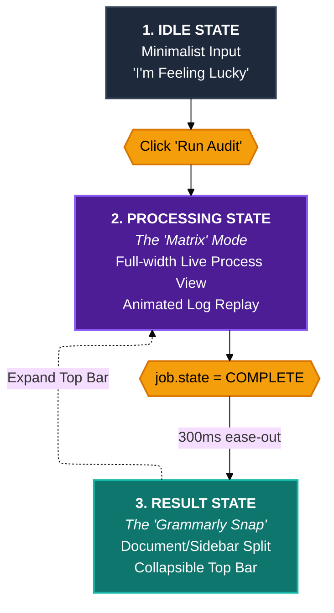
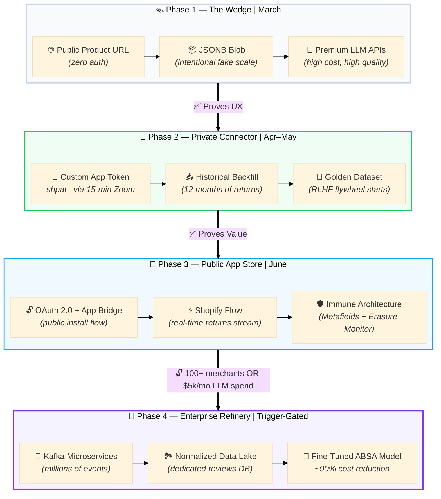

<aside>
🚨

**Normative Scope.** Only **Active** status documents are normative. Parts with **Needs Rework** status — Parts 6, 7, 8, 9, 10, and Appendix B — are reference-only until explicitly cleared by Sahal.

Blueprint text wins over all other sources. When glossary, tickets, or AI interpretations conflict with this document, they are corrected — not the blueprint.

</aside>

## 🦭 Canon Map — Where to Look for What

*When you have a question, go to the canonical section first. Do not guess, do not use Discord history.*

| **Question** | **Canonical Home** |
| --- | --- |
| What to build and why | Part 2 → §2.1–2.3 |
| Pipeline runtime behavior and orchestration mechanics | Part 3 → §3.1–3.5 |
| SCOUT ingestion (Scraping Fallback Chain + listing text extraction) | Part 3 → §3.6–3.7 |
| Schema and table definitions (DDL) | Part 4 → §4.2 |
| Contract fields, types, and allowed values per step | Part 4 → §4.4–4.7 |
| Taxonomy (problem_category, listing_risk_type, action_type, placement) | Part 4 → §4.4.2 |
| Prompt artifacts and versioned LLM inputs/outputs | Part 4 → §4.6 |
| Evaluation protocol, golden dataset, and acceptance targets | Part 4 → §4.7 |
| Data governance, RLS policies, and security stance | Part 4 → §4.5 |
| UI layout, visual system, and interaction contracts | Part 5 → §5.1–5.6 |
| Term definitions and controlled vocabulary | Glossary & Taxonomy (pointer only — blueprint text wins) |
| Resolved blueprint decisions and canonical changes | Blueprint Decision Register (synced below) |

---

## Change Control (how edits happen)

- Propose changes via suggestions/comments on the relevant section.
- Semantic changes require BDR resolution first.
- Every meaningful accepted canon edit is logged in the Blueprint Change Log.

Links:

- [Change Control: How the Blueprint Evolves](https://www.notion.so/Change-Control-How-the-Blueprint-Evolves-7087e9861e9f49fc86c6826470eee347?pvs=21)
- [](https://www.notion.so/508d0f2b5dc0441b97255241dfc750cb?pvs=21)
- [Blueprint Decision Register](https://www.notion.so/Blueprint-Decision-Register-319abd95e17080c9a0e5f9bca972204e?pvs=21)

---

# Part 1: The Strategic Foundation (The "Why" & "What Success Looks Like")

## 1.1 Executive Summary

### 📌 The Core Conflict: The Listing Information Gap

E-commerce is suffering from a **Listing Information Gap**: product listings fail to state the constraints a reasonable buyer would need to judge the purchase.

When a listing relies on vague terms (e.g., “standard fit”), two failures compound:

- **The customer fails:** They buy the wrong item, leading to frustration, returns, and churn.
- **The merchant bleeds:** The return becomes a liability event. Ambiguity creates a clean opening for **Item Not As Described (INAD)** disputes, where banks default to the customer and standard protection products often do not cover losses.

### 🔑 Revenue Recovery Engine (RRE)

RRE is a **precision intelligence layer** that detects **Buyer Expectation Gaps** across the purchase journey and generates **Surgical Edits** that align customer expectations with product reality.

**Claim-proof framing (what makes “precision” real):** RRE treats ambiguity as a *defensibility* problem.

- It proactively checks for missing **Required Check Categories** (reference: Part 4 → controlled vocab):
  - **Fitment** (compatibility constraints: vehicle trim/year/model, tolerances)
  - **Specs** (dimensions, materials, ratings, install requirements)
  - **Condition** (finish, wear, refurb status, cosmetic vs functional)
- It recognizes named **fail states** (Known Losers) that reliably trigger returns/INAD disputes (reference: Part 4 → `fail_state` taxonomy).

It classifies expectation gaps on a **Liability vs Experience Risk Spectrum** and outputs *one of two edit intents*:

- **Warnings** when ambiguity creates a LIABILITY_RISK outcome (fitment, incompatibility, missing specs).
- **Clarifications** when ambiguity creates an experience-related outcome (feel, quality perception, finish, comfort).

### Value Proposition: Protection through Precision

- **For the buyer (EXPERIENCE_RISK):** fewer expectation mismatches through clear context and constraints.
- **For the merchant (LIABILITY_RISK):** fewer preventable returns and fewer dispute/INAD losses caused by missing specs.

*This is one mechanism solving both sides of the Double-Loss Scenario: the same ambiguity drives disappointment and disputes.*

For the full taxonomy, controlled vocabularies, and pipeline architecture, see [Project Blueprint - Part 4 - Data](https://www.notion.so/Project-Blueprint-Part-4-Data-92dabd95e1708367928101ae4d93030d?pvs=21).

## 1.2 Success Metrics (MVP vs Future)

### MVP (demo-first)

- **MVP evaluation metrics + targets:** See Part 4 (Data) → **4.7 Evaluation Protocol (Data)**.
- **MVP performance target:** See Part 2 (Product) → Non-Functional Requirements (Console load target on seeded demo data).

### Future / legacy targets (preserved)

- Preserved in [Project Blueprint - Appendix B - Roadmap, Future Scale, & Post-MVP Specs](https://www.notion.so/Project-Blueprint-Appendix-B-Roadmap-Future-Scale-Post-MVP-Specs-31dabd95e170800e91cbc0fe013951c2?pvs=21) → **Future Vision Backlog → Productionization Scale & Quality Targets** (includes legacy CoT North Star + scale KPIs).

## 1.3 Strategic Positioning (The "Why")



### ⚡ Why Now (The Market Wedge)

- **The Stripe Gap:** As of 2026, merchants are increasingly exposed on INAD outcomes. When a listing is vague, liability shifts hard toward the merchant, and many protection products exclude INAD-style disputes.
- **The Trust Deficit:** In an era of AI-generated “slop,” customers reward **specific truth**. A merchant who states constraints clearly builds trust and reduces returns.

### 🛡️ The Shield Metaphor (what we are, and what we are not)

We are not building a weapon to fight customers. We are building a **Shield of Clarity** that prevents the mismatch in the first place.

- **Old way:** vague listing → wrong purchase → return/dispute → merchant loses revenue.
- **RRE way:** highlight constraints → *right* purchase → fewer returns/disputes → merchant keeps earned revenue and earns loyalty.

## 1.4 Vision & Mission

- **Vision:** To create the **Ideal Listing** of e-commerce product truth, where descriptions are so accurate and transparent that a return becomes a statistical anomaly.
- **Mission:** To protect merchant profitability by eliminating the **Listing Information Gap**—ensuring the customer knows *exactly* what they are buying, and the merchant keeps the revenue they earned.

## 1.5 The Problem: The **Listing Vagueness Cost**

### 1.5.1 The Merchant Liability Problem

When a listing fails to state key constraints, the same ambiguity causes two compounding losses:

1. **Experience Loss:** Missing context causes disappointment — bad reviews, lower trust, and churn.
2. **Liability Loss:** Missing specs create dispute surface area — returns, chargebacks, and INAD outcomes where banks default to the customer and standard protection products often do not cover the loss.

This is the core economic claim: **vague = expensive**. Ambiguity is not just a CX issue — it is a liability event that turns a preventable mismatch into a direct merchant loss. The same listing failure that frustrates a buyer also opens a clean dispute window the merchant cannot defend.

Fixing the description upstream prevents the liability event downstream. For the full controlled failure pattern vocabulary, see [Project Blueprint - Part 4 - Data](https://www.notion.so/Project-Blueprint-Part-4-Data-92dabd95e1708367928101ae4d93030d?pvs=21).

### 1.5.2 The Gray Zone (Silent Marginal Erosion)

The core problem is not just the occasional “hair-on-fire” SKU with a 30%+ return rate.

It is the **Gray Zone**: the *bulk of the catalog* sits in a mid-tier band (often **16–18% return rates**) that looks “fine enough” in isolation, so it gets ignored.

This creates silent, catalog-wide profit loss. Small description mismatches compound across hundreds of SKUs.

**RRE solves the Insight-to-Action Gap** by turning this invisible mid-tier leakage into a prioritized, evidence-backed fix list.

### 1.5.3 The Structural Barrier (The Sync Problem)

This is why the solution must be a **sidecar**: manual improvements get overwritten by distributor syncs, so merchants stop investing in catalog truth even when they know the listing is wrong.

## 1.6 Target User (MVP)

- **Who:**
  - **Beachhead (MVP):** Independent Aftermarket Auto Parts.
  - **Future Expansion:** Furniture, Apparel, Technical Gear.
  - *Note: The RRE logic is vertical-agnostic, but the initial Golden Dataset and taxonomy are optimized for automotive fitment precision.*
- **What “high-fidelity” means:** The buyer needs precise constraints to judge *fit* (objective) **or** *feel* (subjective), and small mismatches reliably drive returns, churn, or disputes.
- **Why them (fit):** In these categories, “close enough” is not good enough. A part that is 1mm off does not fit the car. A table that is 1 inch too wide does not fit the room.
- **Why them (feel):** Even with size charts, apparel still fails on unspoken expectations (fabric weight, stretch, transparency, drape).
- **The goal:** Reduce INAD and preventable returns by **injecting truth**, not by fighting customers.

## 1.7 System Constraints (MVP)

1. Evidence must be quote-backed.
2. Human-in-the-loop approval is required.
3. Pull-based: the merchant initiates the audit; output is a self-contained, exportable report.
4. Honest uncertainty is visible (low data volume, low confidence).
5. **Zero Mental Math:** The buyer should not have to calculate, infer, or cross-reference. Surgical Edits must be self-contained and explicit (for example, explicit tolerances and exclusions).
6. Standalone console for MVP (runtime details live in Part 3).

# Part 2: The Product Blueprint (The "What" to Build)

## 2.0 Source of Truth (Read This First)

- **Part 2 (this doc) = Product Canon:** What we build and why (aligned to the internal MVP truth in PROJECT_PROFILE: pull-based, zero-auth, no push workflows).
- **Part 3 = Software (Runtime Canon):** orchestration mechanics, runtime invariants, UI rendering contracts, build order.
- **Part 4 = Data (Data Canon):** Supabase DDL, the canonical `Insight` contract (JSON Schema), taxonomy, seed protocol, eval data + metrics.
- **MVP UI data rule:** The Console renders from **one stable Run payload** (see Part 3 → `RunDTO` / `getRun(job_id)`), not a chain of 3–4 endpoints.

> **Rule:** If Part 2 describes runtime mechanics or data contracts, it must be a *reference* to Part 3 or Part 4, not a second spec.
>

## 2.1 The Orchestration Flow (Current → After)

**MVP Data Strategy:** Launch with seeded, curated dataset for deterministic debugging.

**V2 Enhancement:** Dual-stream intelligence—Review Analysis (JudgeMe) + Returns Data (Shopify Flow), with deeper returns integration (ReturnGO/Loop APIs + support tickets) for correlation and predictive scoring.



### *Resolving Buyer Expectation Gaps (Demo-First Workflow)*

This three-step flow guides the merchant from customer confusion to a clear, defensible listing improvement plan. Each step is focused on one outcome: identifying Buyer Expectation Gaps, understanding why they matter, and resolving them with confidence.

For runtime execution and payload contracts, see [Project Blueprint - Part 3 - Software](https://www.notion.so/Project-Blueprint-Part-3-Software-62dabd95e1708231a48c81dce377bb83?pvs=21)

- **Step 1: SCOUT (Evidence Hunter) — Surface where expectations begin to break**
  - SCOUT helps the merchant quickly understand what buyers are actually experiencing versus what they believed they were buying.
  - It brings the most important signals into one view so the merchant can see where confusion, disappointment, or preventable friction first appears.
  - The business value: instead of guessing why a product is creating problems, the merchant starts with a focused picture of where trust is breaking down.
- **Step 2: CRITIC (Spectrum Classifier) — Diagnose the Buyer Expectation Gap**
  - CRITIC turns those signals into a clear diagnosis of the gap between the promise of the listing and the reality of the customer experience.
  - It helps the merchant understand whether the issue is primarily a risk problem that needs protection or a clarity problem that needs better expectation-setting.
  - The business value: the merchant can move from vague customer frustration to a precise explanation of what must be clarified, corrected, or protected.
- **Step 3: PRESCRIBER (The Surgeon) — Turn the diagnosis into a merchant-ready fix**
  - PRESCRIBER converts the diagnosed Buyer Expectation Gap into a concrete recommendation the merchant can review and act on.
  - It shows how the listing should change so future buyers understand the product more accurately before they purchase.
  - The business value: the merchant leaves with a practical, evidence-backed fix that reduces avoidable confusion, protects trust, and improves decision quality.

### 2.1.3 State Transformation: Before vs. After

System fundamentally transforms merchant's role, operational efficiency, and business strategy.

- **Role & Focus**
  - 🔴 **BEFORE:** Amateur Data Analyst manually correlating scattered clues.
  - ✅ **AFTER:** Proactive Revenue Strategist acting on prioritized, evidence-backed Surgical Edits.
- **Cognitive Load**
  - 🔴 **BEFORE:** High frustration from context switching and guesswork.
  - ✅ **AFTER:** Low cognitive load with clear, evidence-backed recommendations.
- **Workflow**
  - 🔴 **BEFORE:** Reactive (triggered by revenue loss); hours per investigation.
  - ✅ **AFTER:** Proactive insight-to-action loop in minutes.
- **Scalability**
  - 🔴 **BEFORE:** 1-2 products per week deep-dive capacity.
  - ✅ **AFTER:** Daily visibility across entire product catalog (V2).
- **Decision Quality**
  - 🔴 **BEFORE:** Intuition-based educated guesses.
  - ✅ **AFTER:** Data-backed testable hypotheses with quantified impact.
- **Business Impact**
  - 🔴 **BEFORE:** Revenue leakage on dozens of unexamined SKUs.
  - ✅ **AFTER:** Systematic profit leak closure and portfolio optimization.

> **Bottom Line:** Absolute transformation from high-effort, low-confidence guesswork to high-efficiency, data-driven strategic action—converting customer feedback from liability into growth engine.
>

### 2.1.4 The Continuous Improvement Cycle

This transformation isn't a one-time event—it's a self-reinforcing flywheel. Each revenue recovery creates momentum for the next optimization cycle:



> Key Insight: The flywheel's power compounds over time. As merchants implement fixes and see quantified results (Step 4 → Step 1), they build confidence in the system and accelerate adoption. This creates a natural expansion path from fixing one product to optimizing the entire catalog.
>

## 2.2 MVP Feature Set (Surgical Edits Edition): Reorganized for Clarity

### 2.2.1 The Big Picture: MVP Scope

> **Principle:** Define clear boundaries first to set expectations.
>

### *2.2.1.1 ✅ What's In (Core MVP Deliverables)*

- **🔑 Core Data:** A seeded, curated dataset that represents a "known-good" analysis input.
- **⚙️ Processing:** Deterministic runs with clear states (*idle → running → complete*) and visible step logs (**Log Replay**, not live streaming).
- **🧠 Workflow Shape:** Follows a `SCOUT → CRITIC → PRESCRIBER` model.
- **📊 UI Outputs:** **Buyer Expectation Gap Detection & Surgical Edits** rendered in a **pipeline trace view** (Log Replay + status) and in a **Document/Sidebar view**: the Document Pane (listing text with highlighted segments) + Surgical Edit Cards in the sidebar (with inline evidence dropdowns). UI design source of truth: Part 5 → §5.3.
- **📎 Exportability:** "Copy-to-clipboard" (or equivalent) for **Surgical Edits** and **Risk Assessments**.
- **🔒 Safety by Default:** No OAuth or API-key onboarding required for MVP; no embedded admin surfaces; no merchant-wide private data access required.
- **🧾 Optional (manual):** CSV upload is allowed as a side-door for higher-fidelity signals (not required for the deterministic demo).

### *2.2.1.2 ❌ What's Out (Post-MVP)*

- **Embedded Shopify app requirements** (*e.g., App Bridge, iframe, admin-native UI mandates*).
- **OAuth-based onboarding / permissions flows**.
- **Merchant-granted API-token integrations as an MVP requirement** (Shopify Admin tokens, OAuth, private keys).
- **Clarifier:** This does *not* prohibit SCOUT from using **public widget tokens/keys** that are already present in storefront HTML for read-only review loading. (Runtime spec: Part 3 → SCOUT Scraping Fallback Chain.)
  - **Push workflows / notifications** (emails, weekly summaries, alerts, scheduled reporting).
  - **Nightly batch operations** as the primary user experience (*e.g., scheduling, 3 AM windows, 10k-product SLAs*).
  - **Multi-source ingestion at scale** (*e.g., returns photos, helpdesk tickets, multi-review providers*) beyond what is needed for the deterministic demo.
  - **Real-time webhooks** as an MVP requirement (allowed later).
  - **Hard performance tuning / vector infra** (allowed later).
  - **MCP-based SCOUT/scraping refactors before Demo Day**. For the March 31 MVP window, SCOUT remains deterministic and code-driven. MCP-assisted scraping is a post-demo / Phase 2 exploration.

  ### 2.2.2 Step 1: Foundational Setup & Configuration

    > **Principle:** Get connected and running in minutes. This covers the initial one-time setup.
    >

  ### *2.2.2.1 🔑 Core System Initialization*

  - **📌 Goal:** Boot the Sidecar Console in a deterministic demo mode without any merchant credentials or OAuth.
  - **Architecture:** Operates as a **Sidecar Console**, not an embedded app.
  - **Strategic Note:** Demonstrates pipeline-first thinking; avoids OAuth and avoids merchant token handling in MVP.
  - **Acceptance Criteria:**
    - ✅ **Given** the service boots, **then** it reports a clear health status.
    - ✅ **Given** seeded demo config is present, **when** viewing the Console, **then** it shows a clear run state (*e.g., idle, running, complete*) with progress indicators.
    - ✅ **Given** no credentials are provided, **then** the MVP remains fully usable in demo mode.

  ### *2.2.2.2 🔑 Data Source Integration*

  - **MVP stance:** No merchant-granted API-key integrations are required.
  - **Primary input (MVP):** public storefront URL + seeded demo dataset.
  - **Live ingestion (zero-auth):** SCOUT may extract **public widget tokens/keys** from storefront HTML in order to read reviews the same way a buyer’s browser does. (Runtime spec: Part 3 → SCOUT Scraping Fallback Chain.)
  - **Optional input (manual, MVP-allowed):** CSV uploads for returns/support exports to enrich the evidence available within each Surgical Edit Card.
  - **Future integrations (post-MVP):** JudgeMe API tokens, Shopify Admin tokens, and other authenticated sources can be added later if they become necessary.
  - **Future Integration (Returns Data - V2):**
    - **As a** merchant, **I want to** enable returns data analysis without granting financial permissions, **so that** I can get return insights while maintaining security.
    - **MVP note:** This is not required for the deterministic demo. Keep as a future integration path.
    - **Acceptance Criteria (future):**
      - ✅ Setup provides a low-permission path to receive return reason codes.
      - ✅ System confirms “returns analysis enabled” without requesting financial scopes.
      - ✅ Ingestion is fast and logged clearly.

  ### 2.2.3 Step 2: The Core Workflow (From Analysis to Action)

    > **Principle:** Turn raw data into trusted, actionable **Surgical Edits**. This is the main user journey.
    >

  ### 2.2.3.0 The Output (The Surgical Edit Card)

  - **Old label:** “Liability Shield.”
  - **New label:** **Surgical Edit** (taxonomy-driven label variants below).
  - **Card name:** **Surgical Edit** (same Diff View, same interaction model).
  - **UI logic (intent):** The *card label* changes based on the **Liability vs Experience Risk Spectrum** taxonomy.
    - **LIABILITY_RISK → 🛡️ RISK SHIELD** (color family: red + gray).
    - **EXPERIENCE_RISK → ✨ CLARITY BOOST** (color family: blue + orange).
  - **What the merchant sees on each card:**
    - **Risk Assessment:** The issue category (e.g., compatibility, sensory), the risk type (🛡️ Liability Risk or ✨ Experience Risk), a severity score, and a one-sentence reasoning summary. When a card is driven by a missing Required Check Category (Fitment, Specs, or Condition), that gap is labeled on the card. When a known dispute failure pattern is present, the card surfaces that too.
    - **The Proposed Fix:** The exact listing change — whether that’s adding a missing constraint, swapping a misleading claim, removing an unsafe segment, or flagging a claim for manual review. The Document Pane highlights the affected segment in context, coordinated with the sidebar card.
    - **Evidence Review:** A collapsible dropdown showing verbatim customer quotes that anchor the recommendation. Merchants can verify the AI’s reasoning in seconds without leaving the card.
    - **Export Action:** A “Copy to Clipboard” button that exports the complete Surgical Edit Plan (current description, proposed fix, evidence, and expected outcome).
  - **Invariant:** Regardless of label, every card must include evidence and a merchant-approvable recommendation.
  - **Clarifier:** "🛡️ RISK SHIELD" is a *label variant* for **LIABILITY_RISK** Surgical Edits (Warnings). It is not the legacy "Liability Shield" artifact.
  - For the full rendering contract and field-level specs, see [Project Blueprint - Part 3 - Software](https://www.notion.so/Project-Blueprint-Part-3-Software-62dabd95e1708231a48c81dce377bb83?pvs=21) → §3.3 and [Project Blueprint - Part 4 - Data](https://www.notion.so/Project-Blueprint-Part-4-Data-92dabd95e1708367928101ae4d93030d?pvs=21) → §4.4.3.

  ### *2.2.3.1 🔑 Risk Assessment & Surgical Edit Drafting*

  - **📌 Goal:** Receive a **Risk Assessment** that produces clear, evidence-backed **Surgical Edits**.
  - **Acceptance Criteria:**
    - ✅ **Given** a Buyer Expectation Gap is identified, **when I** open the Risk Assessment, **then** I see the issue category, risk type (Liability vs Experience), supporting evidence, the proposed fix, and the expected outcome — all in a single structured card.
    - ✅ **Given** the system evaluates a product, **then** existing listing claims are also evaluated for defensibility — not just missing information (the system can flag what's already written as a risk).
    - ✅ **Given** a liability gap stems from a missing Required Check Category, **then** I can see which category is absent (Fitment, Specs, or Condition) directly on the card.
    - ✅ **Given** the system proposes swapping existing text, **then** I can see the exact excerpt being replaced and what replaces it.
    - ✅ **Given** the system proposes removing text, **then** I can see the exact excerpt being removed and a one-sentence justification for why removal is the right call.
    - ✅ **Given** the system proposes adding a missing constraint in a prominent position, **then** I can see it rendered as a top-of-listing warning block or a new spec bullet — not buried inline.
    - ✅ **Given** the system flags a risk without proposing a specific fix, **then** I see a clearly labeled review-only annotation backed by evidence (no listing change implied).
    - ✅ **Given** I'm reviewing any recommendation, **then** I see a specific, actionable clause (*e.g., "Tolerance: ± 5mm"*) and understand what buyer confusion it prevents.

  ### *2.2.3.2 🔑 Reviewing Evidence & Building Trust (Evidence Audit View)*

  - **📌 Goal:** Provide transparent, scannable evidence to validate AI recommendations in seconds.
  - **Inline Evidence (Trust in Context):**
    - **Requirement:** Users must be able to validate the AI's reasoning in seconds without leaving the card.
    - **Mechanism:** Each Surgical Edit Card includes a collapsible **inline evidence dropdown** (e.g., "View 3 customer complaints") showing verbatim `evidence_quotes[]` that anchor the claim.
    - **Key Data:** Verbatim customer quotes (evidence) + return reason codes *when provided via CSV or other merchant-supplied exports*.
    - **UI design source of truth:** Part 5 (Design) → **§5.4.4 Evidence Cards** (anatomy, visual hierarchy, interaction).
  - **The Document Pane (Focused Review):**
    - **View:** The center Document Pane renders `listing_text` read-only, with AI-detected segments highlighted in context, coordinated with the active Sidebar Card.
    - **Document Pane rendering (MVP):** The Document Pane shows the live listing text with affected segments highlighted, struck through, or annotated in context — coordinated with the active Surgical Edit Card. Swaps highlight the exact text being replaced; removals show it struck through; injections appear as insertion banners or ghost bullets at the appropriate position; flags render a ⚠️ LIABILITY WARNING badge on the card with no document highlight. Full rendering contract: [Project Blueprint - Part 3 - Software](https://www.notion.so/Project-Blueprint-Part-3-Software-62dabd95e1708231a48c81dce377bb83?pvs=21) → §3.3 and [Project Blueprint - Part 5 - Design](https://www.notion.so/Project-Blueprint-Part-5-Design-bd3abd95e170827b923b81aef9951cb5?pvs=21) → §5.3.
    - ✅ Includes a **"Copy to Clipboard"** primary action.
    - *Optional (deprioritized):* Side-by-side is Track B only if a reviewer explicitly asks.
    - **UI design source of truth:** Part 5 (Design) → **§5.3** (Document/Sidebar layout) and **§5.5** (interaction & motion).
  - **Product-Level Alerts (post-MVP / out of scope):**
    - Preserved as a future activation surface.
    - MVP remains pull-based: users initiate audits inside the Console.

  ### *2.2.3.3 🔑 Taking Action on Surgical Edits*

  - **📌 Goal:** Easily approve and export system-generated Surgical Edits (without writing to external systems).
  - **The Batch Safety Valve (Bulk Approval):**
    - **As a** Merchandising Lead, **I want to** review “Gray Zone” updates in a **bulk review view**, **so that** I can approve 50+ description tweaks in under 10 minutes without visiting every PDP.
    - **Supported action types (MVP):** `inject` (including placement-aware `top_block` / `bullet_summary`), `replace`, `remove`, and `flag`.
    - **MVP stance:** Prefer an **in-place diff** presentation even in bulk.
    - *Optional (deprioritized):* A bulk side-by-side (SxS) view is Track B only if a reviewer explicitly asks.
  - **Ready-to-Ship JSON Payloads:**
    - **Purpose:** Generate JSON payloads validated against external schemas (*e.g., Gorgias/Zendesk API schemas*) to prove integration-readiness.
    - **Spec:** The system *does not write* to external APIs.
    - **Requirement:** JSON must be viewable in the UI for inspection.
    - **UI design source of truth:** Part 5 (Design) → “View Raw JSON” interaction.

  ### 2.2.4 Step 3: Monitoring & Ongoing Value (MVP = in-console only)

    > **Principle:** Provide strong in-console observability during a pull-based audit run. No push delivery is in scope.
    >

  ### *2.2.4.1 🔑 The Observability Console*

  - **📌 Goal:** Show step-by-step visibility into system operations during a run.
  - **Features:**
    - **Job Trace:** Step-by-step visibility of a running job (animated trace / **Log Replay** is acceptable; real-time streaming is not required in MVP).
    - **Core Telemetry:** Key metrics like *latency, tokens used, and estimated cost*. UI design source of truth: [Project Blueprint - Part 5 - Design](https://www.notion.so/Project-Blueprint-Part-5-Design-bd3abd95e170827b923b81aef9951cb5?pvs=21) → §5.6 Demo Mode storyboard + Live Process View.

  ### *2.2.4.2 🔑 Resource Quota Monitor*

  - **📌 Goal:** Prove API governance and operational discipline without any billing logic.
  - **Requirements:**
    - ✅ Display live quota state for upstream APIs (*e.g., "Shopify Leaky Bucket: 38/40", "API Rate Limit Status: 40/80 bucket."*).
    - ✅ Show soft warnings at **70%** and hard warnings at **90%** of quota utilization.
    - ✅ Surface the active rate-limit reset timer and last-throttle event (if any).
    - *Also displays "Token Usage Cost: $0.012 est".*

  ### *2.2.4.3 🔑 The Weekly Victory (Value Without Login) — post-MVP / out of scope*

  - Preserved as a future push surface.
  - MVP remains pull-based and in-console only.

  ### 2.2.5 Appendix: Technical Guardrails

    > **Principle:** Define the technical standards for performance and quality.
    >

  ### *2.2.5.1 Non-Functional Requirements (NFRs)*

  - **Performance:** Console loads fast on seeded demo data (target **<3 seconds**).
  - **Reliability:** Runs are deterministic (`demo=true`), fail-closed on invalid outputs, and jobs are re-runnable.
  - **Usability:** Environment configuration is quick (target **<2 minutes**).
  - **Preserved future requirements:** The older **six-stage pipeline** and detailed **LLM cost control protocol** are preserved in Project Blueprint - Appendix A: Future Roadmap (not MVP scope).

  ### *2.2.5.2 Quality Assurance*

  - **📌 Goal:** Prove the system measures reliability and truthfulness, not just generates output. This is the PM-quality signal.
  - **Feature:** The Evaluation (Eval) Harness (MVP-aligned).
  - **Scope:** This section defines *what is measured* (metrics, acceptance targets), not how the script is implemented.
  - **Source of Truth:** Golden answers and evaluation protocol are defined in Part 4 (Data) → **4.7 Evaluation Protocol (Data)**.

## 2.3 UX Principles

<aside>
👉

**Moved to Part 5 §5.0.** UX Principles are now the opening section of the Frontend & UX Canon. See [Project Blueprint - Part 5 - Design](https://www.notion.so/Project-Blueprint-Part-5-Design-bd3abd95e170827b923b81aef9951cb5?pvs=21) → **§5.0 UX Principles**.

For future vision, see [**Project Blueprint - Appendix B: Future Roadmap**](https://www.notion.so/Project-Blueprint-Appendix-B-Future-Roadmap-d9eabd95e17083969fe601b12194f42b?pvs=21) → **A.-1 Preserved Vision (Pre‑Scope‑Cut)**.

</aside>

## **2.4 User Research & Validation Hub**

- **2.4.1 Customer Interview Notes:** A link to a database or folder containing all raw notes and recordings from merchant interviews.
- **2.4.2 Key Qualitative Insights:** A summary table of the top 5-10 "Aha!" moments and direct quotes that are directly influencing the MVP's design and feature set.
- **2.4.3 Beta Program Feedback Log:** A living log of all feedback gathered during the beta program, which will directly inform the V1.1 roadmap.

## 2.5 MVP Definition & Success Criteria (Risk Reduction)

### 2.5.1 Definition of Done (MVP, demo-first)

**✅ MVP is complete when it can execute this end-to-end demo flow:**

1. 1️⃣ **Load seeded input** (a curated, known-good dataset).
2. 2️⃣ **Run the workflow** (SCOUT → CRITIC → PRESCRIBER) with a visible run state (idle → running → complete).
3. 3️⃣ **Show the pipeline trace view UI** (step-by-step logs + status indicators).
4. Render results as evidence-backed Surgical Edits in the **Document/Sidebar view** (Document Pane with highlighted segments + Surgical Edit Cards with inline evidence dropdowns).
5. 5️⃣ **Export the Surgical Edits** (copy-to-clipboard or equivalent) so the output is shareable.

### 2.5.2 Quality Assurance Requirements

**🔬 "Golden Dataset" Creation:**

- **Source of truth:** Golden answer set construction + labeling protocol live in Part 4 (Data) → **4.7.1 Golden Answer Set (Ground Truth)** and **4.7.1A Golden Dataset Labeling Protocol**.
- **Minimum size:** At least **20 manually-analyzed forensic pairs** (Demo-Grade). Target 100+ for V1.1 Productionization.
- **Golden dataset update:** Must explicitly include **Vague Phrase Traps** (examples: vague size chart, “standard fit” language, unclear install requirements) so we can prove RRE detects them.

**🎯 Viability Threshold (MVP-aligned):**

- Acceptance targets are defined in Part 4 (Data) → **4.7.3 Acceptance Target (Demo-grade)**.
- The MVP must meet:
  - ≥ 80% pass rate on the chosen overlap score.
  - ≤ 2 hallucination failures per 100 evaluated outputs.
  - **Claim-proof KPI suite (product-facing):**
    - **Liability-Weighted F1 (L):** weighted correctness where HIGH-liability failures matter more.
    - **Edit Precision Score:** penalizes over-broad edits and rewards minimal, precise interventions.
    - **Verbatim Evidence Score:** verifies the edit preserves Locked Listing Claims + stays quote-grounded.
    - **Canonical definitions + computation:** Part 4 (Data) → **4.7.2 Metrics**.
- Failure to meet these targets requires contract/prompt refinement before beta launch.

# Part 3: The Technical Architecture (The "How")

## Quick Nav (start here)

<aside>
🧭

**Agent orchestration (runtime — this doc):** §3.3 — *Prompt artifacts + static I/O schemas live in Part 4 §4.6*

**Data canon:** [Project Blueprint - Part 4 - Data](https://www.notion.so/Project-Blueprint-Part-4-Data-92dabd95e1708367928101ae4d93030d?pvs=21)

- Taxonomy allowed values: **4.4.2**
- Core schema (DDL): **4.2**
- Insight contract + interface: **4.4.3**
- Step-level contracts: **4.6**
- Prompt artifacts (versioned): **4.6**
- Evaluation protocol: **4.7**

**Design canon:** [Project Blueprint - Part 5 - Design](https://www.notion.so/Project-Blueprint-Part-5-Design-bd3abd95e170827b923b81aef9951cb5?pvs=21)

- Visual system: **5.1–5.2**
- Layout + panes: **5.3**
- Core components: **5.4**
- Interaction & motion: **5.5**
- Demo Mode storyboard: **5.6**

</aside>

## 3.0 Introduction

### 3.0.1 What this is (read this first)

This is the runtime canon for the RRE console: turn a product URL into evidence-backed **Surgical Edits** by scanning for **Buyer Expectation Gaps** across the **Liability vs Experience Risk Spectrum**. This project has two goals: it is a portfolio-grade build for the team, and a credible business seed. This document stays focused on the runtime spec.

### 3.0.2 Interface boundary (read this second)

**Part 3 = Software (Runtime Canon).** This document owns:

- Runtime behavior and invariants (what must happen when the app runs)
- Orchestration mechanics (Inngest steps, retries, throttling, idempotency)
- UI behavior and rendering contracts
- Build order, implementation checklists, and operational constraints

**Part 4 = Data (Data Canon).** The following are defined *only* in [Project Blueprint - Part 4 - Data](https://www.notion.so/Project-Blueprint-Part-4-Data-92dabd95e1708367928101ae4d93030d?pvs=21):

- Supabase schema and table definitions (DDL)
- Data contracts (typed inputs and outputs per step)
- Taxonomy and allowed vocabularies (e.g., `problem_category`)
- Prompt artifacts as versioned files and their expected outputs
- Golden Dataset construction and seed protocol
- Data governance rules (RLS policies, demo-read policies, PII stance)

> **Rule:** If something in Part 3 mentions a schema, prompt, or taxonomy, it must be a *reference*, not a second spec.
>

### 3.0.3 Target demo

A **clickable, deterministic demo** that proves modern AI engineering judgment without becoming a full startup build.

- A user can paste a product URL and watch a **Live Process View** run.
- Demo Day is protected by **Demo Mode**: `?demo=true` loads a seeded dataset so results are instant and reliable.

### 3.0.4 Non-goals (scope locks)

We are intentionally *not* building:

- A dedicated run-log or telemetry table for MVP. (`logs` jsonb on the `jobs` table is MVP per BDR-021 — Log Replay reads from the DB, not in-memory. A separate `runs` / `job_logs` table remains out of scope.)
- MCP-based `SCOUT`/scraping simplification for the March 31 demo window. MVP `SCOUT` remains deterministic and code-driven; MCP exploration is deferred until after Demo Day.
- A production Shopify embedded app.
- A full authentication product or multi-tenant permissions system.
- An enterprise-grade PII handling pipeline (full detection/redaction/retention system).
  - **MVP exception (minimal safety):** apply a lightweight, best-effort redaction pass before persisting raw scrape payloads.
- High-scale vector infrastructure or performance tuning.
- Fine-tuning or training.

### 3.0.5 Runtime constraints

**Zero‑iframe (Standalone Console):** The app runs as a standalone web console (local dev or deployed URL). It is **not** rendered inside the Shopify Admin iframe.

- No Shopify App Bridge.
- No session-token handshake assumptions.
- All navigation is internal to the app.

**Why this matters:** This constraint simplifies auth and routing for MVP and keeps the Sidecar architecture clean.

## **3.1 High-Level Architecture: The "Sidecar" Pattern**

This section defines the async execution model (the Sidecar) and the integration boundary that makes it reliable on serverless.

### **3.1.1 The Pattern: Asynchronous Sidecar**



We are **not** building an Embedded App (App Bridge). We are building a **Sidecar Orchestrator**.

- **Shopify** is just the "Data Source."
- **Vercel** is the "Compute Layer."
- **Supabase** is the "State Layer."

**The Data Flow (The Loop):**

1. **Trigger:** User inputs URL in our Next.js Console.
2. **Event:** System pushes a `job.start` event to the **Inngest Event Bus**.
3. **Async Execution:** The browser disconnects. The user sees a "Processing..." screen (Live Process View).
    - **Note on Serverless Timeout Limit:** Standard Vercel Serverless Functions time out after **10 seconds** (Hobby Tier) or **60 seconds** (Pro). Scraping 500 reviews takes 3+ minutes. Without Inngest/Sidecar, this architecture fails immediately.

    <aside>
    🧱

   ### **Serverless Timeout Limit (Reality Check)**

    **Core Problem:** Synchronous pipelines fail at p99 on serverless.

    ***Latency Compounding Factors***

    - **Cold start tax:** 3–7s lost before code executes
    - **Scraping tail latency:** One retry doubles total scrape time
    - **LLM call stacking:** Minor jitter escalates to hard timeouts

    ***Step Output Limit (Durability Gotcha)***

    Inngest memoizes step outputs with ~4MB payload limit.

    **Rule:** Never pass raw HTML or large blobs between steps.

    - **Storage protocol:** Persist large payloads to Supabase `scrape_records` fields first
    - **Review storage:**
        - `all_reviews` = full parsed corpus
        - `blob` = raw provider payload / HTML audit trail
    - **Runtime derivation:** Filter `CRITIC` `reviews[]` from `all_reviews` at runtime—don't persist separately
    - **Step boundaries:** Pass only IDs + cleaned fields (e.g., `scrape_id`, `listing_text`)

    ***Failure Mode***

    Vercel terminates request (504) → lose scrape credits + model tokens with no durable state.

    > **Therefore:** Heavy work must be **durable + resumable** (Inngest step boundaries), not a single request.
    >

    **Evidence:** [Vercel LLM Pipeline Feasibility Analysis](https://www.notion.so/Vercel-LLM-Pipeline-Feasibility-Analysis-d46abd95e1708362a4bd81d4c53169fb?pvs=21)

    </aside>

4. **The Swarm:** In the background, Inngest spins up Serverless Functions to scrape, analyze, and write data to Supabase.
5. **Rehydration:** The Frontend rehydrates the run by reading a single, stable “run” payload (polling or streaming as an implementation choice) and rendering **Log Replay** + final results.
    - **Reference (UI contract):** see **§3.3 Track A, Step 2** and **§3.3.3** (`getRun(job_id)` / `RunDTO`).

### **3.1.2 Async Boundary Pattern (Fast Ack → Durable Work)**

**Purpose:** define the integration contract between "a user action" and "durable background work".

- **Rule 1:** Verify authenticity (shared secret or signature).
- **Rule 2:** Acknowledge fast (sub-500ms) and do all heavy work async.
- **Rule 3:** Persist idempotency keys (`event_id`, `job_id`) so retries are safe.
- **Rule 4:** Emit internal events (for example `scrape.completed`, `analysis.completed`) and let Inngest advance the pipeline.
- **Implementations:**
  - **Status Check Loop (Level 1):** start async work → sleep → check state → repeat (bounded).
  - **Webhook resume (Level 2):** webhook receives payload → writes DB → emits internal event → pipeline resumes.

### **3.1.3 Demo Mode (contract)**

**Mechanism:** `demo=true` query param.

**flag propagation (required):** the `job.start` event payload must include `is_demo: boolean`.

**Demo Mode Interface (Runtime) — checksum**

If `demo=true` is present:

- Demo mode must not call external services.
- `SCOUT` bypasses live scraping and reads only seeded rows in Supabase.
- UI still replays `SCOUT` → `CRITIC` → `PRESCRIBER` logs as an animation.
- Seed protocol source of truth: [Project Blueprint - Part 4 - Data](https://www.notion.so/Project-Blueprint-Part-4-Data-92dabd95e1708367928101ae4d93030d?pvs=21) → **4.3**.

## **3.2 Tech Stack & Engineering Rules**

This section names the core technologies, then the non-negotiable runtime rules for how we use them.

### **3.2.1 Core stack (one screen)**

- **Frontend + server runtime:** Next.js (App Router) + TypeScript
- **Durable orchestration:** Inngest
- **State layer:** Supabase (Postgres)
- **Deployment:** Vercel

### **3.2.2 Non-negotiable engineering rules (runtime)**

<aside>
🚨

<aside>

***Non-Negotiable Rules -* Violation breaks the demo or creates data leaks**

- **Step Payload Rule**
  - Never pass raw HTML or large blobs between Inngest steps
  - Persist to `scrape_records` storage fields; pass only IDs + cleaned fields
  - **Review storage:**
    - `all_reviews` = full parsed review corpus
    - `blob` = raw provider payload / HTML audit trail
    - CRITIC `reviews[]` = derived at runtime from `all_reviews` (not persisted separately)
- **Demo Safety Firewall**
  - `demo=true` must never call external services

</aside>

</aside>

***Data Integrity Rules***

- **Structured Output Reliability (BDR-005):** Sanitize all model output: `cleanJson` → `cleanAIOutput` (jsonrepair) → fail closed.
  - `risk_severity` is runtime-calculated (never LLM-generated) from `identified_keywords[]` + `classification_certainty` using Weight Table.
  - Formula, Weight Table, Certainty Multiplier: [Project Blueprint - Part 4 - Data](https://www.notion.so/Project-Blueprint-Part-4-Data-92dabd95e1708367928101ae4d93030d?pvs=21) → §4.6.3.
  - Weight Table changes require golden dataset re-eval (Part 4 → §4.7) pre-merge.
  - Reference: [**Project Blueprint - Appendix A:** Reference Code](https://www.notion.so/Project-Blueprint-Appendix-A-Reference-Code-bdeabd95e17082ceb453019c60a3bb67?pvs=21) → `risk_severity` formula.
- **Field Name & Taxonomy Casing Locks:** All names/enums locked in [Project Blueprint - Part 4 - Data](https://www.notion.so/Project-Blueprint-Part-4-Data-92dabd95e1708367928101ae4d93030d?pvs=21) → §4.4.2. PR guardrail blocks deviations. New fields require BDR approval.
- **Step Payload Rule:**
  - **Never pass raw HTML/large blobs between steps.**
  - Persist to `scrape_records` storage fields; pass only IDs + cleaned fields.
  - **Reviews storage:**
    - `all_reviews` = full parsed corpus
    - `blob` = raw provider payload / HTML audit trail
    - `CRITIC reviews[]` = runtime-derived from `all_reviews` (not persisted separately)
- **Automated Data Contracts (No Schema Drift):**
  - **Never manually write/update Zod schemas.**
  - Generate via `supabase gen types` + `supabase-to-zod`.
  - **Database = absolute Single Source of Truth** for fields, IDs, casing.

***Operational Rules***

- **Retry Strategy:** Rerun failing step only, not entire job.
- **Demo Safety:** `demo=true` blocks all external service calls. Replay logs only.
- **Free-Tier Limits:**
  - **Apify:** $5/month cap. No looped scrapes.
  - **Gemini:** 2 RPM max. Inngest throttle: `{ limit: 2, period: "1m" }`. Use **throttle** (lossless queue) not rate limiting (lossy).
- **Exponential Backoff (non-negotiable):** On `429 Resource Exhausted`: 4s initial, 60s max, 3 attempts with jitter. Exhausted retries → Inngest queues payload for next window. No synchronous `while`-loop retry.
- **Batch Size Limits (non-negotiable):**
  - **Per-step:** Max 5 catalog items per LLM call. One item = one product URL's `expectation_gaps[]`. No cross-product merging.
  - **Per-product:** Max 30 reviews per `CRITIC` call (BDR-004).
  - Both limits enforced simultaneously.
- **PR Guardrails:** Automated reviewer (PR-Agent/CodeRabbit) reads `pr-reviewer-rules.md`. Auto-blocks taxonomy/casing/payload violations from [Project Blueprint - Part 4 - Data](https://www.notion.so/Project-Blueprint-Part-4-Data-92dabd95e1708367928101ae4d93030d?pvs=21).
- **Database Connections:** Next.js Serverless uses Supabase Connection Pooler (port 6543, `pgbouncer` mode). Never direct Postgres (port 5432).
- **Serverless Timeout:** Long tasks require `export const maxDuration = 60;` in file. Dashboard config insufficient.
- **Environment Isolation:** Vercel Preview uses Inngest Branching. Never share Production `INNGEST_EVENT_KEY` with Preview/Local.

## **3.3 Agent Orchestration (Runtime Execution)**

**Purpose:** Define the runtime execution model for SCOUT, CRITIC, and PRESCRIBER — the invariants, sequencing rules, and orchestration contracts that govern how agents behave at runtime. Prompt text and static I/O schemas live in Part 4 → **§4.6 Agent Contracts**.

**Important:** Prompt *contents*, schema files, and versioned artifacts live in **Part 4 (Data)**. This section defines only *runtime execution* (what each step is responsible for at runtime — not what it says in its prompt).

### 3.3.1 Shared invariants (non-negotiable)

<aside>
🧯

**Locate and Repair Model Output firewall (non-negotiable):** All model output must be sanitized through `cleanJson` → `cleanAIOutput` (jsonrepair) → fail closed. For `replace`/`remove`, the runtime resolves a deterministic `matched_segment`; if `match_score < 0.80`, skip the insight and emit a warning. A run with skipped insights returns `COMPLETE_WITH_WARNINGS`. Step-by-step implementation: [**Project Blueprint - Appendix A:** Reference Code](https://www.notion.so/Project-Blueprint-Appendix-A-Reference-Code-bdeabd95e17082ceb453019c60a3bb67?pvs=21) → Repair Chain.

</aside>

<aside>
🌡️

**Inference Temperature**

- **Setting:** `temperature = 0` (deterministic)
- **Scope:** All `CRITIC` and `PRESCRIBER` LLM calls
- **Constant:** `LLM_INFERENCE_TEMPERATURE = 0`
- **Rationale:** Eliminates stochastic variance in classification outputs; ensures eval repeatability and Zod validation stability

</aside>

<aside>
📌

***LLM Version Lock (non-negotiable)***

<aside>

**Rule:** All `CRITIC` and `PRESCRIBER` LLM calls must explicitly pin a specific model version (e.g., `gemini-flash-latest`).

- **Constant:** `LLM_MODEL_ID`
- **Auto-upgrade/downgrade:** Explicitly disable in SDKs and CLIs. Never rely on provider defaults.
- **Failure mode:** If pinned model unavailable (quota exhaustion, deprecation), step must **fail closed** with explicit error. No silent fallback.

**Rationale:** Silent model switching corrupts eval reproducibility and invalidates `CRITIC`/`PRESCRIBER` output contracts via unmapped shifts in capability, schema adherence, and prompt formatting.

</aside>

</aside>

#### Evidence & mapping (must be traceable)

1. Every **Buyer Expectation Gap** must cite evidence IDs.
2. Every **Surgical Edit** must map to a `expectation_gap_id`.
3. Weak evidence is visible (low confidence or fail-closed).

#### Role separation (do not blur responsibilities)

- `CRITIC` classifies the mismatch. `PRESCRIBER` drafts the edit. Do not merge responsibilities.

#### Claim-proofing & safety (Non-Negotiable)

<aside>
🛡️

***Runtime Safety Constraints***

Enforced at step boundaries. Full spec: [Project Blueprint - Part 4 - Data](https://www.notion.so/Project-Blueprint-Part-4-Data-92dabd95e1708367928101ae4d93030d?pvs=21) → §4.6.

1. **Claim-proof invariant:** Evaluate existing listing claims for defensibility. Undefendable claims → Buyer Expectation Gaps.
2. **Required Check Categories invariant:** `CRITIC` scans `listing_text` for missing Required Check Categories (Fitment, Specs, Condition). Missing category → `LIABILITY_RISK` gap (even with sparse reviews).
3. **Preserve Existing Safety Constraints Rule:** `PRESCRIBER` must not `remove` negative constraints (e.g., "does not fit", "excludes") unless deletion is strictly safer. Prefer `replace` or `flag`.
4. **Locked Claims Survival Rule:** Locked Listing Claims must survive all edits. Loss → Quote Validity Fail → blocks publication. (Eval: Part 4 → §4.7.)
5. **No-Invented-Numbers Rule:** `PRESCRIBER` outputs numbers only if verbatim in `evidence_quotes[]` or `listing_text`. No source → `surgical_edit = null`, `action_type = flag`. Fail closed. (Eval: Part 4 → §4.7.)

</aside>

#### Anti-hallucination (Advisory)

- Material/attribute claims (e.g., "velvet", "GSM", "matte") require explicit evidence support. If absent, `PRESCRIBER` drafts safer Clarification using only verifiable language. Full advisory: [Project Blueprint - Part 4 - Data](https://www.notion.so/Project-Blueprint-Part-4-Data-92dabd95e1708367928101ae4d93030d?pvs=21) → §4.6.4.

#### UI determinism (must render safely)

1. **Edit anchor invariant (UI safety):** For `replace` and `remove`, `PRESCRIBER` must not rely on exact string equality.
    - **Runtime resolution:** Runtime resolves `target_segment` → `matched_segment` before persisting to `prescriptions` table (not deferred to UI).
    - **Resolution method:** Uses `findFuzzyIndices` (appendix) with contextual anchors, then feeds result through `enforceMatchThreshold` (appendix).
    - **UI rendering:** UI highlights only `matched_segment`, never raw model text.
2. **Match threshold invariant (Moderate):** For `replace` and `remove`:
    - If `match_score &lt; 0.80`, insight is **skipped** (non-renderable) and emitted as warning.
    - Do not attempt to render in-situ edit anchor without `matched_segment`.

### 3.3.2 Step responsibilities



- **`SCOUT` (Evidence Hunter)**
  - Extract reviews via provider-aware Scraping Fallback Chain
  - Extract `listing_text` via Description Extraction Cascade
  - Optionally ingest manual CSV signals
- **`CRITIC` (Spectrum Classifier)**
  - **Review Sampling Gate (pre-LLM, BDR-004):** SCOUT applies Signal Filter → max 30 reviews. `CRITIC` receives `review_id` + `text` + `rating` only. Rename to `source_review_id` at output boundary. Never passes `all_reviews` or blobs. Full algorithm: §3.6.5.
  - **Taxonomy validation:** Runtime validates outputs against Part 4 canon.
  - **Risk scoring (deterministic, BDR-005):** LLM outputs `identified_keywords[]` + `classification_certainty` only. Runtime calculates `risk_severity` post-validation (§3.2.2). Eliminates stochastic variance.
  - **Proactive claim-proof scan:** Scan `listing_text` for missing Required Check Categories → emit gaps with `required_check_category` set (Part 4 → §4.6).
  - **Verbatim Grounding Check:** Flag undefendable claims in `listing_text` as gaps (intervention: `replace` or `flag`).
  - **Listing Attribute Extraction Guard (BDR-020):** Never make binary present/missing judgment directly. Use 3-phase workflow:
        1. **Phase 1 (LLM):** Extract technical descriptors from `listing_text` → `extracted_listing_attributes` JSON. Semantic translator only.
        2. **Phase 2 (Logic Gate):** TypeScript cross-references against synonym schema (`fitment_check`, `specs_check`, `condition_check`).
        3. **Phase 3 (Programmatic Append):** If Required Check Category missing, runtime appends `LIABILITY_RISK` gap to `expectation_gaps[]` with `required_check_category` set. Binary judgment never delegated to LLM.
- **`PRESCRIBER` (The Surgeon)**
  - **Input (non-negotiable, BDR-011):** Receives `expectation_gaps[]` from `CRITIC` + `listing_text` (in-memory from `SCOUT`). Never receives raw reviews or unpruned arrays. `listing_text` required for No-Invented-Numbers Rule enforcement.
  - **Reasoning trace requirement:** Each gap needs non-null `reasoning_trace`. Null → skip + log `COMPLETE_WITH_WARNINGS`.
  - **Intervention selection:** Choose `inject` | `replace` | `remove` | `flag`. If `inject`, select placement: `inline` | `top_block` | `bullet_summary`.
  - **Surgical Edit creation:** Draft evidence-backed edit. Enforce Locked Claims Survival + Preserve Existing Safety Constraints (Part 4 → §4.6.4).

### 3.3.3 Step I/O Contract (canonical — do not restate in PRs or tickets)

**SCOUT → output** *(persisted to `scrape_records`, passed forward as IDs + small fields only)*

| **Must output** | **Must NOT pass forward as step output** |
| --- | --- |
| `scrape_id` (the `scrape_records.id` just written) | Raw HTML |
| `job_id` | Full unpruned review array |
| `listing_text` (cleaned) | `blob` content |
| `listing_text_source` | Any field exceeding ~4MB |
| `provider`, `review_scrape_method` |  |
| `review_count` (metadata) |  |
| `all_reviews` (full review corpus → persisted to `scrape_records`) | `all_reviews` (never pass as Inngest step output) |

- **`SCOUT` → `CRITIC` Handoff**

    **Rule:** Large payloads (`all_reviews`, raw HTML) → persist to `scrape_records` first. `SCOUT` filters in-memory, passes only small fields via Inngest.

    **Storage canon:**

  - `all_reviews` = full scraped corpus
  - `blob` = raw provider payload / HTML audit trail
  - `CRITIC` = receives pruned `reviews[]` only (never `all_reviews` or blobs)

    **Payload shape (BDR-008):** Max `MAX_CRITIC_REVIEWS = 30` reviews via Signal Filter. Canon: Part 4 → §4.6.2. Reference: [**Project Blueprint - Appendix A:** Reference Code](https://www.notion.so/Project-Blueprint-Appendix-A-Reference-Code-bdeabd95e17082ceb453019c60a3bb67?pvs=21).

    **Field invariant (BDR-008):** Payload uses `review_id`. `CRITIC` outputs `source_review_id` (rename at boundary, not in payload). Breaking this kills traceability (BDR-003).

    **Exclusions:** `CRITIC` never receives `blob`, unpruned arrays, or `weight` (internal to SCOUT).

- **`CRITIC` Output**

    **Shape:** One row per gap. Canon: Part 4 → §4.6.3. Reference: [**Project Blueprint - Appendix A:** Reference Code](https://www.notion.so/Project-Blueprint-Appendix-A-Reference-Code-bdeabd95e17082ceb453019c60a3bb67?pvs=21).

    **BDR-020:** TypeScript gate appends `LIABILITY_RISK` gaps for missing Required Check Categories (not LLM).

    **BDR-005:** `CRITIC` must **NOT** output `risk_severity`. Runtime calculates post-validation. Zod rejects if present.

- **`CRITIC` → `PRESCRIBER` Handoff**

    **Input:** `expectation_gaps[]` + `listing_text` (in-memory). **Not** reviews or unpruned arrays.

    **Why** `listing_text` **required (BDR-011):** No-Invented-Numbers Rule unenforceable without it. Never re-inject raw reviews—no `target_context` field exists.

    **Requirement:** Each gap needs non-null `reasoning_trace`. Null = skip + log `COMPLETE_WITH_WARNINGS`.

- **`PRESCRIBER` Output**

    **Target:** `prescriptions` table. Canon: Part 4 → §4.6.4. Reference: [**Project Blueprint - Appendix A:** Reference Code](https://www.notion.so/Project-Blueprint-Appendix-A-Reference-Code-bdeabd95e17082ceb453019c60a3bb67?pvs=21).

### 3.3.4 Join key (required)

- `CRITIC` must emit `expectation_gap_id` for each buyer expectation gap.
- `PRESCRIBER` must output `expectation_gap_id` on every Surgical Edit.
- UI and eval tooling must treat this mapping as the source of truth.

### 3.3.5 Output shape (reference only)

- **`CRITIC`:** see Part 4 → **4.6.3 `CRITIC` Agent**.
- **`PRESCRIBER`:** see Part 4 → **4.6.4 `PRESCRIBER` Agent**.

### 3.3.6 UI promise (ties to Part 2 UX)

The UI should be able to render an explicit chain:

**Surgical Edit** → **Buyer Expectation Gap** → **Expected Outcome** (the "If-This-Then-That" promise).

## **3.4 Durable Orchestration Logic: The Durable Steps Ladder**

**Objective:** Learn durable orchestration in the safest order: **stub → polling → webhook resume**.

<aside>
🪜

**Build ladder rule:** Do not start Level 2 until Level 1 is rock-solid.

</aside>

<aside>
🧩

**Inngest workflow skeleton (reference):** this shows the durability knobs we rely on.

- **Step boundaries** = independent time budgets + isolated retries.
- **Idempotency keys** = safe replays after crashes.
- **Memoized step outputs** = retries do not re-scrape.
- **Concurrency key** = prevents a single user from spamming the queue.

(See evidence + rationale: [Vercel LLM Pipeline Feasibility Analysis](https://www.notion.so/Vercel-LLM-Pipeline-Feasibility-Analysis-d46abd95e1708362a4bd81d4c53169fb?pvs=21).)

- **Reference snippet:** See **3.8.4 Inngest workflow skeleton** in the appendix.

</aside>

### **3.4.1 The Workflow DAG (3 steps, same shape at every level)**



**Data contract source of truth:** Typed inputs/outputs for each step live in [Project Blueprint - Part 4 - Data](https://www.notion.so/Project-Blueprint-Part-4-Data-92dabd95e1708367928101ae4d93030d?pvs=21) → **4.6 Agent Contracts**.

***Workflow Shape (3-Agent Pipeline)***

Same structure across all levels to maintain stable UI and DB contracts:

1. **SCOUT (Evidence Hunter)**
    - Collects raw listing + review evidence
2. **CRITIC (Spectrum Classifier)**
    - Detects **Buyer Expectation Gaps**
    - Evaluates Required Check Category gaps via deterministic TypeScript gate
    - Classifies `listing_risk_type`
3. **PRESCRIBER (The Surgeon)**
    - Drafts **Surgical Edits**
    - Validates output (fail closed)

**Implementation:** Orchestration via Inngest step functions (`SCOUT → CRITIC → PRESCRIBER`) in `src/inngest/functions/run-pipeline.ts`.

### **3.4.2 Design Rationale**

Detailed timeout evidence and serverless constraints: see **3.1**.

***Alternative Rejected***

- **"Just a Vercel API Route"**
  - Long-running scrape + inference work cannot be made reliable within serverless request timeouts.

***Core Requirements***

- **Idempotency:** `job.start` must be safe to send twice.
  - Dedupe using `job_id` with unique constraint in Supabase.
- **Retries + backoff:** Retry at **step boundary**, not whole job.
  - On retry exhaustion: persist terminal "failed job" record for inspection.
- **Concurrency control (Gemini free tier):** 2 RPM global per API key.
  - Enforce **global model-call lock** (e.g., `global_gemini_lock`) to prevent instant 429s.
  - Add buffer sleep in Gemini helper as secondary guard.

## **3.5 SCOUT Canon — Review Ingestion (The Scraping Fallback Chain)**

**Purpose:** Make “zero-auth, any Shopify URL” review ingestion reliable without pretending all providers behave the same.

**MVP scope lock:** For the March 31 demo window, `SCOUT` remains deterministic and code-driven. MCP-based scraping/tool simplification is explicitly deferred until after Demo Day.

**Data contract source of truth:** Provider fields (`provider`, `provider_api_key`, `review_scrape_method`) live in Part 4 (Data) → `scrape_records` + `SCOUT` contract.

### **3.5.1 Non-negotiable rule: scrape the HTML once, then stop scraping**

- `SCOUT` performs **one** plain fetch of the product page HTML.
- **HTML Step Payload Rule (non-negotiable):** `SCOUT` must strip/extract inside the `SCOUT` step boundary.
  - **Never pass raw HTML between Inngest steps.** Do not return raw HTML as an Inngest step output.
  - Persist raw payloads only in Supabase using the appropriate `scrape_records` storage fields.
  - Step outputs and events should contain only *small, cleaned fields* (for example `scrape_id`, `listing_text`, `provider`, `review_scrape_method`).
  - **Context-window budget rule:** After `stripHtmlBloat(html)`, if the payload is still too large to safely process (size or character count), `SCOUT` must:
    - Persist the full payload to the appropriate `scrape_records` storage fields, and
    - Pass only extracted containers / text fields forward (never a full DOM blob).
- Everything after that is either:
  - calling the same **public widget endpoints** the storefront uses, or
  - a controlled **SaaS-rendered HTML fallback** for “Data Drought” providers.

### **3.5.2 Step 0 — Provider detection (HTML signature scan)**

**Input:** `source_url`

**Output:** `provider`

- Detect the installed provider by scanning HTML for known widget signatures.
- If no signature matches, set `provider = unknown` and go straight to Tier 3.

### **3.5.3 The Scraping Fallback Chain (ordered; stop at first success)**

**Clarifier:** The numbered tiers below are workflow-stage labels only. The persisted `review_scrape_method` field must always use the text enums `PUBLIC_PROVIDER_API`, `HTML_TOKEN_SCRAPE`, `HTML_SCRAPE`, or `PAID_SCRAPE` — never numeric values.

1. **Tier 1 — PUBLIC_PROVIDER_API (The “Leaked” Path)**
    - **JudgeMe:** Extract `public_token` via `shop.metafields.judgeme`.
        - If found, call `https://judge.me/api/v1/reviews`.
    - **Okendo:** Extract `subscriber_id` from `<meta name="oke:subscriber_id">`.
        - Call `{{https://api.okendo.io/v1/stores/{id}}}/reviews`.
2. **Tier 2 — HTML_TOKEN_SCRAPE (The “JS Init” Path)**
    - **Stamped:** Regex match `apiKey` within `StampedFn.init({ apiKey: "..." })`.
    - **Yotpo:** Regex match `app_key` from the library source URL: `staticw2.yotpo.com/{app_key}/widget.js`.
    - **Rule:** Do not invent ad-hoc regex. Use the implemented token extraction library in `lib/scout/providers/common.ts`.
3. **Tier 3 — PAID_SCRAPE (The “Fortress” Path)**
    - **Loox:** **Fortress Architecture.** Review data is inlined in obfuscated scripts.
        - **Action (mandatory):** use **ZenRows** or **Firecrawl** with JS rendering to capture the DOM post-hydration.
        - Persist the rendered payload immediately.
        - **Record:** `review_scrape_method = PAID_SCRAPE`.
    - Use ZenRows (preferred), Firecrawl (alternative), or Apify (fallback) when:
        - provider is `yotpo` (WAF/TLS fingerprinting blocks)
        - provider is `unknown`
    - **Note:** The goal of Tier 3 is *durable progress*, not synchronous speed. Tail latency still happens; Inngest step boundaries make it survivable.

**`*HTML_SCRAPE` (Extraction Mode)***

**Purpose:** Deterministic HTML parsing for Data Drought providers (primarily Loox).

**When used:**

- Final payload is rendered HTML requiring deterministic parsing to extract reviews
- Most common for Loox (obfuscated inline data)

**Recording rule:**

- `review_scrape_method = HTML_SCRAPE` when final extraction uses deterministic HTML parsing
- If workflow includes both SaaS render + HTML parse, record *final extraction mode* (`HTML_SCRAPE`)

### **3.5.4 Safety valves (do not skip)**

- **Pagination safety valve:** enforce a hard `MAX_PAGES = 5` to avoid infinite loops. This value is locked (Part 4 → §4.6.2). The "example: 100" figure that previously appeared here was illustrative and is superseded by the Part 4 lock. Rationale: free-tier Gemini runs at 2 RPM; scraping more pages than `CRITIC` can consume within the `MAX_CRITIC_REVIEWS = 30` cap creates queue backlog with no signal benefit. **(BDR-014)**
- **CORS rule:** all ingestion happens server-side (Inngest step / Next.js server route). Never from a browser component.
- **Yotpo request discipline:** Tier 2 GETs should set a store-domain `Referer` header. Without this, expect blocks or empty results.
- **Failure visibility:** throw explicit errors for viability gaps (do not fail silently on “empty data”).
- **Silent-failure detector (non-negotiable):** detect “200 OK but empty/near-empty data.”
  - Track `expected_review_count` (if discoverable) vs `returned_reviews.length`.
  - If the ratio drops below a threshold, mark the scrape as failed (or `viability_gap_detected`) instead of reporting success.

### **3.5.5 The Signal Filter (Deterministic Pruning)**

- **Objective:** Maximize "Signal Density" by extracting a concentrated payload of high-signal reviews, preventing "Lost in the Middle" context decay in the `CRITIC` agent.
- **Runtime Rule:** This is a **pure code** step (TypeScript/Python). `SCOUT` is strictly forbidden from using an LLM to "rank" reviews. Pruning must be deterministic, low-latency, and free.
- **The Sorting Algorithm:**
    1. **Filter:** Discard any review with `rating == 4` (remove ambiguous mid-positive noise; 1–3-star and 5-star reviews are retained — 5-star reviews often carry fitment confirmation and are valid positive Required Check Category signal).
    2. **Filter:** Discard any review with `text_length < 30 characters` (remove low-signal noise).
    3. **Weight (Regex Score):** Assign +1 point per occurrence of the **Canonical Risk-Indicating Keyword List (SSOT):** `fit`, `broke`, `return`, `gap`, `hole`, `quality`, `install`, `doesn't fit`, `too wide`, `size`.
    4. **Sort:** Sort the remaining array by: `Rating` (Primary: 1, 2, 3, null, 5, 4 — worst-first, 5-star fitment signal second, 4-star ambiguous noise last) → `Weight` (Secondary) → `text_length` (Tertiary). **(BDR-025)**
    5. **Truncate:** Return the top `MAX_CRITIC_REVIEWS = 30` items. **(BDR-004)**
- **Handoff:** The resulting array is passed to the `CRITIC` agent. If total review count is < 5, the system must still proceed but log a `DATA_DROUGHT` warning.

<aside>
⏳

**Demo-era constraint (BDR-025):** `MAX_CRITIC_REVIEWS = 30` is a hard cap for the MVP demo window — not a permanent product decision. Review length varies significantly; a fixed count cap can produce low-signal input to CRITIC on catalogs with short or generic reviews. A token-budget or word-budget replacement model is a **Phase 2 priority**. The sort-order fix (BDR-025) mitigates quality risk for now, but this constraint must not be allowed to slide post-demo. See BDR-025 in the Blueprint Decision Register.

</aside>

> **Keyword SSOT:** This is the canonical keyword list for forensic scoring across the pipeline. §3.4.2 cross-references this section — do not maintain a separate copy elsewhere.
>
>
> <aside>
> 📦
>
> **Keyword SSOT migration note:** This list is the current runtime reference. Canonical home is Part 4 → §4.6.2. Do not maintain a separate copy in Part 3 after Part 4 is updated.
>
> </aside>
>
> ### **3.5.6 Viability matrix (MVP guidance)**
>
> - **High viability (start here):** JudgeMe, Stamped.
> - **Medium viability (needs request discipline):** Okendo.
> - **Low viability (requires Tier 3 + rendering):** Yotpo.
> - **Major architectural risk (Fortress; Tier 3 mandatory):** **Loox** (obfuscated inlined data; requires JS-rendered capture).
>
> ### **3.5.7 Failure conditions (forensic reality check)**
>
> These are the known reasons a Tier 1/2 “success” can be a lie.
>
> - **Rotate-on-access tokens:** `public_token` or equivalent rotates per session.
> - **Short-lived JWTs / secure handshakes:** required token is not present in static HTML.
> - **Cookie-gated or WAF-gated endpoints:** backend returns a 200 with empty JSON.
> - **Anti-bot soft blocks:** requests succeed but results are silently degraded.
>
> **Rule:** If a failure condition is detected, record it explicitly and force a fallback (Tier 3) or fail closed.
>
> ### **3.5.8 Reference (implementation cookbook)**
>
> - The "deep dive" endpoint patterns, anti-bot pitfalls, and cost math live in:
> - [Shopify Review Ingestion Architecture Research](https://www.notion.so/Shopify-Review-Ingestion-Architecture-Research-6ccabd95e170838d80b001486dd942f3?pvs=21)
>
> ### **3.5.9 V1.1 Scale Path — MapReduce Semantic Aggregation (Phase 3 Deliverable)**
>
> <aside>
> 📦
>
> **Moved to RRE Roadmap.** Full architecture (four-phase pipeline, K-Means clustering, data contracts) lives in [Project Blueprint - Appendix B - Roadmap, Future Scale, & Post-MVP Specs](https://www.notion.so/Project-Blueprint-Appendix-B-Roadmap-Future-Scale-Post-MVP-Specs-31dabd95e170800e91cbc0fe013951c2?pvs=21) → **Phase 3 → Technical Architecture: MapReduce (V1.1)**. Not required for MVP or Phases 1–2.
>
> </aside>
>
> ## **3.6 `SCOUT` Canon — Listing Text Extraction (The Cascade)**
>
> **Purpose:** Reliably extract `listing_text` (product description) across OS 2.0 themes where static selectors are not universal.
>
> **Data contract source of truth:** `listing_text` and `listing_text_source` live in Part 4 (Data) → `scrape_records` + `SCOUT` output contract.
>
> ### **3.6.1 Non-negotiable rule: use the Native JSON endpoint first** *(BDR-023)*
>
> Shopify natively exposes product data — including the core description, tags, and variants — via a `.json` endpoint appended to any product URL. This is structured, server-rendered, and requires no DOM parsing or HTML loading.
>
> `SCOUT` must attempt to fetch this endpoint **before** loading Cheerio or any DOM parser. DOM-based extraction is a fallback only — for headless architectures or stores where the endpoint is disabled or returns unusable content.
>
> ### **3.6.2 The Extraction Cascade (ordered; stop at first valid)**
>
> - **Path A — Native Shopify JSON (The Fast Path)**
>   - Append `.json` to `source_url` and fetch the `product` object.
>   - Extract `body_html`, `title`, and `tags` from the response.
>   - Strip HTML markup from `body_html` using a lightweight HTML-to-text utility.
>   - **Metafield enrichment (supplemental):** After stripping `body_html`, scan the product page HTML for a `window.meta.product` script tag. If found, merge any spec fields (dimensions, compatibility, condition) into `listing_text` as a structured block before the acceptance check. This handles stores where owners store specs in Shopify Metafields instead of `body_html`.
>   - **`tags` handling:** Append `tags` as a comma-separated block to `listing_text` (e.g., `"Tags: LED, H11, 2020 Ford F-150"`). Tags frequently encode fitment data in the automotive vertical and are valuable for `CRITIC`'s `fitment_check` Required Check Category scan.
>   - Pass through acceptance gate (§3.6.3) before proceeding.
>   - If accepted: set `listing_text_source = NATIVE_JSON`.
> - **Path B — Headless State Payload (The React/Hydrogen Path)**
>   - **Trigger:** Path A returns a 404 **OR** `body_html` fails the acceptance gate (empty or below minimum viable length threshold). A 200 OK alone is not sufficient to accept Path A.
>   - Fetch the full product page HTML.
>   - Scan the bottom of the DOM for state injection script tags: `__NEXT_DATA__` (Next.js/Hydrogen) or `__REMIX_CONTEXT__` (Remix).
>   - Parse the raw JSON state payload to locate the product description node.
>   - Pass through acceptance gate (§3.6.3).
>   - If accepted: set `listing_text_source = HEADLESS_STATE`.
> - **Path C — JSON-LD / DOM Selector (The Legacy Fallback)**
>   - **Trigger:** Paths A and B both fail or return unusable content.
>   - **Sub-path C1 — JSON-LD:** Parse `application/ld+json` Product schema. Candidate: `description`. Validate for truncation / low fidelity. If accepted: set `listing_text_source = JSON_LD`.
>   - **Sub-path C2 — Targeted DOM ("Skeleton Key" selector map):** Use a weighted selector map keyed by theme fingerprints (runtime-owned).
>     - **Dawn (OS 2.0 baseline):** `.product__info-container`
>     - **Prestige (Luxury/Tabs):** `.Product__Info` or `.Product__Tabs`
>     - **Impulse (AJAX/Complex):** `#CollectionAjaxContent` or `.product-block`
>   - Sanitize known spoilers (review badge widgets, shipping/returns modals, "view details" truncation links).
>   - If accepted: set `listing_text_source = DOM_SELECTOR`.
>   - **Note:** `RULE_BASED_FALLBACK_SCRAPE` is a legacy enum value (retained in §4.4.5 for backward compatibility with existing seeded rows) but is no longer produced by this cascade. Path C maps exclusively to `JSON_LD` or `DOM_SELECTOR`.
>
> ### **3.6.3 Acceptance Gates (MVP)**
>
> - `listing_text` must be non-empty and exceed minimum viable length threshold.
> - **Path A gate (BDR-023):**
>   - 200 OK from `.json` endpoint is **not** sufficient.
>   - `body_html` must also be non-empty and above minimum length threshold after stripping.
>   - If empty or too short despite valid HTTP response → Path A **fails** → attempt Path B.
> - **Known-bad placeholders:** If extraction returns age gate, "quick view" truncation, or empty tab shell requiring AJAX → fail job with explicit error.
>
> ### **3.6.4 Reference (implementation cookbook)**
>
> - Theme forensics, JSON-LD pitfalls, and selector-map guidance live in:
>   - [Shopify Product Description Extraction Strategy](https://www.notion.so/Shopify-Product-Description-Extraction-Strategy-d38abd95e1708223a8b8812c45e3dda5?pvs=21)
>
> ## **3.7 UI Safety (Runtime Guardrails)**
>
> <aside>
> 👉
>
> **Moved to Part 5 §5.10.** UI Safety rules are now part of the Frontend & UX Canon. See [Project Blueprint - Part 5 - Design](https://www.notion.so/Project-Blueprint-Part-5-Design-bd3abd95e170827b923b81aef9951cb5?pvs=21) → **§5.10 UI Safety (Runtime Guardrails)**.
>
> </aside>
>
> ## 3.8 Track B Feature Specs (Moved to RRE Roadmap)
>
> <aside>
> 📦
>
> **Moved to RRE Roadmap.** Track B items are phased stretch goals — not required for Demo Day. Each item is maintained in [Project Blueprint - Appendix B - Roadmap, Future Scale, & Post-MVP Specs](https://www.notion.so/Project-Blueprint-Appendix-B-Roadmap-Future-Scale-Post-MVP-Specs-31dabd95e170800e91cbc0fe013951c2?pvs=21) aligned to the phase where it ships:
>
> - **Phase 1 Track B:** [TB-GEMINI] Real Gemini CRITIC, [TB-EVAL] Eval Harness, [TB-UI] Confidence Triage Badges
> - **Phase 2 Track B:** [TB-CLAUDE] Claude Sonnet Strategist, [TB-SCRAPE] Multi-Provider Review Scraping, [TB-WEBHOOK] Webhook + `waitForEvent`
> - **Phase 3 Track B:** Semantic Search Bar, SxS In-Situ Preview, Tonal Guardrails
>
> </aside>
>

# Part 4: Data Architecture & Intelligence Layer (The "Brain")

## 4.0 Interface Boundary (Read This First)

**Objective:** Prevent duplicated specs and stop “where does this belong?” debates.

**Who this is for:** Everyone (data developers, AI devs, backend devs, technical PMs).

### Part 4 vs Part 3 (Ownership)

**Part 4 = Data (this page).** Owns:

- Supabase schema and table definitions (DDL)
- Data contracts (typed inputs and outputs per step)
- Taxonomy and allowed vocabularies (for example: `problem_category`)
- Prompt artifacts as versioned files and their expected outputs
- Golden dataset construction and seed protocol
- Data governance rules (RLS policies, demo-read policies, PII stance)

**Part 3 = Software** ([Project Blueprint - Part 3 - Software](https://www.notion.so/Project-Blueprint-Part-3-Software-62dabd95e1708231a48c81dce377bb83?pvs=21)). Owns:

- Runtime behavior and invariants (what must happen when the app runs)
- Orchestration mechanics (Inngest steps, retries, throttling, idempotency)
- UI behavior and rendering contracts
- Build order, implementation checklists, and operational constraints

**Rule (non-negotiable):** If Part 4 mentions runtime behavior, UI flows, or orchestration, it must be a *reference*, not a second spec.

## **4.1 The Hybrid Storage Strategy**



**Objective:** Explain why we use *one* storage system (Supabase Postgres) for two distinct access patterns.

**Who this is for:** Data developers and infrastructure engineers.

### **4.1.1 Architecture (Supabase Postgres + pgvector)**

We use a single database to support two types of query:

1. **Relational (audit trail lookup)**
    - **Use case:** "Show me all insights for Job ID #123."
    - **Tech:** Standard SQL indexing (B-Tree).
    - **Why:** Deterministic, fast, reliable joins across `job_id`.
2. **Semantic (similarity search)**
    - **Use case:** "Find reviews similar to 'this fabric itches'."
    - **Tech:** `pgvector` (HNSW index).
    - **Non-negotiable standard:** Exactly **one embedding model** across the system.
    - **Constraint:** A single fixed vector dimension. Never mix embedding dimensions.

<aside>
📈

**V1.1 Scale Path (MapReduce Semantic Aggregation):** The `review_embeddings` table (§4.2.5) doubles as the input for K-Means clustering in the V1.1 MapReduce architecture. When review density exceeds MVP truncation thresholds (>500 reviews/SKU), SCOUT vectorizes the full corpus using the same embedding model, clusters into semantic groups, and runs a Map-Reduce summarization before CRITIC invocation. No additional storage infrastructure required — the existing `review_embeddings` table is the vector source. Runtime orchestration is Part 3-owned (→ §3.5.9).

</aside>

## **4.2 The Core Schema (Single Source of Truth)**



**Objective:** Define the exact Supabase schema (tables + key constraints).

**Who this is for:** Data developers, backend engineers.

> **Schema Design:** Each `insights` row = one evidence-backed Buyer Expectation Gap (`CRITIC` output), classified by `problem_category` + `listing_risk_type`. `PRESCRIBER`'s intervention type, edit anchors, and Surgical Edit text live exclusively in `prescriptions` — keeping `CRITIC` and `PRESCRIBER` table ownership clean.
>

### Tables at a glance

- **`scrape_records`** — Read-Only Scrape ingestion payload + derived `listing_text` (source of truth for evidence).
- **`insights`** — `CRITIC` output. One row = one Buyer Expectation Gap. Taxonomy, risk scoring, evidence, reasoning only. No intervention fields.
- **`prescriptions`** — `PRESCRIBER` output. One row = one Surgical Edit + intervention type, edit anchors, export fields.
- **`prescription_insights`** — Join table connecting prescriptions ↔ insights.
- **`jobs`** — Minimal run state for the Console.
- **`review_embeddings`** — Semantic index for similarity search.

### Implementation notes

- **Join key:** `job_id` connects the run across `scrape_records`, `insights`, `prescriptions`.
- **Traceability:** `scrape_id` ties every derived artifact back to the immutable `scrape_records` row.
- **Constraint strategy:** Prefer DB-level checks for invariant enforcement (enum-like guards, nullability rules).

### **4.2.1 Table: `scrape_records`**

**Purpose:** Immutable source of truth for scrape ingestion + derived `listing_text`.

**Primary key:** `id` (uuid)

**Joins:** Referenced by `insights.scrape_id`, `prescriptions.scrape_id`, `review_embeddings.scrape_id`

### Key Column Distinctions

- `blob` — Raw provider payload (JSON/HTML). Immutable. Used for ELT/debugging only.
- `all_reviews` — Complete parsed review array from `SCOUT`. No filtering applied.
- `reviews[]` (runtime) — Not stored. Signal Filter truncates `all_reviews` to top 30 high-signal items before `CRITIC` ingestion.

### Implementation Notes

- **Normalization:** Under BDR-017, reviews remain un-normalized. Do not create separate `reviews` table for MVP.
- **Demo flag:** `is_demo` owned here. Downstream surfaces derive via `scrape_id → scrape_records.is_demo`.
- **Security:** RLS prevents client writes; server-side reads only.
- **Schema location:** `supabase/migrations/20260307000000_rre_v1_baseline.sql`

### **4.2.2 Table: `insights` (The Core Unit of Work)**

- **Purpose:** One row = one Buyer Expectation Gap.
- **Primary key:** `id` (uuid)
- **Joins:** `scrape_id → scrape_records.id` (traceability). `job_id` joins the run across tables.
- **Notes:** `problem_category` and `listing_risk_type` are controlled vocabularies (see **4.4.2**). This table is **`CRITIC`-owned only**. Intervention type, edit anchors, and `surgical_edit` are not on this table — they live in `prescriptions` (§4.2.3).
- **Contract:** Field-level constraints are canonical in **4.4.3 Insight Contract**.

#### Fields at a glance (what every dev should recognize)

- **Traceability:** `scrape_id`, `job_id`, `source_review_id`, `provenance_url`
- **Taxonomy:** `problem_category`, `listing_risk_type`
- **Risk + explainability:** `risk_severity`, `confidence_score`, `reasoning_trace`, `identified_keywords`, `classification_certainty` *(BDR-007)*
- **Evidence:** `evidence_quotes` (`text[]`)
- **Optional eval labels:** `required_check_category`, `fail_state`

### 🔑 ID Semantics (canonical reference)

The RRE pipeline uses four distinct ID types. They are not interchangeable.

| **ID** | **Type** | **Represents** | **Lives in** |
| --- | --- | --- | --- |
| `job_id` | `text` | One pipeline run (`SCOUT` → `CRITIC` → `PRESCRIBER`) | `jobs`, `scrape_records`, `insights`, `prescriptions` |
| `scrape_id` | `uuid` (= `scrape_records.id`) | One `scrape_records` row — the Read-Only Scrape ingestion artifact for one product URL in one run | `scrape_records` (PK), `insights.scrape_id`, `prescriptions.scrape_id` |
| `source_review_id` | `text` | One individual review from the raw source provider. Stable, provider-assigned. | `scrape_records` (inside `blob`), `insights.source_review_id` |
| `expectation_gap_id` | `uuid` (= `insights.id`) | One Buyer Expectation Gap (`CRITIC` output row). The join key between `CRITIC` and `PRESCRIBER`. | `insights` (PK), `prescriptions.expectation_gap_id` |

> **Note:** `product_id` is not a first-class RRE field in Sprint 1. May be derived from `source_url` but not persisted. Do not create until added to schema.
>

**Invariant:** `source_review_id` must be preserved from `scrape_records.blob` → `insights.source_review_id` for every row. Any drop/overwrite = traceability bug (BDR-003).

> **`CRITIC`-only boundary:** `action_type`, `placement`, `surgical_edit`, `target_segment`, `matched_segment`, `match_score` are **not** on this table. They belong to `prescriptions` (§4.2.3), which `PRESCRIBER` writes exclusively.
>

### **4.2.3 Table:** `prescriptions` **(Surgical Edit Plan)**

- **Purpose:** `PRESCRIBER` output. One row = one Surgical Edit + intervention type, edit anchors, export fields.
- **Primary key:** `id` (uuid)
- **Joins:**
  - `scrape_id → scrape_records.id`
  - `job_id` (run linkage)
  - `expectation_gap_id → insights.id` (`CRITIC` → `PRESCRIBER` join key)
- **Notes:**
  - Many-to-many evidence citation via `prescription_insights`
  - `expectation_gap_id` = explicit join to driving `CRITIC` insight
  - `reasoning_trace` absent — remains `CRITIC`-owned on `insights` (BDR-019)
  - `status` tracks merchant review decision; default = `pending`

### **4.2.4 Table:** `jobs` **(Run State + Failure Visibility)**

- **Purpose:** Minimal run-state tracking for Console.
- **Primary key:** `job_id` (text)
- **Joins:** `job_id` = run join key across `scrape_records`, `insights`, `prescriptions`
- **Notes:** Intentionally minimal. Run status only, not full telemetry.
- **States:** `PENDING → RUNNING → COMPLETE → COMPLETE_WITH_WARNINGS → FAILED`

### **4.2.5 Table:** `review_embeddings` **(Semantic Index)**

- **Purpose:** Semantic index for similarity search.
- **Primary key:** `id` (uuid)
- **Joins:** `scrape_id → scrape_records.id`
- **Notes:**
  - One embedding model, one fixed vector dimension
  - Per BDR-018: links via `scrape_id` only — no per-review FK
  - For granular traceability: use `source_review_id` as text identifier vs relational constraint
- **Runtime selection (reference only):** Provider/model choice + embedding generation → [Project Blueprint - Part 3 - Software](https://www.notion.so/Project-Blueprint-Part-3-Software-62dabd95e1708231a48c81dce377bb83?pvs=21)

## **4.3 Golden Dataset Construction (Data)**

**Objective:** Define the seeded demo dataset (minimum rows + required fields) and the determinism contract.

**Who this is for:** Data developers and QA.

<aside>
✅

**Seeded rows summary (minimum for Sprint 1 demo)**

- `scrape_records`: **1 row** with `is_demo = true`
- `insights`: **5 rows** linked to that `scrape_records.id`
- `prescriptions`: **1+ rows** linked to that `scrape_records.id`
- `prescription_insights`: join rows for every prescription ↔ insight citation
- `review_embeddings`: optional (only if semantic search is needed in the demo)

</aside>

### Determinism contract (non-negotiable)

- In demo mode (`demo=true`), runtime selects seeded rows (`is_demo = true`). Query behavior is owned by Part 3.
- Same seeded inputs must yield the same top insights every run.
- **Runtime reference:** UI log replay behavior, external-call prohibitions, and flag propagation live in [Project Blueprint - Part 3 - Software](https://www.notion.so/Project-Blueprint-Part-3-Software-62dabd95e1708231a48c81dce377bb83?pvs=21) → **Demo Mode Runtime Invariants (Software)**.

### **4.3.1 Seeding checklist (Data-Owned Spec)**

- [ ]  **Create 1 seeded `scrape_records` row** with `is_demo = true`.
  - [ ]  Provider metadata is present:
    - [ ]  `provider` (recommended: `judgeme` for demo stability)
    - [ ]  `provider_api_key` (nullable)
    - [ ]  `review_scrape_method` (recommended: `PUBLIC_PROVIDER_API`)
  - [ ]  Listing-text extraction outputs are present:
    - [ ]  `listing_text` (canonical text CRITIC/anchoring operate on)
    - [ ]  `listing_text_source` (recommended: `NATIVE_JSON` per BDR-023)
- [ ]  **Create 5 seeded `insights` rows** linked to the seeded `scrape_records.id`.
- [ ]  **Create 1+ seeded `prescriptions` rows** linked to the seeded `scrape_records.id`.
- [ ]  **Create `prescription_insights` join rows** for every prescription ↔ insight citation.
- [ ]  (Optional) Seed `review_embeddings` rows if semantic search is part of the demo.

**Implementation note (reference only):** Seed script filename/repo placement/insert mechanics are owned by Part 3 (Software). This section defines *what must exist*, not *how it is inserted*.

## **4.4 Data Contracts & Taxonomy**

**Objective:** Define the shared vocabulary + canonical `Insight` contract that every step must conform to.

**Who this is for:** All developers and technical PMs.

<aside>
📌

**Glossary is a pointer document (BDR-001).** `docs/RRE-Glossary---Taxonomy.md` provides plain-English definitions that link back to the canonical sections in this document. If any glossary entry conflicts with the taxonomy definitions here, **Part 4 wins**. Divergent glossary entries must be corrected to match this spec — not the other way around.

</aside>

### What you must memorize (TL;DR)

1. **Taxonomy (problem_category)** is *not optional*.
    - Allowed values are listed in **4.4.2.1**.
2. **Liability vs Experience Risk Spectrum (listing_risk_type)**
    - `LIABILITY_RISK` = warning-style constraint.
    - `EXPERIENCE_RISK` = clarification-style expectation reset.
3. **Casing is frozen (Sprint 1)**
    - `problem_category`: lowercase_snake_case
    - `action_type`: lowercase
    - `listing_risk_type`: UPPERCASE
4. **Insight contract is the law**
    - Canonical schema lives in **4.4.3**.
    - Runtime must validate outputs and fail closed on repeated violations (enforcement details live in Part 3).

**Scope note:** This section is the data authority. Prompt rules live in **4.6**. Runtime enforcement lives in [Project Blueprint - Part 3 - Software](https://www.notion.so/Project-Blueprint-Part-3-Software-62dabd95e1708231a48c81dce377bb83?pvs=21).

### **4.4.1 Locate and Repair Model Output Contracts**

**Context:** LLM outputs are probabilistic; UI rendering and TypeScript contracts are deterministic. The boundary is a **resilience firewall**.

- **Edit Anchors: Backend-Resolved**
  - `target_segment`: Model-proposed (may be "dirty").
  - `matched_segment`: Backend-resolved exact substring from `listing_text`, safe for highlighting.
- **Confidence Scoring: Required**
  - Persist `match_score` (0–1 normalized similarity).
  - **Threshold:** `MIN_MATCH_SCORE = 0.80` (locked).
  - Below threshold → prescription not rendered as edit anchor (Part 3 defines fail-closed behavior).
- **Matching: Normalized View**
  - Robust to casing and diacritics (accent/Unicode noise).
  - Does not alter stored `listing_text`; defines equivalence class for matching.
- **Storage Location:** `prescriptions` **Table**
  - `target_segment`, `matched_segment`, `match_score` are PRESCRIBER-owned (written during §4.2.3 persist).
  - CRITIC does not write these fields. `insights` table has no edit anchor columns.

### **4.4.2 Taxonomy & Controlled Vocabularies**

Context: We are classifying **Buyer Expectation Gaps** (not generic sentiment).

***4.4.2.1 Unified Taxonomy (`problem_category`)***

We categorize every finding into one of four buckets.

| **Category** | **listing_risk_type** | **Definition** | **Example input** | **Action Type** | **Surgical Edit (example)** |
| --- | --- | --- | --- | --- | --- |
| `compatibility_issue` | `LIABILITY_RISK` | Missing technical fitment data (e.g. fitment constraints, VINs, protocols). | "Did not fit my 2020 Ford." | `replace` | **Warning Surgical Edit:** "Fits 2018–2019 models only. Verify 2020+." |
| `compatibility_issue` | `LIABILITY_RISK` | Over-broad or contradictable compatibility claim. | "It definitely does **not** fit my 2020 model." | `remove` | **Removal (example):** "~~Compatible with all Ford models~~" |
| `dimensional_issue` | `LIABILITY_RISK` | Missing or vague measurements (e.g. clearance, bolt patterns, dimensional tolerances). | "Too wide for my hallway." | `inject` (placement: `top_block`) | **Warning Surgical Edit:** "Max width: 42 in. Measure before ordering." |
| `sensory_issue` | `EXPERIENCE_RISK` | Vague description of texture, feel, or finish (e.g. acoustics, color, surface feel). | "Felt scratchy." | `inject` | **Clarification Surgical Edit:** "Texture: coarse weave. Not soft-to-skin." |
| `performance_issue` | `EXPERIENCE_RISK` | Mismatch in expected utility or intensity (e.g. longevity, heat resistance, output levels). | "Not bright enough." | `inject` | **Clarification Surgical Edit:** "Output: 400 lumens. Soft glow (not task lighting)." |

> **Casing convention (frozen for Sprint 1):** `problem_category` values → **lowercase_snake_case** (e.g. `compatibility_issue`). `action_type` values → **lowercase** (e.g. `inject`, `replace`). `listing_risk_type` values → **UPPERCASE** (e.g. `LIABILITY_RISK`, `EXPERIENCE_RISK`). This ensures alignment with AI prompt contracts.
>

***4.4.2.2 `listing_risk_type`***

- `LIABILITY_RISK` — Creates liability/dispute/return risk. Output: **Warning**-style Surgical Edit.
- `EXPERIENCE_RISK` — Creates experience risk. Output: **Clarification**-style Surgical Edit.

**Rule:** `problem_category` and `listing_risk_type` are separate fields. Do not overload category names.

***4.4.2.3 `required_check_category`***

**Purpose:** Proactively detect missing critical info in listings (before reviews accumulate). Separate vocabulary from `problem_category`.

- `fitment_check` — Fitment Compatibility
  - Required: Year, Make, Model, Trim, Engine, Drive, explicit inclusions/exclusions.
  - Liability keywords: `only`, `except`, `does not fit`, `excludes`, `not compatible`.
- `specs_check` — Technical Specifications
  - Required: Dimensions (mm/in), material, voltage/amperage, thread pitch, tolerances.
  - Goal: Define "agreed-upon specifications" for dispute defense.
- `condition_check` — Condition & Grade
  - Required: OEM vs aftermarket vs remanufactured, grade, cosmetic vs functional condition, core charge, surface finish.
  - Goal: Prevent "quality wasn't expected" disputes via objective baseline.

***4.4.2.4 `fail_state` (Known Losers Classification)***

**Purpose:** Label historic INAD dispute losses so evaluation can report defensibility on specific loss patterns.

- `fail_generic_fitment` — Generic fitment broadening (e.g., "fits most…") that drops trim/variant exclusions.
- `fail_oem_implication` — Listing implies OEM when item is aftermarket/remanufactured.
- `fail_cosmetic_functional_conflation` — Condition language conflates cosmetic and structural/functional state.
- `fail_missing_negative_constraint` — Critical exclusion/"does not fit" constraint missing or removed.
- `fail_visual_mismatch` — "Ghost inventory" or component promises not supported by images/BOM data.
  - Scope: V2 signal when we ingest images or structured BOM data.

### **4.4.3 Insight Contract (Canonical) — `Insight`**

**Contract rule:** Runtime must validate model output against this contract and fail closed on repeated violations. Enforcement mechanics (Zod, retries, JSON repair, etc.) are defined in [Project Blueprint - Part 3 - Software](https://www.notion.so/Project-Blueprint-Part-3-Software-62dabd95e1708231a48c81dce377bb83?pvs=21).

#### Fields at a glance (what every dev should recognize)

- **Taxonomy:** `problem_category`, `listing_risk_type`
- **Risk:** `risk_severity`, `confidence_score`, `reasoning_trace`
- **Evidence:** `evidence_quotes[]`, `source_review_id`
- **Optional eval labels:** `required_check_category`, `fail_state`

> **PRESCRIBER fields are not here:** `action_type`, `placement`, `surgical_edit`, `target_segment`, `matched_segment`, and `match_score` belong to `prescriptions` (§4.2.3). This contract is CRITIC output only.
>

<aside>
📋

### **Insight Contract Overview**

**CRITIC LLM Outputs**

- `problem_category` — Taxonomy classification
- `listing_risk_type` — `LIABILITY_RISK` | `EXPERIENCE_RISK`
- `identified_keywords` — Signal terms extracted
- `classification_certainty` — Likely | Possible | Unlikely
- `confidence_score` — 0–1 normalized
- `reasoning_trace` — One-sentence justification
- `evidence_quotes[]` — Review excerpts
- `source_review_id` — Provenance pointer

**Runtime-Injected Fields**

- `risk_severity` — Calculated via BDR-005 formula (§4.6.3)

**BDR-020 Lifecycle Note**

CRITIC also emits `extracted_listing_attributes` (internal only; not persisted). Runtime may append additional `LIABILITY_RISK` gaps post-validation (§4.6.3).

**Prohibited Fields**

These belong to `prescriptions` table (§4.2.3):

- `action_type`, `placement`, `surgical_edit`
- `target_segment`, `matched_segment`, `match_score`

**Enforcement**

Zod validation, JSON repair, fail-closed mechanics → Part 3.

</aside>

Canonical Insight and Prescription JSON contracts are maintained in `src/ai/schemas/insight.schema.json` and `src/ai/schemas/prescription.schema.json`.

**Implementation note (reference only):** Canonical validator (e.g., `InsightSchema`), enforcement mechanics, and UI display rules live in [Project Blueprint - Part 3 - Software](https://www.notion.so/Project-Blueprint-Part-3-Software-62dabd95e1708231a48c81dce377bb83?pvs=21). `reasoning_trace` is data-owned (one sentence max).

### **4.4.4 Field Name Convention Lock**

**Rule:** The following field names are locked. They must appear with exactly this casing in all code, Zod schemas, Supabase columns, prompt templates, and PR diffs.

<aside>
🚨

**Contract violation:** Any deviation is blocked by the PR guardrail. This list is exhaustive for Sprint 1. Any new field must go through a BDR entry first.

</aside>

```jsx
source_review_id       expectation_gap_id    scrape_id
job_id                 listing_risk_type     problem_category
risk_severity          classification_certainty   identified_keywords
action_type            placement             target_segment
matched_segment        match_score           surgical_edit
reasoning_trace        evidence_quotes       required_check_category
fail_state             listing_text          listing_text_source
provider               review_scrape_method  confidence_score
control                treatment             trigger
success_metric         expected_outcome
progress               logs                  warnings
all_reviews            provenance_url
```

### **4.4.5 Taxonomy Value Casing Lock**

**Rule:** Locked strings. No uppercase, no Title Case, no snake_UPPER unless explicitly noted as an exception.

| **Field** | **Allowed Values** | **Notes** |
| --- | --- | --- |
| `action_type` | `inject` | `replace` | `remove` | `flag` |  |
| `placement` | `inline` | `top_block` | `bullet_summary` |  |
| `listing_risk_type` | `LIABILITY_RISK` | `EXPERIENCE_RISK` | Exception: UPPER (DB check constraints) |
| `classification_certainty` | `"likely"` | `"possible"` | `"unlikely"` |  |
| `review_scrape_method` | `PUBLIC_PROVIDER_API` | `HTML_TOKEN_SCRAPE` | `HTML_SCRAPE` | `PAID_SCRAPE` | UPPER enum constants. Never use numeric tiers (1, 2, etc.) |
| `listing_text_source` | `NATIVE_JSON` | `HEADLESS_STATE` | `JSON_LD` | `DOM_SELECTOR` | `RULE_BASED_FALLBACK_SCRAPE` *(legacy — no longer emitted by active cascade; retained for backward compatibility with existing seeded rows only)* | UPPER enum constants. `NATIVE_JSON` is the primary path (BDR-023). DB migration required: add `NATIVE_JSON` and `HEADLESS_STATE` to check constraint before applying. |

### **4.4.6 Automated Data Contracts (No Schema Drift)**

- **Never write or update Zod schemas manually.**
- Generate them directly from the Supabase Postgres schema using `supabase gen types` and `supabase-to-zod`.
- **Database is the absolute Single Source of Truth** for all fields, IDs (e.g., `expectation_gap_id`), and casing.

## **4.5 Data Governance & Security (The "Senior" Check)**

**Objective:** Define the minimum security posture for storing and serving review + listing data.

**Who this is for:** Data developers, backend engineers, and senior reviewers.

**Scope rule:** This section defines *policy and posture* (RLS, demo-only reads, PII stance). Implementation mechanics and “build checklist” guardrails live in [Project Blueprint - Part 3 - Software](https://www.notion.so/Project-Blueprint-Part-3-Software-62dabd95e1708231a48c81dce377bb83?pvs=21).

<aside>
🔒

<aside>

**RLS is non-negotiable ([Blueprint Decision Register](https://www.notion.so/Blueprint-Decision-Register-319abd95e17080c9a0e5f9bca972204e?pvs=21)-009).**

Row Level Security **must** be enabled on all RRE tables before any data is persisted.

- **Policy:** An RRE deployment without RLS active is a security incident regardless of other access controls.
- **Exceptions:** Disabling or bypassing RLS — even temporarily — requires explicit approval and must be logged as an [Blueprint Decision Register](https://www.notion.so/Blueprint-Decision-Register-319abd95e17080c9a0e5f9bca972204e?pvs=21) entry.

</aside>

</aside>

### Policy checklist (MVP)

1. **Row Level Security (RLS) — normative, non-negotiable**
    - RLS must be enabled on all tables: `scrape_records`, `insights`, `prescriptions`, `jobs`, `review_embeddings`.
    - The client must never write to these tables.
    - Reads must be scoped to the current `job_id` (server-side enforcement).
    - Any migration that touches RLS policies must be reviewed and approved by Sahal before applying.
2. **Demo-only anonymous reads (optional)**
    - Allowed only for curated seeded rows (`is_demo = true`).
    - Never enable anon reads for non-demo rows.
3. **PII redaction (required)**
    - Redact PII *before* persisting `scrape_records`.
    - Redaction order is non-negotiable: Credit Card → Email → Phone.

### Reference: Demo-only anon read policies (example)

```sql
-- WARNING: This makes some data readable without auth.
-- Use only if demo rows are curated and sanitized.
create policy "anon_read_demo_scrape_records" on scrape_records
 for select
 to anon
 using (is_demo = true);
create policy "anon_read_demo_insights" on insights
 for select
 to anon
 using (
  exists (
   select 1
   from scrape_records r
     where r.id = insights.scrape_id
     and r.is_demo = true
  )
 );
create policy "anon_read_demo_prescriptions" on prescriptions
 for select
 to anon
 using (
  exists (
   select 1
   from scrape_records r
   where r.id = prescriptions.scrape_id
    and r.is_demo = true
  )
 );
```

### Reference: PII redaction (required)

- **PII types (MVP):** credit cards, emails, phone numbers.
- **Replacement strings (MVP):**
  - Credit cards → `[REDACTED_CC]`
  - Emails → `[REDACTED_EMAIL]`
  - Phones → `[REDACTED_PHONE]`
- **Runtime source of truth:** Paste-ready code lives in Part 3 → **§3.12.7 PII Redaction Utility**.
- **Scope note:** Best-effort. It blocks common leaks without slowing the pipeline.

### **4.5.1 AI Agent Schema Safety Protocol (Non-Negotiable, BDR-010)**

**Context:** AI coding agents (Cursor, Anti-Gravity, Claude, etc.) can silently alter Supabase schema — adding or dropping columns, disabling RLS, or applying migrations — without a human review catching it. This protocol exists because one such incident already occurred. It is the mitigation.

<aside>
⚠️

**Before any AI agent proposes or executes Supabase schema changes**, follow every step below. No exceptions.

</aside>

***Pre-Change Checklist***

1. **Snapshot schema.** Run `supabase db diff` or `supabase inspect db schema`. Read full output before proceeding.
2. **Review every line.** No batch approvals. Focus on: `DROP`, `ALTER TABLE`, `CREATE/DROP/ALTER POLICY`, `DISABLE ROW LEVEL SECURITY`.
3. **Human-only execution.** AI drafts `.sql` migration files. Only Sahal runs `supabase db push` or applies migrations.
4. **Verify golden dataset.** Post-migration: seed script must run cleanly, demo must complete error-free.

***Hard Prohibitions***

**AI agents must never:**

- Execute `supabase db push` or apply migrations without human-reviewed diff.
- Drop/rename columns on `scrape_records`, `insights`, `prescriptions`, `jobs`, `review_embeddings` without BDR entry.
- Modify, disable, or remove RLS policies.
- Add columns to normative tables without Sahal approval.
- Run ad-hoc `ALTER TABLE` or `DROP TABLE` (must be migration file).

***Incident Response***

**If protocol violated:** Treat as security incident. Revert via `supabase db reset` or rollback migration. Audit for data contamination. Document in BDR entry.

## **4.6 Agent Contracts (Prompts + I/O)**

**Objective:** Define the prompt artifacts and step-level I/O handshakes for SCOUT → CRITIC → PRESCRIBER.

**Who this is for:** AI/ML developers, data developers, and backend engineers.

### Structure (how to read this section)

1. **Prompt requirements** (what must be true about prompt files)
2. **Agent intent summaries** (what each agent is trying to do)
3. **Prompt artifacts** (full prompt text, tucked under toggles)
4. **Step I/O contracts** (the fields each step must accept/emit)

### Scope + boundary rules

- **Runtime mechanics live in Part 3:** retries, throttling, fail-closed behavior, and orchestration are owned by [Project Blueprint - Part 3 - Software](https://www.notion.so/Project-Blueprint-Part-3-Software-62dabd95e1708231a48c81dce377bb83?pvs=21) → **§3.3 Agent Orchestration (Runtime Execution)**. That section covers *how* agents run; this section (§4.6) covers *what* they say and emit.
- **Field-level constraints live in 4.4.3:** this section references the `Insight` contract, but does not redefine enum values or co-constraints.
- **Prompts are production artifacts:** prompts live in the repo as versioned files (diffable, reviewable).

### **4.6.1 Prompt artifact requirements (data-owned)**

1. Each prompt artifact is a versioned file in the repo (diffable, reviewable).
2. Each prompt has a clear expected output shape (the `Insight` contract in **4.4.3**).
3. Each prompt change should be tested against the seeded dataset from **4.3** to confirm it does not break determinism.
4. **Precedence rule:** If any prompt text conflicts with the `Insight` JSON Schema contract in **4.4.3**, the schema is authoritative.

### **4.6.2 SCOUT Agent (Evidence Hunter)**

**Goal:** Extract canonical `listing_text` and signal-filtered reviews for `CRITIC`.

**Input:**

- `source_url` — storefront URL
- `job_id` — run identifier
- `is_demo` — if `true`, bypass external calls; read seeded `scrape_records`

**Write Target:** `scrape_records` table (§4.2.1)

**Outputs:**

- **Persisted to `scrape_records`:** All columns per §4.2.1 DDL. Key fields: `id`, `listing_text`, `listing_text_source`, `provider`, `review_scrape_method`, `blob`, `review_count`.
- **Passed to `CRITIC` (in-memory, BDR-008):**

    ```json
    {
      "scrape_id": "uuid-string",
      "listing_text": "Cleaned product description text...",
      "reviews": [
        {
          "review_id": "string",
          "text": "string",
          "rating": 1
        }
        // ... up to MAX_CRITIC_REVIEWS = 30 items
      ]
    }
    ```

- **`review_id` → `source_review_id` mapping:** `CRITIC` outputs detected gaps with `source_review_id` matching input `review_id`. Rename happens at `CRITIC` output boundary. Dropping this breaks traceability (BDR-003).
- **Structure:** `reviews[]` is flat. Objects contain only `review_id`, `text`, `rating`.
- **Array Limit:** Truncate to `MAX_CRITIC_REVIEWS = 30`. Signal Filter (Part 3 → §3.5.5) handles truncation (BDR-006).

**Review Ingestion:**

- Scraping fallback chain (stop at first success): `PUBLIC_PROVIDER_API → HTML_TOKEN_SCRAPE → HTML_SCRAPE → PAID_SCRAPE`
- Pagination limit: `MAX_PAGES = 5`
- Runtime details: Part 3 → §3.5.5

**Signal Filter (pure TypeScript, pre-`CRITIC`):**

- Discard: `rating == 4` and `text_length &lt; 30`
- Score by keyword match
- Sort: score → text length
- Truncate to top `MAX_CRITIC_REVIEWS = 30`
- Runtime: Part 3 → §3.5.5

**Output Discipline:** Pass only `scrape_id` + `listing_text` + filtered `reviews[]`. Never forward raw HTML or `blob` field.

**Demo Mode:** If `is_demo = true`, skip external calls. Read seeded `scrape_records` row. Pass `listing_text` and seeded reviews to `CRITIC`. Zero external calls.

### **4.6.3 CRITIC Agent (Spectrum Classifier)**

- **Goal:** Detect and classify Buyer Expectation Gaps.
- **Input:** Pre-scored, truncated `SCOUT` payload:
  - Max `MAX_CRITIC_REVIEWS = 30` high-signal reviews + `listing_text`
  - `CRITIC` never receives raw, unpruned review array
  - BDR-020: Required Check Category detection uses `listing_text` only; reviews inform review-driven mismatches only
  - Pruning algorithm: Part 3 → §3.5.5 **(BDR-006)**

#### BDR-020: Listing Attribute Extraction Guard (Three-Phase Protocol)

<aside>
⚠️

**Non-negotiable data gate.** The LLM extracts attributes; the TypeScript runtime evaluates gaps. The LLM must never emit Buyer Expectation Gaps for missing Required Check Categories.

</aside>

- **Phase 1 (LLM):** Extract technical attributes from `listing_text` into `extracted_listing_attributes` object (translation only, no gap judgment).
- **Phase 2 (TypeScript):** Logic gate evaluates presence/absence vs. Required Check Category synonym schema.
- **Phase 3 (Runtime):** Programmatically append `LIABILITY_RISK` Buyer Expectation Gaps for any missing Required Check Categories. No secondary LLM fallback.
- **Output:** Two-phase shape (LLM emits → runtime appends before `PRESCRIBER` handoff):
  - **LLM emits (raw model output, validated by Zod):**
    - `extracted_listing_attributes`: An object containing string arrays for `fitment_check`, `specs_check`, and `condition_check`. *(Internal artifact for Phase 2 logic; not persisted to the DB).*
    - `expectation_gaps[]`: The standard array of detected Buyer Expectation Gaps.
    - `expectation_gap_id`
    - `problem_category`
    - `listing_risk_type`
    - `identified_keywords` (`string[]`)
    - `classification_certainty`
    - `reasoning_trace` (non-nullable)
    - `evidence_quotes[]`
    - `source_review_id`
  - **Runtime appends (post-validation):**
    - **Required Check Category Buyer Expectation Gaps:** Any `LIABILITY_RISK` Buyer Expectation Gap generated by the TypeScript logic gate (Phase 3) based on empty `extracted_listing_attributes`.
    - `risk_severity`: Calculated deterministically for **all** surfaces (LLM-generated and programmatically-generated) via the formula in §4.6.3 below.

#### `risk_severity` Calculation (BDR-005 — Zero Mental Math Rule)

**Core principle:** `risk_severity` must never be LLM-generated. Runtime calculates it deterministically after schema validation.

**LLM Output Contract (formula inputs — what `CRITIC` must emit):**

- `identified_keywords`: `string[]`
- `classification_certainty`: `"likely"` | `"possible"` | `"unlikely"`

**Runtime calculation:**

```jsx
risk_severity = Math.max(1, Math.min(100,
  identified_keywords
    .filter(kw => kw in KEYWORD_WEIGHT)
    .reduce((sum, kw) => sum + KEYWORD_WEIGHT[kw], 0)
    * CERTAINTY_MULTIPLIER[classification_certainty]
))
// Floor at 1 (DB CHECK constraint >= 1).
// Zero occurs when: all keywords filtered by allowlist OR certainty="unlikely" with low-weight terms (BDR-016).
```

**Allowlist Rule (non-negotiable):** Ignore any `identified_keywords` not in the Weight Table. Silently drop unlisted terms — no fallback score.

**Weight Table (locked, Sprint 1)**

| **Keywords** | **Weight** |
| --- | --- |
| `doesn't fit` / `does not fit` / `return` | 15 |
| `broke` / `gap` / `hole` / `excludes` | 10 |
| `fit` / `install` / `quality` / `too wide` / `size` | 5 |
| Unlisted | 1 |

**Certainty Multiplier**

| **Certainty** | **Multiplier** |
| --- | --- |
| `"likely"` | 1.0 |
| `"possible"` | 0.5 |
| `"unlikely"` | 0.1 |

<aside>
🚨

**Change protocol:** Any Weight Table modification requires golden dataset re-eval (§4.7) before merge.

</aside>

- **Non-negotiable:** Use controlled vocabularies from **4.4**.

### **4.6.4 `PRESCRIBER` Agent (The Surgeon)**

- **Core Function**
  - **Converts Buyer Expectation Gaps into concrete interventions.**
- **Input Requirements**
  - `expectation_gaps[]` from CRITIC — hydrated array with runtime-injected `risk_severity`
  - `listing_text` — canonical product description for:
    - Sourcing verbatim `control` excerpts
    - Allowlist of citable numeric values (No-Invented-Numbers Rule)
    - **Must be same string from CRITIC step** — no fresh DB reads
  - **Prohibited inputs:** Raw reviews, `blob`, other scrape fields (triggers Safety Constraint Erasure)
- **Output Schema**
  - **Writes to `prescriptions` table only** (not `insights`)
  - **Required Fields:**
    - `expectation_gap_id` — FK to CRITIC insight
    - `action_type` — `inject` | `replace` | `remove` | `flag`
    - `placement` — required for `inject` only
    - `target_segment` — excerpt for `replace`/`remove`
    - `matched_segment` + `match_score` — backend-resolved anchor
    - `surgical_edit` — draft text (`null` for `remove`)
    - `expected_outcome` — nullable; `null` only for `flag` with no defensible claim
    - `control`, `treatment`, `trigger`, `success_metric` — export fields
  - **Prohibited:** `reasoning_trace` stays on `insights` (BDR-019)
- **Non-Negotiable Constraints**
  - **Numeric Values:**
    - Only use numbers verbatim from `evidence_quotes[]` or `listing_text`
    - If absent → `action_type = flag` + `surgical_edit = null`
  - **Anchor Discipline:**
    - `replace`/`remove` must include exact `target_segment`
    - Backend resolves `matched_segment` + `match_score`
- **Intervention Logic (MVP)**
  - `inject` — Missing constraint clause (requires `placement`)
  - `replace` — Misleading claim (requires `target_segment`)
  - `remove` — Unsafe segment with no replacement (requires `target_segment`, sets `surgical_edit = null`)
  - `flag` — High-risk but uncertain correction
- **Language Guidelines**
  - Concise, objective, plain language
  - `LIABILITY_RISK` → warning constraint tone
  - `EXPERIENCE_RISK` → clarification/expectation reset tone

### **4.6.5 Other prompt artifacts (minimum set)**

- **Repair Prompt (`PROMPT_JSON_REPAIR`):** Used when the model returns malformed JSON.
- **Schema Prompt Wrapper:** Ensures outputs match the contract in §**4.4.3**.
- **Few-shot examples:** Only if needed to stabilize Buyer Expectation Gap detection.

**Rule:** Do not redefine allowed values inside prompt prose. The contract is the schema in §**4.4.3**.

### **4.6.6 Prompt Artifacts (reference)**

Version-controlled prompts are maintained in `src/ai/prompts/critic_agent.md` and `src/ai/prompts/prescriber_agent.md`.

# Part 5: Design

<aside>
🧭

**Page navigation (clickable)**

</aside>

## **5.0 UX Principles (Evidence Audit View)**

<aside>
📌

**Canonical home for all UX principles.** Moved from Part 2 §2.3. Part 2 now references this section.

</aside>

### 5.0.1 Core UX Principles

- **1. Progressive Disclosure of Logic**
  - Default view is clean and focused.
  - Every Surgical Edit card includes an **Inspect** toggle revealing:
    - Verbatim evidence quotes.
    - One-sentence `reasoning_trace` (explainability artifact).
    - Contract validation status (pass/fail).
  - **MVP safety rule:** Do not display raw prompt/response pairs or chain-of-thought.
- **2. Trust Through Transparency**
  - Clearly communicate *how* and *when* data is analyzed.
  - Always provide direct, verifiable evidence (customer quotes).
  - **Slang-to-Spec Translation:** Translate subjective customer language into the most concrete spec the merchant can act on.
    - Example: "Feels cheap" (subjective) → "Material GSM is low" (objective) → Surgical Edit: "Lightweight fabric (low GSM). Not intended for rugged use."
  - **Goal:** Build merchant confidence in evidence-backed outputs.
- **3. The "If-This-Then-That" Promise**
  - The UI shows a direct link between:
    - **Surgical Edit** (what we added),
    - **Buyer Expectation Gap** (what it resolves),
    - and **Expected Outcome** (what improves, and why).
  - Example: Because we added "Professional installation required," disputes framed as "user damage / incorrect use" become harder to win against the merchant.
- **4. Traceability of Evidence**
  - Every output must citation-link back to a verbatim customer quote and its source review.
  - The UI evidence dropdown must display the source quote for every recommendation. The data contract ensuring end-to-end traceability is maintained in [Project Blueprint - Part 4 - Data](https://www.notion.so/Project-Blueprint-Part-4-Data-92dabd95e1708367928101ae4d93030d?pvs=21) → §4.2.2.
- **5. Standalone Architecture (MVP decision)**
  - MVP ships as standalone console (not embedded).
  - **Runtime constraint details:** See [Project Blueprint - Part 3 - Software](https://www.notion.so/Project-Blueprint-Part-3-Software-62dabd95e1708231a48c81dce377bb83?pvs=21) → **Runtime Constraint: Zero‑iframe (Standalone Console)**.
- **6. Visual Integrity + Brand Voice Veto**
  - Merchandisers review changes side-by-side (Text Diff) and can veto for brand voice.
  - **Note:** Full "In-Situ Preview" (Overlay) and "Tonal Guardrails" (3 variations) are moved to **Design Track B (Stretch)**. See §5.8.
- **7. Honest Uncertainty (MVP intent)**
  - Weak signals are visibly flagged to prevent over-trust.
  - **UI design source of truth:** §5.8.3 Confidence Triage Badges (Track B).

### 5.0.2 UX as Adoption Catalyst

> **Core Insight:** Technology is not defensible. Merchant experience and execution quality determine market success.
>

### 5.0.3 Competitor Failures Validate Strategy

- **VOC AI (Shulex)**
  - **Technology:** Identical ABSA capabilities to RRE
  - **Result:** 1.3-star Shopify rating — catastrophic failure
  - **Why It Failed:** Broken UX, reliability issues, merchant complaints of "scam" and login failures
  - **Lesson:** Superior AI is worthless if merchant experience fails
- **TheReviewIndex**
  - **Technology:** Sophisticated ABSA implementation
  - **Result:** Limited adoption despite strong analytics
  - **Why It Failed:** No native Shopify app — outside-in scraper creates barriers
  - **Lesson:** Integration barriers kill adoption regardless of quality

(Competitor lessons retained as reference; no scope expansion)

### 5.0.4 MVP Competitive Strategy (Scope-aligned)

1. **Flawless Console UX = Trust**
    - Glass Box observability makes system feel understandable
    - Evidence-first inspection makes outputs believable
2. **Demo Safety = Credibility**
    - Seeded, deterministic demo mode proves reliability even when upstream services fail
3. **Seamless Workflow = Engagement**
    - Copy-to-clipboard and inline evidence inside each card reduce activation energy

> **MVP moat:** Reliability + clarity + evidence-backed outputs
>

## **5.1 Design Philosophy: "The Aesthetic Constitution"**

**Core Concept:** Build a **High-Resolution Surgical Console** benchmarking Vercel, Linear, and Stripe Radar. Every pixel must justify its existence.

### **5.1.1 The Visual Invariants (Layering & Surfaces)**

*This explicitly supersedes the generic `zinc-950` tokens previously defined in §5.2.3.*

The visual invariants are now defined as solid, opaque surfaces (Bento Grid) optimized for positive contrast polarity. See [DESIGN.md](http://DESIGN.md) §2.

→ **Canonical class tokens for all layers, borders, rounding, and scrollbar rules:** [[DESIGN.md](http://DESIGN.md)](<https://www.notion.so/DESIGN-md-330abd95e170805899ffd08903a3badf?pvs=21>) §2 & §4.

## **5.2 Visual System**

### **5.2.1 Component Library: shadcn/ui**

- **Stack:** shadcn/ui (Radix Primitives + Tailwind CSS).
- **Constraint:** Design only with components in [shadcn/ui docs](https://ui.shadcn.com/) (Cards, Sheets, Toasts, Tables).

### **5.2.2 Typography (RRE-195: Premium Font Stack)**

*Note: RRE-195 explicitly supersedes the Inter font mandate from RRE-188. `Inter` and `JetBrains Mono` are deprecated. The new stack (`Geist Sans` + `Geist Mono`) and its routing rule — if data comes from DB/LLM/Scraper use Mono; if it's a UI label use Sans — are the permanent standard.*

→ **Canonical font stack, type scale, routing rule, and Mono Zones:** [[DESIGN.md](http://DESIGN.md)](<https://www.notion.so/DESIGN-md-330abd95e170805899ffd08903a3badf?pvs=21>) §3.

- **Whitespace enforcement (RRE-195):** See §5.3.1 for the Panel Padding Invariant and inter-component gap. These supersede the `p-6`/`p-8` values from RRE-188.

### **5.2.3 Color Palette (Dark Mode)**

All surface, border, glassmorphism, and semantic color tokens are defined and maintained in [[DESIGN.md](http://DESIGN.md)](<https://www.notion.so/DESIGN-md-330abd95e170805899ffd08903a3badf?pvs=21>) [§2](https://www.notion.so/DESIGN-md-330abd95e170805899ffd08903a3badf?pvs=21). Refer there for all copy-pasteable class strings.

For risk-type-specific signal colors (LIABILITY_RISK / EXPERIENCE_RISK lane styling), see §5.2.4 below — these are product-semantic and are not in [[DESIGN.md](http://DESIGN.md)](<https://www.notion.so/DESIGN-md-330abd95e170805899ffd08903a3badf?pvs=21>).

### **5.2.4 Signal Colors (Liability vs Experience Risk Spectrum Lanes)**

<aside>
🎨

**Canonical color authority for the Risk Spectrum.** All UI components must derive lane styling from this table. No local overrides.

</aside>

| **listing_risk_type** | **Lane label** | **Color role** | **Tailwind class** | **Hex** | **Use case** |
| --- | --- | --- | --- | --- | --- |
| `LIABILITY_RISK` | 🛡️ RISK SHIELD | Risk Red (primary) | `rose-500` | `#EF4444` | Hard constraint highlights, card accent, active span background |
| `LIABILITY_RISK` | 🛡️ RISK SHIELD | Forensic Gray (secondary) | `zinc` scale | — | Compliance-style warning framing, muted borders |
| `EXPERIENCE_RISK` | ✨ CLARITY BOOST | Clarity Blue (primary) | `blue-500` | — | Expectation reset highlights, card accent, active span background |
| `EXPERIENCE_RISK` | ✨ CLARITY BOOST | Clarity Orange (secondary) | `orange`/`amber` scale | — | "Read this before buying" nuance, emphasis callouts |
| Shared (both lanes) | Evidence signal | Evidence Amber | `amber-500` | `#F59E0B` | Evidence quotes, complaint signal, monospace quote blocks |

**Terminology rule:** Never use legacy "Defense Term" wording in UI. The merchant-facing recommendation is always a **Surgical Edit** (applied via `inject` | `replace` | `remove` | `flag`, with `inject.placement`).

### **5.2.5 Iconography**

Use `lucide-react` security / audit icons:

- `ShieldCheck` (LIABILITY_RISK: Warning / Risk Shield)
- `Lightbulb` or `CheckCircle` (EXPERIENCE_RISK: Clarification / Clarity Boost) — ⚠️ `Sparkles` is **banned globally** (RRE-169). Do not use anywhere in the product.
- `Siren` (Risk)
- `Scale` (Evidence / Judge)
- `ScanSearch` (Scout)

### **5.2.6 Accessibility (A11y)**

- **Contrast:** Meet WCAG AA (5.5:1). Watch gray on dark backgrounds.
- **Focus:** Visible `ring-2 ring-blue-500` on all interactive elements.
- **Motion:** Respect `prefers-reduced-motion` for animations.

## **5.3 Layout & Screen Structure (The Main Screen)**

### **5.3.1 The Result Layout: Document/Sidebar ("The Grammarly Snap")**

#### **The 60/40 Center-Pivot Layout**

The Result State uses a strict **60/40 split** to establish the Document Pane as the undisputed hero and the Sidebar as the observer. A 50/50 split is banned — it creates visual ambiguity about which pane is primary. The Document Pane is always the Source of Truth; the Sidebar is the Action Surface.

→ **Canonical grid spec, panel padding invariant, and gap:** [[DESIGN.md](http://DESIGN.md)](<https://www.notion.so/DESIGN-md-330abd95e170805899ffd08903a3badf?pvs=21>) §5.

---



**The layout is two-phase, not static.**

**Phase A — Processing State:** When the job is running, the console renders the full-width Live Process View terminal (see §5.6 Scene 2). No split pane yet.

**Phase B — Result State ("The Snap"):** When `job.state = COMPLETE`, the terminal collapses into a **sticky, collapsible top bar** (expandable on demand by the merchant). The layout transitions to a **Document/Sidebar** view:

- **Left/Center Pane (The Document):** Read-only display of the scraped `listing_text`. AI findings are anchored directly to the text via highlights, insertion banners, and strikethroughs — rendered per `action_type`. Spec: **§5.3.3**.
- **Right Pane (The Sidebar):** Tabbed, filterable list of Surgical Edit Cards stacked vertically. Spec: **§5.3.4**.

**Why this works:** The merchant sees the actual product listing they already know. AI findings are surfaced *on* it — zero translation layer required. The Live Process View terminal remains accessible via the collapsible bar, preserving the "hacker wow factor" for engineers and investors who want to review the process replay.

> **Transition spec:** `300ms ease-out`. Respect `prefers-reduced-motion` (instant cut if set). See §5.5.3 for full motion spec.
>

### **5.3.2 Command Input / Landing Page Entry Point (RRE-187)**

- **Placement:** Center (idle) → top (active)
- **Idle state layout (RRE-187):** Vertically and horizontally centered on the full viewport. No agent pipeline labels, no architectural explanations, no heavy text blocks in the home view.
- **H1 header (required):** `"Find the revenue leak."` — `font-sans`, `Geist Sans`, large weight.
- **Sub-header (required):** `"Paste a product URL. Get a baseline check of the expectation gaps causing your returns."` — `font-sans`, `text-zinc-400`.
- **Input field styling:** Deeply padded (`p-6` or `p-8`), `rounded-2xl`, `shadow-md`, solid Layer 1 surface (`bg-white border border-zinc-300`). No glassmorphism. No `backdrop-blur`. No translucent borders.
- **DemoChips.tsx:** Subdued pills below the search bar — subtle zinc border, no strong background fill, small font.
- **`NeuralStreamTerminal` visibility rule:** Must NOT render in IDLE state. Conditionally mounted only when `job.state` transitions away from IDLE. Scene 2 (PROCESSING) only.
- **Primary button:** `Run Audit`
- **Micro-interaction:** Click triggers "System Initialization" animation (progress bar scan).

### **5.3.3 The Document Pane**

**Purpose:** Display the scraped `listing_text` as a read-only document with AI findings anchored directly to the text.

**DocumentPane Sidebar Header — KPI Badge + Primary CTA (RRE-183):**

Two elements are injected in the `DocumentPane.tsx` sidebar header, above the Surgical Edit Cards:

- **Revenue Recovery KPI Badge:** Renders "+$12,400 Est. Revenue Recovery" using `bg-gradient-to-r from-emerald-400 to-cyan-400 bg-clip-text text-transparent`. Communicates financial value immediately on load, before the merchant reads a single card.
- **Primary Export CTA:** The primary **"Copy Description"** button copies the final `listing_text` with all approved Surgical Edits applied (ready-to-paste). Style: `bg-emerald-600 hover:bg-emerald-500 text-white shadow-[0_0_15px_rgba(16,185,129,0.3)]`. Visually dominates the header. A secondary **"Export Report"** dropdown option copies the Markdown Surgical Edit Plan. **(BDR-026)**

Read-only clarity banner: A small, non-intrusive banner pinned to the top of the pane: *"✏️ Read-only — copy edits from the sidebar."* Prevents the merchant from expecting to type directly. One line; always visible.

**Highlight rendering rules (by `action_type`):**

- **`replace`:** Wrap `matched_segment` in a `<span>` using the REPLACE highlight — uniform treatment regardless of `listing_risk_type` (RRE-186). Risk-type differentiation is conveyed by the sidebar card lane color (§5.2.4), not the document highlight. On card click: activate the span's focus state and trigger `scrollIntoView`. Only one active span at a time. → Class strings: [[DESIGN.md](http://DESIGN.md)](<https://www.notion.so/DESIGN-md-330abd95e170805899ffd08903a3badf?pvs=21>) §6.
- **`remove`:** Wrap `matched_segment` in a `<span>` with strikethrough plus a left-border accent. The left-border is required — strikethrough alone looks like a prior tracked change. On card click: scroll behavior identical to `replace`. → Class strings: [[DESIGN.md](http://DESIGN.md)](<https://www.notion.so/DESIGN-md-330abd95e170805899ffd08903a3badf?pvs=21>) §6.
- **`inject` (`placement: top_block`):** Render a prominent **insertion banner** above the `listing_text` block. Style: amber/red background, bold copy, above-the-fold. Always visible on page load — no scroll required.
- **`inject` (`placement: bullet_summary`):** Render a **ghost bullet** (dashed outline, zinc-600 border) at the bottom of the spec/bullet list. On card click: `scrollIntoView` to the ghost bullet.
- **`inject` (`placement: inline`):** No document anchor available. Highlight the document **Title** span (subtle amber background). Sidebar card reads: *"Missing inline context — insert adjacent to relevant text."* This is the bootcamp shortcut scoped explicitly to `inline` placement only.
- **`flag`:** No highlight rendered — `flag` = review-only, no text change implied. Card click expands the evidence dropdown in the sidebar only.

**Anchor rule (non-negotiable):** Every highlight `<span>` must have `id={expectation_gap_id}`. This is the scroll target for sidebar card click events. `expectation_gap_id` is the join key — do not use any other identifier (Part 3 → §3.3.4).

**"Whisper" Highlight System (supersedes RRE-186 background-fill approach):** Highlights must use border-based underlines, not background fills. Text readability is the absolute constraint — highlights are surgical underlines, not highlighter pens. Insertion banners (`inject`) are the only exception: they retain a subtle fill because they must be above-the-fold visible.

→ **Canonical class strings for all highlight states (INJECT, REPLACE inactive/active, REMOVE):** [[DESIGN.md](http://DESIGN.md)](<https://www.notion.so/DESIGN-md-330abd95e170805899ffd08903a3badf?pvs=21>) §6.

- Auto-Scroll Invariant: Sidebar card click MUST trigger `scrollIntoView({ behavior: 'smooth', block: 'center' })` on the corresponding `<span>`, followed by a single opacity pulse (`opacity: 0.6 → 1`) to draw the eye.
- **Do NOT remove `id` attributes** from any highlight `<span>` during a CSS refactor. The `id={expectation_gap_id}` is the `scrollIntoView` anchor. Removing it is a regression, not a cosmetic issue.

### **5.3.4 The Sidebar Pane**

**Purpose:** Tabbed, filterable list of Surgical Edit Cards. The merchant's primary action surface.

**Tab strip:**

| **Tab label** | **Maps to `problem_category`** | **`listing_risk_type`** | **Badge color** |
| --- | --- | --- | --- |
| `All Issues` | All insights | — | zinc |
| `Compatibility` | `compatibility_issue` | LIABILITY_RISK | rose |
| `Dimensional` | `dimensional_issue` | LIABILITY_RISK | rose |
| `Performance` | `performance_issue` | EXPERIENCE_RISK | blue |
| `Sensory` | `sensory_issue` | EXPERIENCE_RISK | blue |

**Badge counts:** Issue count badges (e.g., `Compatibility (4)`) are computed **client-side** by grouping `insights[]` from the single `RunDTO` payload. Do not make a secondary fetch — this violates the "one stable run payload" rule (Part 3 → §3.3.3).

**Card default state (RRE-157):** All cards start **collapsed**. The collapsed view shows: (1) issue category badge, (2) listing risk type badge, (3) the `reasoning_trace` field truncated to one line with `...` as the primary readable text — this is what the merchant scans to triage. **Exception: `remove` cards start pre-expanded by default**, so the merchant sees the justification immediately without clicking. `SEV` and `CONF` telemetry scores are **hidden** from both the collapsed and default expanded view — accessible only via a hover tooltip or "Advanced / Inspect" dropdown (RRE-161). Do not render raw confidence scores in the primary card UI.

**Card interaction model:**

- `replace`, `inject`, `remove` cards: click → expand card details + trigger `scrollIntoView` on the matched document `<span>`.
- `flag` cards: click → expand evidence dropdown only. No document scroll (no highlight exists to scroll to).

## **5.4 Core Components (MVP)**

**Purpose:** Core components are implemented using `shadcn/ui`. The canonical UI artifacts are maintained in `src/components/`:

- `SurgicalEditCard.tsx` → `src/components/insights/`
- `DocumentPane.tsx` → `src/components/run/`
- `NeuralStreamTerminal.tsx` → `src/components/run/`

Remaining subsections retain their full spec where implementation is not yet confirmed.

<aside>
🔴

**Ownership boundary (non-negotiable):** Part 5 = visual spec only. Data contracts, field nullability, and RunDTO shape are Part 3-owned. Never redefine them here. → Part 3 §3.3 (see §3.3.1–§3.3.6)

</aside>

### **5.4.1 Live Process View (Log Replay) + Consumer Loading State (RRE-185)**

*Implemented. See `NeuralStreamTerminal.tsx` in `src/components/run/` and `app/run/[id]/run-client.tsx`.*

**PROCESSING state — default (consumer-facing):** Raw terminal scroll is hidden by default. Replace with:

- A centered glowing pulse animation or 3–4 shimmer skeleton cards.
- Plain-English cycling step strings: `"Scanning product listing..."` → `"Cross-referencing reviews..."` → `"Generating revenue recovery plan..."`.

**"Advanced / View Logs" toggle:** An explicit toggle button conditionally renders the full `NeuralStreamTerminal.tsx`. The component is never deleted — it is preserved for the investor / engineer "hacker moment" and debugging, accessible on demand.

### **5.4.2 Telemetry Bar (MVP, Engineering Flex)**

**Objective:** Demonstrate performance and cost awareness.

- **Placement:** Fixed VS Code-style footer bar, pinned to the bottom of the viewport (RRE-161). Not in the result header. Not in the sidebar. Not floating.
- **Metrics:**
  - **Latency:** e.g., `1.2s` (live counter)
  - **Tokens:** e.g., `15,402` (I/O count)
  - **Cost:** e.g., `$0.04` (estimated run)
  - **Status:** `System: Healthy` (status dot)

### **5.4.3 The Surgical Edit Card (Sidebar Component) (RRE-184)**

*Implemented. See `SurgicalEditCard.tsx` in `src/components/insights/`. Note: canonical path is `insights/`, not `run/`.*

#### **Grayscale-to-Color Focus Hierarchy**

All cards use a **Grayscale Inactive → Full Color Active** model to create unambiguous visual hierarchy. The merchant always knows exactly where to look. Inactive cards are readable but clearly receded. The active card snaps forward with a scale pop. The resolved card (post-APPROVE/REJECT) visually clears from the queue with full grayscale and `pointer-events-none`.

→ **Canonical class strings for Inactive, Active, and Resolved states:** [[DESIGN.md](http://DESIGN.md)](<https://www.notion.so/DESIGN-md-330abd95e170805899ffd08903a3badf?pvs=21>) §6.

#### **Git-diff Visual Spec (RRE-184)**

Cards must visually separate `control` (original) and `surgical_edit` (treatment) using a color-coded left-border diff layout. The left-border accent on both CURRENT and SUGGESTED is required — the old full-border box approach is deprecated.

→ **Canonical class strings for CURRENT and SUGGESTED diff containers:** [[DESIGN.md](http://DESIGN.md)](<https://www.notion.so/DESIGN-md-330abd95e170805899ffd08903a3badf?pvs=21>) §6.

- **REJECT button only — opt-out model (RRE-202, supersedes RRE-159):** All Surgical Edits are **accepted by default**. The APPROVE button has been **removed entirely**. The merchant's only required action is to REJECT edits they disagree with.
- **Style:** `border border-zinc-300 text-zinc-600 rounded-lg hover:bg-zinc-100 hover:border-zinc-400 text-sm px-3 py-1.5` — secondary/ghost only. Do NOT use green. Do NOT use red.
- **Icon (optional):** `XCircle` or `X` from `lucide-react` at `w-4 h-4` prepended to the label.
- **Label:** `Reject` (sentence case — not `REJECT`, not `Dismiss`).
- **On click:** card transitions to Resolved state (`opacity-40 grayscale pointer-events-none`) with a subtle `Rejected` badge in `text-zinc-400 text-xs`.
- **"Copy Description" CTA** copies all edits *except* explicitly rejected ones — filter predicate: `insights.filter(i => !rejectedIds.has(i.expectation_gap_id))`.
- Do NOT add an APPROVE button. Do NOT add an "Accept" affordance of any kind. Accepted is the default state; no UI confirmation is needed or wanted.
  - **Icon rule:** Use `Check` or `CheckCircle` from `lucide-react` for the SUGGESTED indicator. `Sparkles` is banned globally (RRE-169).
  - **Sanitization rule:** Raw database strings, UUIDs, and JSON arrays must never be visible in the text blocks. Display human-readable plain text only.

  ### **5.4.5 Surgical Edit Plan Cards (Exportable plan report)**

    **Objective:** Render the exportable Surgical Edit Plan as a structured, scannable card.

  - **Data source:** `prescriptions[]` from RunDTO (Part 3). Each prescription includes `control`, `treatment`, `trigger`, `success_metric`, and linked supporting insights.
  - **Canonical field spec:** PROJECT_PROFILE → Section 13 output standard for the Surgical Edit Plan
  - **Layout:** Vertical stack, below or alongside the Surgical Edit Card list
  - **Card anatomy:**
    - Header: label + index (e.g., “Plan 1 of 2”) + optional claim-proof pills
    - Row 1: `CURRENT` (monospace, zinc-400)
    - Row 2: `PROPOSED FIX` (monospace, bold)
    - Row 3: `TRIGGER` (sans, zinc-300)
    - Row 4: `SUCCESS METRIC` (sans, zinc-300)
    - Footer: “Backed by N supporting insights” link/badge
  - **Lane styling:** LIABILITY_RISK = red/gray accents, EXPERIENCE_RISK = blue/orange accents
  - **Empty state:** `No Surgical Edit Plan generated yet.`

  ### **5.4.6 Export Action (Primary CTA) (RRE-183)**

    **Objective:** Let the user take the Surgical Edit Plan out of the console (demo "money moment").

  - **Placement:** `DocumentPane.tsx` header toolbar — visible without scrolling once results load.
  - **Primary action:** **Copy Description** — promoted to a massive primary button. **(BDR-026 — overrides RRE-118)**
    - Styles: `bg-emerald-600 hover:bg-emerald-500 text-white shadow-[0_0_15px_rgba(16,185,129,0.3)]`
    - Copies the **final `listing_text` with all approved Surgical Edits applied** — ready to paste directly into Shopify. Zero manual work for the merchant.
    - On click: button text changes to "Copied ✓" for 2 seconds. Toast: *"Updated description copied to clipboard."*
  - **Secondary action (dropdown):** **Export Report** — copies the full Surgical Edit Plan as **structured Markdown**. Per-prescription format: `problem_category` + `listing_risk_type` → `target_segment` → `surgical_edit` → `action_type` → `evidence_quotes[]` (sourced from linked `insights` row via `expectation_gap_id` join) → `expected_outcome`. Output must survive paste into Gmail, Slack, and Notion without reformatting. Demoted from primary per BDR-026.

      ### **5.4.7 ZeroInboxState Component (RRE-162)**

    **Trigger:** `job.state === "COMPLETE"` AND `insights.length === 0`. Must NOT render while `job.state === "RUNNING"`.

    **Purpose:** Proves forensic authority — the AI demonstrates it doesn't fabricate issues when a listing is clean (§2.2). An empty sidebar signals app crash to merchants; this component prevents that.

  - **Component:** `src/components/insights/ZeroInboxState.tsx`
  - **Placement:** Centered in the Sidebar Pane (where the card list would appear).
  - **Icon:** `CheckCircle` from `lucide-react`, `w-12 h-12`, `text-emerald-500`.
  - **Title:** `"No Ambiguity Detected."` — `font-sans`, bold, `text-zinc-100`. Exact copy — do not change.
  - **Subtitle:** `"This listing matches our forensic baseline."` — `font-sans`, `text-zinc-400`. Exact copy — do not change.
  - **CTA:** `"Scan Another Product"` — primary style button. On click: clears all current run state and returns to idle URL input. No lingering job data in memory or URL.

## **5.5 Interaction & Motion (MVP)**

### **5.5.1 Copy Action**

- Primary button label: **Copy Description** *(BDR-026)*
- Toast on click: *"Updated description copied to clipboard."*
- Secondary dropdown label: **Export Report** — triggers Markdown Surgical Edit Plan copy.

### **5.5.2 Motion & Loading States (RRE-185)**

**Objective:** Motion conveys real-time intelligence while remaining approachable to a merchant persona.

1. **Streaming Text:** Typewriter effect for AI output (no instant render).
2. **Consumer Loading State (PROCESSING default):** 3–4 shimmer skeleton cards or a centered glowing pulse animation. Plain-English step strings cycle automatically. Raw system logs are hidden until the user opts in via "Advanced / View Logs".
3. **Status Indicators:** Pulsing dots for active process steps (e.g., violet dot pulses during the compliance review phase). Do not use internal agent names in merchant-facing labels (RRE-168).

### **5.5.3 The Snap Transition (Processing → Result) — "Surgical Snap"**

**Trigger:** `job.state` transitions to `COMPLETE`.

**Three-axis sequence (order is non-negotiable):**

1. **Y-axis: Terminal Collapse** — The `NeuralStreamTerminal` collapses to a sticky one-line summary bar (`✓ Pipeline complete — N issues found • 1.4s ▾`). It does NOT disappear — the `▾` chevron lets the merchant re-expand it on demand.
2. **X-axis: Panel Slide** — Document and Sidebar panes slide in from their respective edges. The 100ms delay is intentional: the terminal must visibly start collapsing before the panes appear, preventing a visual collision.
3. **Z-axis: Card Cascade** — Sidebar cards materialize sequentially with a per-card stagger. The list feels assembled, not dumped.

Total wall-clock: ~`650ms` for a 5-card result. No bounce. No spring. This is a forensic tool, not a consumer app.

→ **Canonical axis timings, class strings, and stagger values:** [[DESIGN.md](http://DESIGN.md)](<https://www.notion.so/DESIGN-md-330abd95e170805899ffd08903a3badf?pvs=21>) §6.

**Reduced motion (A11y — non-negotiable):** If `prefers-reduced-motion: reduce` is set, skip ALL transitions. Render the result state instantly with zero animation. No exceptions.

**Live Process View top bar (post-snap):**

- Sticky at top of the result view.
- One-line summary: process steps + insight count (e.g., `Analyzing Context → Reviewing Compliance → Generating Surgical Edits • 5 issues found • 1.4s`). Internal agent names (SCOUT / CRITIC / PRESCRIBER) must never appear in merchant-facing UI (RRE-168).
- Click/tap to expand back to full Live Process View terminal for review.
- Telemetry Bar (latency, tokens, cost) moves into this bar or remains in its fixed footer position (implementation choice).

### **5.5.4 Click-to-Locate (Sidebar → Document)**

**Purpose:** Define the precise interaction contract between a sidebar card click and its document pane anchor.

**Trigger:** User clicks any Surgical Edit Card in the sidebar.

**Behavior by `action_type`:**

- **`replace` / `remove` / `inject` (`top_block` or `bullet_summary`):**
    1. Card **expands** to show body + evidence dropdown trigger.
    2. Document pane calls `document.getElementById(expectation_gap_id).scrollIntoView({ behavior: 'smooth', block: 'center' })`.
    3. The target `<span>` transitions to its **active highlight state** (brightened background, as defined in §5.3.3).
    4. All other spans revert to their **inactive state** (dimmed background) to focus attention.
- **`inject` (`inline`):**
    1. Card expands.
    2. Document Title span activates (amber highlight).
    3. No body scroll — Title is always visible.
- **`flag`:**
    1. Card expands, evidence dropdown opens.
    2. **No document interaction** — `flag` has no highlight to activate.

**Active state reset:** Clicking a second card deactivates the previous card's document highlight and activates the new one. Only one active highlight at a time.

**Keyboard support (A11y):** Cards must be focusable via `Tab` and activatable via `Enter` / `Space`, triggering the same scroll + expand behavior.

## **5.6 The "Demo Mode" Storyboard**

### **Scene 1: Idle State (RRE-187)**

- Full viewport centered layout. No pipeline labels, no agent diagrams, no heavy text blocks.
- H1: **"Find the revenue leak."** Sub-header: *"Paste a product URL. Get a baseline check of the expectation gaps causing your returns."*
- Massive, deeply padded URL input (`p-6`/`p-8`), `rounded-2xl`, `shadow-md`, solid surface (`bg-white border border-zinc-300`). DemoChips below as subdued zinc pills.
- `NeuralStreamTerminal` is NOT mounted in IDLE state.
- **Designer Goal:** Zero distraction. Input field is the only focus — Perplexity/Raycast aesthetic.

### **Scene 2: Processing State — Consumer-first (RRE-185)**

- Input relocates to top header.
- **Default:** Centered shimmer skeleton cards + cycling plain-English loading steps (`"Scanning product listing..."` → `"Cross-referencing reviews..."` → `"Generating revenue recovery plan..."`).
- Raw `NeuralStreamTerminal` logs are hidden by default. An **"Advanced / View Logs"** toggle reveals the full terminal for engineers and investors.
- Telemetry Bar counts up (Latency/Tokens).
- **Designer Goal:** Merchant-safe loading experience. Hacker aesthetic preserved behind the toggle.

### **Scene 3: Result State ("The Grammarly Snap")**

**Trigger:** `job.state = COMPLETE`. Transition spec: §5.5.3.

1. **Live Process View terminal collapses** into a sticky one-line top bar (`✓ Pipeline complete — N issues found ▾`). The process replay is preserved and re-expandable on demand — it never disappears.
2. **Document/Sidebar layout fades in** (`300ms ease-out`). Two-pane split:
    - **Left/Center (Document Pane):** The scraped `listing_text` renders as a read-only document. AI findings are already anchored — `replace` spans show colored underlines, `remove` spans show strikethrough + left-border, `inject (top_block)` shows an insertion banner above the text. `flag` shows nothing in the document.
    - **Right (Sidebar Pane):** Tabbed list of Surgical Edit Cards, staggered in (`50ms` per card). All cards collapsed except `remove` cards (pre-expanded). Tab strip shows counts per `problem_category`.
3. **First merchant interaction — click a card:**
    - Card expands to show body (The Issue / The Fix) + "View N customer complaints" evidence trigger.
    - Document pane scrolls smoothly to the matched span and brightens its highlight.
    - All other spans dim. One active highlight at a time.
4. **Merchant opens evidence:** Clicks "View N customer complaints" → verbatim quotes appear in Evidence Amber monospace. *"Oh — real customers complained about this exact thing."* That's the forensic authority moment.
5. **Merchant clicks "Copy Description"** *(primary CTA, BDR-026):* The `listing_text` with all approved Surgical Edits applied copies to clipboard — ready to paste directly into Shopify. No manual edit-merging required. Toast: *"Updated description copied to clipboard."* This is the demo's **Time-to-Value moment**. The "Export Report" dropdown (secondary) is available for stakeholders who want the Markdown Surgical Edit Plan.

**Designer goal:** The merchant sees their own listing, annotated like a Grammarly doc. Zero translation layer. The AI's reasoning is surfaced *on* the content, not beside it in a separate panel they have to cross-reference.

## **5.7 Mobile Strategy**

**Constraint:** 50% of viewers use phone (LinkedIn Mobile App).

### **Adaptive UI Elements**

- **Live Process View:** Defaults to single-line ticker (latest log only). Tap to expand full history.
- **Sticky Scroll:** Auto-scrolls to bottom (terminal behavior). If user scrolls up, pause auto-scroll and show "Jump to latest" button.
- **Surgical Edit Card list:** Converts to vertical stack.
- **Typography:** `Geist Mono` scales to `12px` minimum to prevent wrapping.

## **5.8 Track B Stretch Goals (Moved to RRE Roadmap)**

<aside>
📦

**Moved to RRE Roadmap.** Design Track B items are maintained in [Project Blueprint - Appendix B - Roadmap, Future Scale, & Post-MVP Specs](https://www.notion.so/Project-Blueprint-Appendix-B-Roadmap-Future-Scale-Post-MVP-Specs-31dabd95e170800e91cbc0fe013951c2?pvs=21):

- **Phase 1 Track B:** Confidence Triage Badges (lightweight; add to Surgical Edit Cards)
- **Phase 3 Design Track B:** SxS In-Situ Preview, Tonal Guardrails (3 Copy Variations), Semantic Search Bar

</aside>

## **5.9 Operations Dashboard — "Engine Room" (Moved to RRE Roadmap)**

<aside>
📦

**Moved to RRE Roadmap.** Full spec (layout, storyboard, DoD, data contracts) lives in [Project Blueprint - Appendix B - Roadmap, Future Scale, & Post-MVP Specs](https://www.notion.so/Project-Blueprint-Appendix-B-Roadmap-Future-Scale-Post-MVP-Specs-31dabd95e170800e91cbc0fe013951c2?pvs=21) → **Phase 3 → Operations Dashboard ("Engine Room")**. Does not block MVP or Phases 1–2.

</aside>

## **5.10 UI Safety (Runtime Guardrails)**

<aside>
📌

**Canonical home for all UI safety rules.** Moved from Part 3 §3.7. Part 3 now references this section.

</aside>

### **5.10.1 Explainability & Chain-of-Thought**

**Rule:** The UI must never display raw chain-of-thought.

- The only explainability artifact shown is the one-sentence `reasoning_trace` field (as defined in [Project Blueprint - Part 4 - Data](https://www.notion.so/Project-Blueprint-Part-4-Data-92dabd95e1708367928101ae4d93030d?pvs=21) → §4.4.3).
- Any "hidden reasoning" or model verbosity controls are runtime implementation details.

**Warning codes (UI must render these as non-fatal banners/rows)**

- `MATCH_CONFIDENCE_TOO_LOW` — edit anchor could not be resolved with confidence (`match_score < 0.80`).
- `JSON_REPAIR_FAILED` — payload could not be repaired into valid JSON after `cleanAIOutput`.
- `LIABILITY_FLAG_NO_VERBATIM_SPEC` — PRESCRIBER detected a high-risk expectation gap but no verbatim numeric spec existed in evidence (`action_type = flag`, `surgical_edit = null`). UI must render ⚠️ **LIABILITY WARNING** badge: *"High risk detected but no verbatim spec found. Manual verification required."*

**Semantic diffing fragility (known risks)**

The in-situ diff view (`replace`/`remove` highlighting) must guard against two LLM-specific failure modes:

1. **Stuttering (recursive duplicates):** LLMs can repeat tokens ("the the"). LCS-based diff algorithms arbitrarily delete one instance, producing a confusing UI diff. **Mitigation:** before rendering, scan the edit script for adjacent INSERT+DELETE of identical tokens and collapse them to a NO-OP or explicit `DUPLICATE` tag.
2. **Character-level noise:** Subword tokenizers (BPE) make LLM outputs vulnerable to invisible Unicode chars or smart-quote substitution. **Mitigation:** diff at the normalized character level, not at the token-embedding level, to ensure robustness against high-frequency character noise.

### **5.10.2 Security Stance (Frontend Rules)**

**Objective:** Keep the demo safe without turning security into a second project.

**Policy source of truth:** RLS rules, demo-only anon read policies, and PII stance live in [Project Blueprint - Part 4 - Data](https://www.notion.so/Project-Blueprint-Part-4-Data-92dabd95e1708367928101ae4d93030d?pvs=21) → **§4.5 Data Governance & Security**. This section states only the frontend-visible guardrails.

- **Secrets never ship to the browser:** Apify + Gemini keys live only in server-side env vars (Vercel + local `.env`).
- **Server-only reads by default:** For MVP, the browser should not read Supabase tables directly.
- **PII redaction (runtime-owned):** Before persisting any raw scrape payload, apply the redaction step defined by policy in Part 4 → **§4.5**.
  - **MVP rule:** Use the implemented regex-based redaction utility in `lib/scout/normalize.ts`. Do not use an ML model for redaction in MVP.

## **5.11 UI Integrity Checklist (Pre-Commit Gate)**

<aside>
🛡️

**FOR AI AGENTS — MANDATORY READ BEFORE TOUCHING ANY UI FILE.**

Before modifying anything in `app/run/`, `src/components/run/`, or `src/components/insights/`, run through this checklist. Every item is a protected invariant on `staging-pivot`. Absence of an explicit ticket AC mandating a change = you must preserve it. Silence on deletions is an automatic FAIL.

</aside>

### Protected Interactive Elements

#### `DocumentPane.tsx` (`src/components/run/`)

- **Two copy buttons** must both be present in the sticky header:
    1. **"Copy Edited Listing"** — copies final `listing_text` with all approved Surgical Edits applied (plain text, ready to paste into Shopify). Spec: §5.4.6.
    2. **"Copy Edit Report"** — copies the full Markdown audit trail of the Surgical Edit Plan. Spec: §5.4.6.
- **Sticky header** must remain sticky (`position: sticky; top: 0`). Do not flatten it into the document flow during a JSX rewrite.
- **`id={expectation_gap_id}`** must be present on every highlight `<span>`. This is the `scrollIntoView` anchor. Removing it during a CSS refactor is a regression, not a cosmetic fix. Spec: §5.3.3.

#### `run-client.tsx` (`app/run/[id]/`)

- **Logo/brand link** (upper-left) must navigate to `/`. If decorative overlays exist, they must have `pointer-events-none` — the link itself must never be blocked.
- **URL input** in the header must be fully interactive: real `onChange` handler, real state, real button mode-switching. It is not a decorative mock.
- **Viewport-locked layout**: header and footer are fixed; Document Pane and Sidebar scroll independently. The `flex-1 overflow-hidden` constraint chain on inner panels must survive any component extraction. Breaking this chain collapses independent scrolling. Spec: §5.3.1 + [DESIGN.md](http://DESIGN.md) §5.

#### `SurgicalEditCard.tsx` (`src/components/insights/`)

- **"Copy Recommendation"** per-card button must be present.
- **No `APPROVE` button.** Ever. Opt-out model only — all edits are accepted by default; `Reject` is the only merchant action. Spec: §5.4.3 (RRE-202).
- **`Sparkles` icon is banned globally.** Do not use it as a replacement for any other icon. Spec: §5.2.5 (RRE-169).

### Protected Layout Constraints

- **60/40 split** (`grid-cols-[3fr_2fr]`) is non-negotiable. 50/50 is banned. Spec: [DESIGN.md](http://DESIGN.md) §5.
- **`p-8 lg:p-12`** on pane interiors. `p-4` and `p-6` on pane interiors are banned. Spec: [DESIGN.md](http://DESIGN.md) §5.
- **`NeuralStreamTerminal`** must NOT be mounted in IDLE state. Conditionally mount only when `job.state` leaves IDLE. Spec: §5.3.2.

### The Pre-Touch Protocol (Non-Negotiable)

Before editing any file listed above:

1. **Inventory first.** List every button, interactive element, state variable, and structural CSS class currently in the file.
2. **Cross-check.** Map each item against this checklist.
3. **Account for everything.** If you cannot confirm where every listed item ends up after your edit — **STOP. Ask before proceeding.**
4. **Aesthetic / structural tickets are HIGH-RISK.** Visual pivots, layout refactors, and component extractions have the most latitude and the most destructive history. Treat all existing interactive elements as protected by default unless the ticket AC explicitly scopes their removal.

## Appendix — Frontend Rendering Contract (Surgical Edits)

This is the canonical “what to render” reference for the UI. If there’s a conflict between an implementation and this table, the implementation should change.

| Field(s) | Document Pane (listing text) | Sidebar card | Notes |
| --- | --- | --- | --- |
| `action_type = replace`
`matched_segment != null` | Highlight `matched_segment` (underline) | Show replacement copy (`surgical_edit` or `treatment`) | Do **not** highlight `target_segment` directly. |
| `action_type = remove`
`matched_segment != null` | Strikethrough `matched_segment` | Show justification + context | No replacement copy implied. |
| `action_type = inject`
`placement = top_block` | Render insertion banner **above** listing text | Show injected copy | Use warning styling when `listing_risk_type = LIABILITY_RISK`. |
| `action_type = inject`
`placement = bullet_summary` | Render a new “ghost bullet” in the spec/summary area | Show injected copy | This is a placement hint, not a content type. |
| `action_type = inject`
`placement = inline` | (Target behavior) Highlight the resolved anchor (inline insertion location) and show “insert adjacent” affordance | Show injected copy | Today: may be sidebar-only. Target: anchored rendering once we add an inline anchor field. |
| `action_type = flag`
`surgical_edit = null` | No highlight. No diff. | Render ⚠️ warning badge + explanation | This is the No-Invented-Numbers Rule path. Never invent numbers. |
| `action_type = flag`
`surgical_edit != null` | No highlight. No diff. | Render warning badge + short annotation | Still review-only. |

### Mini examples

- **LIABILITY_RISK + inject (top block):** Add a top warning block above the listing: "Does not fit 2022+ models. Verify trim."
- **EXPERIENCE_RISK + replace (anchored highlight):** Underline "glossy finish" in the doc, show replacement copy in the sidebar: "Matte finish. Slight variation is normal."
- **LIABILITY_RISK + flag (no diff):** No highlight. Show ⚠️ badge: "High risk detected but no verbatim spec found. Manual verification required."

### A.2 Frontend Data Contract References

This subsection houses all frontend data-fetching references for the Ops Dashboard and Live Process View. Part 5 must not redefine these contracts — the items below are pointers only.

| **Component** | **Data source / function** | **Part 3 section** | **Notes** |
| --- | --- | --- | --- |
| Ops Dashboard (§5.9) | `getRun(job_id)` / `RunDTO` | → Part 3 §3.2.6 | Full run payload. Do not re-fetch or redefine fields here. |
| Live Process View (§5.6 / `NeuralStreamTerminal.tsx`) | `jobs.logs` column (BDR-021) | → Part 4 §4.2 (jobs.logs DDL) + Part 3 (Log Replay runtime) | Log array rehydrated on page load/refresh. Part 4 §4.2.4 owns the DDL. |
| Sidebar badge counts (§5.3.4) | `insights[]` from `RunDTO` | → Part 3 §3.3 (see §3.3.1–§3.3.6) | Client-side grouping only. No secondary fetch. |
| Evidence dropdown (sidebar evidence surface) | `evidence_quotes[]`, `source_review_id`, `reasoning_trace` | → Part 4 §4.4.3 | Visual rendering rules only. Field contracts owned by Part 4. |

## [DESIGN.md](http://DESIGN.md)

### 1. Overview & Creative North Star

**Creative North Star: "The Expressive Minimalist Console"**

RRE is built to feel like a high-end forensic instrument — not a SaaS dashboard. The aesthetic benchmarks are Vercel, Linear, and Stripe Radar. Every pixel must justify its existence. We prioritize clinical precision, absolute legibility, and the sensation of speed.

The surface logic is **structured clarity**: surfaces are solid, opaque, and layered through tonal shifts and negative space — not translucency or blur. Intelligence (AI insights) is elevated through hierarchy and contrast, not glass effects. Typography pairs editorial display scale with monospaced precision zones.

The default is **light mode** (positive contrast polarity). Dark mode is an opt-in accessibility setting. The target user is a non-technical E-commerce Merchandising Lead working in a brightly lit corporate environment — the interface must serve their eyes, not impress engineers.

The guiding rule: if a design decision degrades legibility of dense numerical data, it is wrong — regardless of how premium it looks.

---

### 2. Colors & Surface Logic

**Default mode is light.** The palette is anchored in `zinc-50` (`#FAFAFA`) — a near-white base that maximizes positive contrast polarity, eliminates halation, and ensures legibility of dense numerical data in brightly lit corporate environments. Dark mode is a user-toggled opt-in (see §2.5).

#### The Three-Layer Depth Model

Depth is achieved through tonal shifts between solid, opaque surfaces — not translucency or blur. No `backdrop-filter`, no `bg-opacity` on structural panes.

| Layer | Name | Tailwind Token | Usage |
| --- | --- | --- | --- |
| Layer 0 | The Canvas | `bg-zinc-50` | Absolute page background. No other base color permitted in light mode. |
| Layer 1 | The Surface | `bg-white border border-zinc-200 shadow-sm` | Main containers: Document Pane, Sidebar Pane, nav. Fully opaque. |
| Layer 2 | The Tool | `bg-white border border-zinc-300 shadow-md` | Active cards, modals, elevated surfaces. Opaque with stronger shadow. |

Depth is communicated by the shadow weight differential between layers: `shadow-sm` → `shadow-md` → `shadow-lg`. No glass rim. No inset glow. Solid surfaces only.

#### The Border Rule

Opaque borders are **permitted and encouraged** for separating content regions — that is now a feature, not a violation. Use `border-zinc-200` for standard separators and `border-zinc-300` for elevated surfaces.

- **Banned:** `border-white/5`, `border-white/10` — translucent borders have no contrast on a light background.
- **Banned:** `backdrop-blur-xl`, `backdrop-filter` on any structural pane — glassmorphism is disallowed by default.

#### Semantic Colors

Semantic signal colors are **unchanged** — they are product-semantic and remain valid in both light and dark modes. Only base text colors change per mode.

| Role | Token | Usage |
| --- | --- | --- |
| Primary CTA | `bg-emerald-600 hover:bg-emerald-500 text-white shadow-sm` | Export, Approve, primary actions. Drop the glow — solid shadow only in light mode. |
| KPI / Revenue | `bg-gradient-to-r from-emerald-600 to-cyan-600 bg-clip-text text-transparent` | Revenue recovery badge. Darkened gradient for light-mode contrast. |
| Liability Risk | `rose-600` (#E11D48) | Hard constraint highlights, card accents. |
| Experience Risk | `blue-600` | Expectation reset highlights. |
| Evidence | `amber-600` (#D97706) | Evidence quotes, complaint signals. |
| System Info | `blue-600` | System labels. |
| AI / Reasoning | `violet-600` | Agent output zones. |
| High-contrast text | `text-zinc-900` | Primary text, mono data zones. Never use `text-zinc-100` in light mode. |
| Secondary text | `text-zinc-500` / `text-zinc-600` | UI labels, captions. |

#### §2.5 Dark Mode (Opt-In Only)

<aside>
🚫

**Antigravity directive — Demo Day: Hardcode Light Mode only. Do not build a theme toggle.** A toggle requires Context Providers, `localStorage` checks, and hydration-mismatch guards — none of which belong in a 72-hour sprint. The spec below is retained for post-demo implementation only.

</aside>

Dark mode is available as an explicit user toggle. It must **never** be the default. If implemented:

- **Background:** `bg-zinc-900` (dark slate) — NOT `#030303` or pure black.
- **Surface Layer 1:** `bg-zinc-800 border border-zinc-700 shadow-sm`
- **Surface Layer 2:** `bg-zinc-700 border border-zinc-600 shadow-md`
- **Primary text:** `text-zinc-100` (off-white) — NOT pure white `#FFFFFF`.
- **Secondary text:** `text-zinc-400`
- No `backdrop-blur` or glassmorphism even in dark mode.
- All semantic signal colors shift one step darker (e.g., `rose-600` → `rose-500`) to maintain WCAG AA contrast on dark backgrounds.

#### Scrollbars

Default browser scrollbars are **banned** in the Document Pane and Sidebar Pane. Use `scrollbar-hide` (Tailwind plugin) or custom webkit scrollbars styled to match the surface layer color.

---

### 3. Typography

We pair the UI clarity of **Geist Sans** with the data precision of **Geist Mono**.

#### The Routing Rule

> If data originates from the DB, LLM, or Scraper — use `Geist Mono`. If it is a UI label, tab, button, or header — use `Geist Sans`. No exceptions.
>

| Scale | Font | Weight | Color (Light Mode) | Usage |
| --- | --- | --- | --- | --- |
| Display (KPIs) | Geist Sans | Bold | `text-zinc-900` | Large data points (e.g., "+$12,400"). Tight tracking. |
| H1 / H2 / H3 | Geist Sans | Semibold | `text-zinc-900` | Section headers, page titles. |
| UI Labels | Geist Sans | Regular | `text-zinc-600` | Tab labels, button text, card titles, nav items. |
| System Data | Geist Mono | Regular | `text-zinc-900` | Log output, evidence quotes, UUIDs, latency/token values. |
| Captions | Geist Sans | Regular | `text-zinc-500` | Small metadata, status chips. |

*Dark mode overrides: Display / H1-H3 / System Data → `text-zinc-100`. UI Labels → `text-zinc-400`. Captions → `text-zinc-400`.*

#### Banned Fonts

`Inter` and `JetBrains Mono` are deprecated and must not appear anywhere in the product.

#### Mono Zones (Exhaustive)

`Geist Mono` is permitted **only** in:

1. `NeuralStreamTerminal.tsx` log output lines
2. Raw JSON display surfaces
3. Database UUID / system ID fields
4. Evidence quote blocks
5. Telemetry Bar numeric values (latency, tokens, cost)

All other surfaces: `Geist Sans`.

---

### 4. Elevation & Depth

#### The Layering Principle

Depth is achieved by stacking solid, opaque surfaces with increasing shadow weight. Layer 1 on Layer 0 creates a "raised card" look. Layer 2 on Layer 1 creates an "elevated modal" feel. Never place a lower layer on top of a higher layer.

#### Shadow Scale (Floating Elements)

For elevated elements (modals, tooltips, hovered cards), use **structured drop shadows** — not glows, not colored light effects.

| Context | Token | Usage |
| --- | --- | --- |
| Resting cards / Layer 1 | `shadow-sm` | Default surface lift. Subtle, not decorative. |
| Active cards / Layer 2 | `shadow-md` | Focused or hovered state. Communicates elevation. |
| Modals / tooltips | `shadow-lg` | Highest layer. Unambiguous foreground. |

- **Banned:** Colored glow shadows (e.g., `shadow-[0_0_40px_rgba(16,185,129,0.05)]`) — these belong to the old dark-mode aesthetic and have zero effect on light backgrounds.
- **Banned:** `shadow-2xl shadow-black/50` — excessively heavy, dark-mode-only.
- Use standard Tailwind shadow tokens only. No custom `shadow-[...]` values on structural surfaces.

#### Rounding Invariants

| Component | Radius |
| --- | --- |
| Containers / Panes | `rounded-2xl` |
| Cards | `rounded-xl` |
| Buttons | `rounded-lg` |

No exceptions.

---

### 5. Layout

#### The 60/40 Center-Pivot (Result State)

```jsx
grid-cols-1 lg:grid-cols-[3fr_2fr]
```

- Left/Center: Document Pane (60%) — the Source of Truth.
- Right: Sidebar Pane (40%) — the Action Surface.
- A 50/50 split is **banned** — it creates visual ambiguity about which pane is primary.
- Inter-pane gap: `gap-6`.

#### Mobile Behavior (< lg breakpoint)

On screens narrower than `lg`, the grid collapses to a single column (`grid-cols-1`). Stack order is **non-negotiable**:

1. **Document Pane** — renders first (top)
2. **Sidebar Pane** — renders second (below)

Do not invert this order. If explicit control is needed, use `order-1` on the Document Pane and `order-2` on the Sidebar Pane.

#### Panel Padding Invariant

Internal padding for Document Pane and Sidebar Pane: `p-8 lg:p-12`.

`p-4` and `p-6` on pane interiors are **banned** — they produce the cramped look that kills the premium feel.

---

### 6. Components

#### Primary CTA Button

```jsx
bg-emerald-600 hover:bg-emerald-500 text-white rounded-lg shadow-sm
```

No gradient fill. No glow. The clean solid button is the premium signal in light mode.

#### Secondary / Ghost Button

```jsx
border border-zinc-300 text-zinc-700 rounded-lg hover:bg-zinc-100
```

#### Cards (Surgical Edit Cards)

`src/components/insights/SurgicalEditCard.tsx`

| State | Classes |
| --- | --- |
| Inactive | `opacity-70 grayscale transition-all duration-200 ease-out` |
| Active / Focused | `opacity-100 grayscale-0 scale-[1.02] bg-white border border-zinc-300 shadow-md transition-all duration-200 ease-out` |
| Resolved | `opacity-40 grayscale pointer-events-none` |

The `scale-[1.02]` snap on focus communicates selection without jumping. `duration-200 ease-out` prevents jank.

#### Document Pane Highlights

`src/components/run/DocumentPane.tsx`

| Type | State | Classes |
| --- | --- | --- |
| REPLACE | Inactive | `border-b-2 border-dotted border-zinc-400 hover:border-zinc-600 transition-colors` |
| REPLACE | Active | `bg-blue-50 border-b-2 border-blue-600 shadow-sm` |
| REMOVE | — | `line-through decoration-rose-600 border-l-2 border-amber-500 bg-rose-50 rounded-sm pl-1` |
| INJECT | — | `border-dashed border-amber-500 bg-amber-50 rounded-md px-2 py-1` |
| FLAG | — | No highlight rendered. |

#### Progress Indicators

`src/components/run/NeuralStreamTerminal.tsx` (for terminal-phase loading) · `src/components/run/run-client.tsx` (consumer loading state)

Avoid spinners. Use 2px slim linear progress bars in `blue-600` (`bg-blue-600 h-0.5`). No glow shadow — solid color bar only.

#### Sidebar

`src/components/run/DocumentPane.tsx` (sidebar panel within the result layout)

```jsx
bg-white border-r border-zinc-200
```

Active nav item: vertical `bg-emerald-600` pill, `w-[3px] h-5 rounded-full`, positioned `absolute left-0`.

#### Diff Containers (Inside Cards)

`src/components/insights/SurgicalEditCard.tsx`

| Slot | Classes |
| --- | --- |
| CURRENT (original) | `bg-rose-50 text-rose-900 border-l-2 border-rose-500 px-2 py-1 line-through rounded-sm` |
| SUGGESTED (treatment) | `bg-emerald-50 text-emerald-900 border-l-2 border-emerald-600 px-2 py-1 rounded-sm` |

*Note: `text-rose-200` / `text-emerald-200` (old dark-mode diff text) are banned in light mode — they are illegible on light backgrounds. Use `text-rose-900` / `text-emerald-900`.*

#### The Snap Transition (Processing → Result)

`src/components/run/run-client.tsx`

Three-axis sequence — order is non-negotiable:

1. **Y-axis: Terminal Collapse** — `height: auto → 64px`, `300ms ease-out`, starts at `0ms`.
2. **X-axis: Panel Slide** — `translateX: ±24px → 0` + `opacity: 0 → 1`, `300ms ease-out`, starts at `100ms`.
3. **Z-axis: Card Cascade** — `translateY: 8px → 0` + `opacity: 0 → 1`, `50ms` stagger per card, starts at `200ms`.

No bounce. No spring. Total wall-clock ~650ms for a 5-card result.

---

### 7. Motion

- Standard transition: `transition-all duration-200 ease-out`.
- Snap transition: `duration-300 ease-out` (see §6 above).
- No bounce, no spring physics anywhere in the product.
- **`prefers-reduced-motion` is non-negotiable.** If set, skip ALL transitions. Render instantly. No exceptions.

---

### 8. Do's and Don'ts

#### Do

- **DO** use `border-zinc-200` / `border-zinc-300` for all borders — solid and visible.
- **DO** use `scrollbar-hide` on Document and Sidebar panes.
- **DO** use `Geist Mono` for all data, logs, evidence, and metric values.
- **DO** use `rounded-2xl` for containers, `rounded-xl` for cards, `rounded-lg` for buttons.
- **DO** use `p-8 lg:p-12` for pane interiors.
- **DO** set `id={expectation_gap_id}` on every highlight `<span>` — this is the scroll anchor.
- **DO** respect `prefers-reduced-motion` — instant cut, no animation.
- **DO** use `opacity-70 grayscale` for inactive cards and `scale-[1.02] grayscale-0 shadow-md` for active cards.
- **DO** use the left-border (`border-l-2`) on REMOVE and diff containers — strikethrough alone looks like a tracked change.
- **DO** keep all styling inline as Tailwind utility classes — never extract them into custom CSS.
- **DO** use `bg-zinc-50` as the page canvas, `bg-white` for all surface panes.
- **DO** use standard Tailwind shadow tokens (`shadow-sm`, `shadow-md`, `shadow-lg`) for elevation.

#### Don't

- **DON'T** use `#030303`, `bg-zinc-900`, or any pure-black background as the default — light mode is the default.
- **DON'T** use `backdrop-blur-xl`, `backdrop-filter`, or any glassmorphism token on structural panes.
- **DON'T** use `border-white/5` or `border-white/10` — translucent borders are invisible on light backgrounds.
- **DON'T** use `text-zinc-100` or `text-rose-200` / `text-emerald-200` in light mode — they are illegible.
- **DON'T** use `Inter` or `JetBrains Mono` — both are deprecated.
- **DON'T** use `Sparkles` from `lucide-react` — banned globally.
- **DON'T** use solid background fills for REPLACE highlights — use border-bottom underlines.
- **DON'T** use `p-4` or `p-6` on pane interiors.
- **DON'T** use a 50/50 grid split — use `grid-cols-[3fr_2fr]`.
- **DON'T** render `NeuralStreamTerminal` in IDLE state — mount it only when `job.state` leaves IDLE.
- **DON'T** show raw UUIDs, JSON arrays, or chain-of-thought in the merchant-facing UI.
- **DON'T** use bouncing or spring physics — this is a forensic tool, not a consumer app.
- **DON'T** add an APPROVE button to Surgical Edit Cards — the opt-out model (RRE-202) removes APPROVE entirely. All edits are accepted by default. `Reject` is the only required merchant action on a card.
- **DON'T** use colored glow shadows (`shadow-[0_0_15px_rgba(...)]`) — use standard Tailwind shadow tokens.
- **DON'T** extract Tailwind utility classes into `globals.css` or any custom CSS file.

---

### 9. Banned Elements (Global)

| Element | Reason |
| --- | --- |
| `bg-[#030303]` or any pure-black background as default | Causes halation, degrades legibility in lit environments |
| `backdrop-blur-xl` / `backdrop-filter` on structural panes | Glassmorphism — fails WCAG AA contrast, banned by RRE-UX-01 |
| `border-white/5`, `border-white/10` | Invisible on light backgrounds — meaningless borders |
| `text-zinc-100` in light mode | Near-white text on white background — illegible |
| `text-rose-200` / `text-emerald-200` in diff containers | Dark-mode-only colors — illegible on light surfaces |
| Colored glow shadows (`shadow-[0_0_Xpx_rgba(...)]`) | Dark-mode aesthetic artifact, zero effect on light backgrounds |
| `Inter` (font) | Deprecated by RRE-195 |
| `JetBrains Mono` (font) | Deprecated by RRE-195 |
| `Sparkles` icon (lucide-react) | Banned globally (RRE-169) |
| Default browser scrollbars in Document / Sidebar panes | Breaks surface consistency |
| Raw chain-of-thought in UI | Trust / safety rule |
| Raw UUIDs / JSON in merchant-facing text blocks | Sanitization rule |
| Bounce / spring physics | Wrong product feel |
| 50/50 grid split | Creates pane ambiguity |
| `APPROVE` button on Surgical Edit Cards | Removed by RRE-202 — opt-out model. All edits accepted by default; `Reject` is the sole card action. |

# Appendix A: Reference Code

## A.1 RunDTO types (UI contract)

- **A.1 & A.2 RunDTO & Server Helpers:** Implemented in `lib/types/contracts.ts` and `app/api/run/route.ts`

## A.2 Server helper: getRun(job_id)

- **A.1 & A.2 RunDTO & Server Helpers:** Implemented in `lib/types/contracts.ts` and `app/api/run/route.ts`

## A.3 Gemini free-tier throttle helper

- **A.3 Gemini Throttle:** Implemented in `src/ai/createAgentClient.ts`

## A.4 Inngest workflow skeleton (durability knobs)

- **A.4 Inngest Skeleton:** Implemented in `src/inngest/functions.ts`

## A.5 Token Hunt Regex Library (paste-ready)

- **A.5 Token Hunt Regex:** Implemented in `lib/scout/providers/common.ts`

## A.6 JSON Cleanup Utility (paste-ready)

- **A.6 JSON Cleanup:** Implemented natively using Vercel AI SDK schema validation in `src/ai/createAgentClient.ts`

## A.7 PII Redaction Utility (paste-ready)

- **A.7 PII Redaction:** Implemented in `lib/scout/normalize.ts`

## A.8 stripHtmlBloat Utility (paste-ready)

- **A.8 HTML Bloat Stripping:** Implemented in `lib/scout/scrape.ts`

## A.10 Fuzzy Indices & Contextual Anchors (findFuzzyIndices)

- **A.10 & A.11 Fuzzy Match & Guardrails:** Implemented in `src/lib/services/prescriber/matcher.ts`

## A.11 Match Resolution Guardrail (threshold + warnings)

- **A.10 & A.11 Fuzzy Match & Guardrails:** Implemented in `src/lib/services/prescriber/matcher.ts`

## A.13 risk_severity formula (BDR-005, paste-ready)

- **A.13 Risk Severity:** Implemented in `src/ai/risk.ts`

# Appendix B: Roadmap, Future Scale, & Post-MVP Specs

<aside>
📋

**Pitch narrative, competitive positioning, and objection handling** → [RRE Pitch Narrative & Competitive Positioning](https://www.notion.so/RRE-Pitch-Narrative-Competitive-Positioning-c2b41f4ab32547ca8c5d694254725662?pvs=21)

</aside>

**Four-Phase Roadmap:** RRE execution from initial value-prop proof (Phase 1) → App Store launch (Phase 3) → proprietary intelligence platform (Phase 4).

**Structure:** Sequential phases. Each has a defined goal, unlock condition, and engineering deliverables. Next phase begins only after prior phase's unlock condition is met.



## Master Summary

| **Phase** | **Timeline** | **Goal** | **Key additions** | **Unlock condition** |
| --- | --- | --- | --- | --- |
| 1 — The Wedge | Now → Mar 31 | Prove the UX | Email Gate (RRE-130), Sync Trap pitch narrative | Ship it |
| 2 — The Private Connector | April – May | Prove the scale (5–10 beta partners) | Agentic Connector, Concierge CSV Bridge, Vision Extension, Golden Dataset flywheel | Demo Day ✅ |
| 3 — App Store Launch | June | Acquire 100 paying merchants + activate Immune Architecture | OAuth, App Bridge, Billing API, Metafield Persistence (RRE-140), Erasure Monitor (RRE-141), Health Badge UI Block | Private beta ✅ |
| 4 — The Enterprise Refinery | Post-PMF (trigger-gated) | Build the Moat: proprietary intelligence platform | Fine-tuned ABSA, Forensic Adjudication, True-Cost Attribution, Image Sentiment, RLHF Refinery | 100+ merchants OR $5k/mo LLM spend |

## 🚦 Progress Tracker

<aside>
📊

Cross-phase view of all deliverables. Check off items as they ship. Context and specs live inside each phase toggle below.

</aside>

#### Phase 1 — The Wedge *(Now → Mar 31)*

- [ ]  UI Snap — merchant-facing product demo live at public URL
- [ ]  SCOUT → CRITIC → PRESCRIBER pipeline running end-to-end on public data
- [ ]  Surgical Edit cards rendering correctly in the UI
- [ ]  [GTM-LEAD] — Email Gate live on Track B scan screen, `leads` table in Supabase

#### Phase 2 — The Private Connector *(Apr–May)*

- [ ]  [DATA-BULK] (Linear: RRE-136 — In Progress) — Agentic Connector script ingesting `ReturnLineItem` + `Metaobjects`
- [ ]  [OPS-ONBOARD] — Logistics-Only Onboarding SOP written and tested on first beta merchant
- [ ]  [OPS-CSV] — Concierge CSV Bridge parser handling Shopify returns CSV export
- [ ]  [SCOUT-AUTH] — Authenticated SCOUT via `shpat_` token
- [ ]  [DB-TENANT] (Linear: RRE-138 — Backlog) — Multi-tenancy + RLS in Supabase
- [ ]  [UI-VISION] — Vision Extension demo-ready (Health Badge injecting on Returns tab)
- [ ]  Golden Dataset logging live (`merchant_feedback` table capturing Approve/Reject/Edit interactions)

#### Phase 3 — App Store Launch *(June)*

- [ ]  [CORE-AUTH] — Shopify OAuth 2.0 flow implemented
- [ ]  [UI-APPBRIDGE] — App Shell + Health Badge App Bridge UI Block replacing [UI-VISION]
- [ ]  [SCOUT-OAUTH] — SCOUT migrated from `shpat_` to OAuth session tokens
- [ ]  [BIZ-BILLING] — Shopify Billing API integrated and tested
- [ ]  [GTM-LISTING] — App Store listing copy, screenshots, and onboarding flow done
- [ ]  [PIPE-FLOW] — Shopify Flow webhook live and streaming new returns to `raw_returns`
- [ ]  [UI-IMMUNE] — Metafield Persistence Layer live; 1-Click Apply writing to `metafields.rre.*`
- [ ]  [WATCH-ERASURE] — Erasure Monitor live; Regression Alerts firing on description rollbacks
- [ ]  App submitted and approved on Shopify App Store
- [ ]  First paying merchant converted
- [ ]  `review_embeddings` table and pgvector pipeline live
- [ ]  K-Means clustering handling merchants with 5,000+ reviews

#### Phase 4 — Enterprise Refinery *(Trigger-Gated)*

- [ ]  Trigger confirmed (100+ merchants OR $5k/month LLM spend)
- [ ]  `reviews` table schema designed and migrated
- [ ]  Kafka ingestion microservice deployed
- [ ]  Golden Dataset exported and prepared for fine-tuning
- [ ]  ABSA model fine-tuned and benchmarked against LLM baseline
- [ ]  Three-stage pipeline (Facts → Feelings → Themes) live in production
- [ ]  Forensic Adjudication Engine — INAD evidence package generation live
- [ ]  True-Cost Attribution — warehouse labor + Grade B devaluation in ROI Victory Report
- [ ]  Image-to-Sentiment — JudgeMe photo ingestion pipeline live
- [ ]  RLHF Refinery — "Tinder for Data" swiping interface live for free-tier users

---

## Phase 1: The Value Prop Engine — "The Wedge"

February 10, 2026 → March 31, 2026

<aside>
🎯

**Goal:** Prove the *Value Proposition* — get a merchant to say, *"This is incredibly valuable. How do I connect it to my store?"*

</aside>

### Deliverables

- **Public Website:** Accepts product URL input
- **Zero-Auth:** Reads public data only—no Shopify credentials needed
- **AI Pipeline:** Analyzes reviews, generates Surgical Edit suggestions (client-visible)
- **Email Gate (Track B):** Captures leads before live URL scans
  - Logs every merchant as warm pipeline contact
  - Auto-survey at 7 days: "Did you apply changes? Did returns improve?"
  - Converts product into GTM motion

<aside>
📍

**Sync Trap Awareness — Phase 1 Pitch Track**

**Context:** RRE is read-only in Phase 1. The Sync Trap objection (*"My ERP wipes my edits every night"*) will surface in every demo.

**Response Strategy:** Address with narrative, not code. Reference the Metafield Persistence / Immune Architecture (Phase 3). See [RRE Pitch Narrative & Competitive Positioning](https://www.notion.so/RRE-Pitch-Narrative-Competitive-Positioning-c2b41f4ab32547ca8c5d694254725662?pvs=21) → Pitch FAQ.

**Requirement:** Mandatory talking point — zero new code needed.

</aside>

### Technical Reality

- We are **optimizing for zero-latency Time-to-Value (TTV).** By utilizing stateless processing and intelligent truncation (max 30 high-signal reviews), we eliminate database write-bloat and prove ROI to the merchant in under 60 seconds.
- **No `reviews` table yet.** If we normalized reviews now, SCOUT would execute ~5,000 database inserts every time it scraped a popular product — Supabase would crash and the sprint would be lost to index optimization.
- The tradeoff is intentional: we are selling the *UX*, not the infrastructure.

### Stretch Goals

#### [GTM-LEAD] — Email Gate & Lead Capture *(Post-Demo Day — Track B)*

- Add an email input field + consent checkbox on the Track B scan initiation screen (live product URL scan).
- Store submitted emails in a `leads` table in Supabase: columns `email`, `store_url`, `created_at`, `survey_sent_at`.
- Trigger an Inngest scheduled job 7 days after scan: send a survey email asking (1) did you apply the changes? (2) did returns/conversions improve? (3) open feedback.
- Follow-up tooling: Resend or Loops (TBD). Keep the pipeline simple — an Inngest job calling a transactional email API is sufficient.
- **GTM logic:** Every live scan = one qualified merchant lead + one future RLHF data signal. Do not skip this.

> **DoD:** Email gate live, `leads` table populated, 7-day survey Inngest job running.
>

#### [TB-GEMINI] — Real Gemini CRITIC (Structured Output)

- Use Vercel AI SDK `generateObject` + canonical schema (Part 4 → §4.4.3).
- Enforce schema validation; fail closed after bounded retries.
- All Gemini calls through `geminiCall()` wrapper: 35s buffer, 2 RPM global concurrency lock.

> **DoD:** Non-demo run produces real `insights` rows without triggering 429s.
>

#### [TB-EVAL] — Evaluation Harness ("PM Quality" Signal)

- Create `scripts/eval.ts`.
- Compute precision, recall, F1-Score against golden dataset (Part 4 → §4.7).

> **DoD:** Script runs end-to-end and prints metrics against seeded golden answers.
>

#### [TB-UI] — Confidence Triage Badges

- **< 15 reviews:** "Low Data Volume" warning badge on affected Surgical Edit Cards.
- **`confidence_score < 0.70`:** "High Ambiguity" badge.
- Prevents over-trust in weak-signal outputs.

> **DoD:** Confidence badges render correctly on seeded demo cards.
>

### Exit Criteria

> *March: Prove the UX (The UI Snap).*
>

---

## Phase 2: The "Private Connector" Beta

April 1, 2026 → May 31, 2026

<aside>
🚀

**Goal:** Ingest historical Returns + Reviews data for 5–10 beta partners with zero software installation friction.

</aside>

<aside>
⚠️

**The Pivot:** `RRE-131` (OAuth) and `RRE-132` (App Shell) are cancelled for this phase. We are not building a public app. We are building a **Custom App (Private Token)** connector. OAuth and App Bridge are deferred to Phase 3, where they belong — after we've proven the business model.

</aside>

### Deliverables

- **Node.js Agentic Connector** — ingests historical Returns + Reviews via Shopify GraphQL Admin API 2026-01.
- **Zoom-based onboarding protocol** — 15-min call where merchant generates `shpat_` token (replaces OAuth).
- **"Vision" Extension** — internal demo tool for investor/prospect calls showing future Health Badge UX. Not for merchant distribution.
- **Concierge CSV Bridge** — fallback path for merchants hesitant to generate tokens. They export returns data from Shopify as CSV.
- **Golden Dataset flywheel launch** — merchant interactions with Surgical Edits logged for training.
  - Surgical Edit cards gain **Approve / Reject / Edit** states.
  - All interactions saved to `merchant_feedback` table (Phase 4 training data).

<aside>
🚫

**Shopify Flow is explicitly NOT used in Phase 2.** Flow is event-driven — it only captures *new* returns going forward. It has zero backfill capability. A merchant with 12 months of returns history installs our tool and Flow gives us: nothing. The only path to Day 1 value is `bulkOperationRunQuery` via the Agentic Connector. Flow belongs in Phase 3 (real-time monitoring after the initial audit is done). Do not reach for it here.

</aside>

### Engineering Tickets

#### [DATA-BULK] (Linear: RRE-136) — The Agentic Connector Script *(replaces RRE-131)*

- Build a Node.js script using the **2026-01 GraphQL Admin API**.
- Execute a `bulkOperationRunQuery` to ingest historical `ReturnLineItem` data: `returnReason` (Enum) and `customerNote` (string).
- Separately fetch `Metaobjects` of type `product_review` for ratings and review body.
- Stream results to Supabase (`raw_returns` and `raw_reviews` tables).
- Auth: `X-Shopify-Access-Token` header using the `shpat_` token from onboarding. No OAuth code required.

#### [OPS-ONBOARD] — The "Logistics-Only" Onboarding Protocol *(replaces RRE-132)*

- Write a standard operating procedure (SOP) for a **15-minute Zoom call** with the merchant.
- Script guides the merchant through: Settings → Apps → Develop apps → Create app → Configure scopes → Install → Copy token.
- **Strictly request three scopes only:** `read_returns`, `read_products`, `read_metaobjects`.
- Do **not** request `read_all_orders`, `read_analytics`, `read_customers`, or any financial/customer PII scopes.
- **Output:** A reusable SOP doc the team can run without Sahal present.

**🎙️ Merchant Script — The "Symptoms" Pitch**

Use this verbatim when a merchant asks *"What data do you need access to?"*:

> *"We use a Logistics-Only integration. We don't want your money data — no revenue figures, no customer PII, no order totals. We only want your Symptoms data: what was returned and why, and what customers said in their reviews. That's it. Two read-only scopes. You can revoke the token in 30 seconds from your Shopify Admin."*
>

*(Full pitch framing and objection responses → [RRE Pitch Narrative & Competitive Positioning](https://www.notion.so/RRE-Pitch-Narrative-Competitive-Positioning-c2b41f4ab32547ca8c5d694254725662?pvs=21))*

#### [OPS-CSV] — The Concierge CSV Bridge *(fallback onboarding path)*

- For merchants who won't do the Zoom call or are uncomfortable generating a `shpat_` token: send them a **one-page CSV export guide**.
- They export their last 90 days of Returns from Shopify Admin (Orders → Returns → Export) and email/upload the CSV to us.
- Backend uses a **Python/Pandas parser on AWS Lambda** to fuzzy-match columns (`Reason`, `Return Reason`, `Comments`, etc.) to the `raw_returns` schema.
- **"Wizard of Oz" clause:** If parsing fails, a developer manually fixes the mapping within 2 hours. Ensures 100% success rate for early beta partners.
- Output: Same `raw_returns` table rows as the API path — downstream pipeline is identical.
- **This is not a long-term solution.** It exists to eliminate the "Security Veto" as a blocker for signing the first 5 design partners.

#### [SCOUT-AUTH] — The Authenticated SCOUT *(updated)*

- SCOUT switches from scraping public URLs to using the merchant's `shpat_` token.
- Before: `fetch('https://public-url.com')`
- After: Shopify GraphQL query fetching `product.bodyHtml` and `product.reviews` via Admin API.
- **Note:** In Phase 3, when OAuth is implemented, SCOUT will switch again from `shpat_` tokens to session tokens.
- **Benefit:** 100% reliable ingestion, no Cloudflare blocks, full catalog access.

#### [UI-VISION] — The "Vision" Extension *(Internal Only — Weeks 4–6)*

- **Constraint: NOT for merchant distribution.** Never pushed to the Chrome Web Store. Never installed on a beta merchant's browser.
- Build a lightweight **Manifest V3 Chrome extension** with `hostPermissions` for `admin.shopify.com`.
- Detect navigation to the Shopify Admin **Returns** tab. Inject a **Health Badge** (🔴 Red / 🟡 Yellow / 🟢 Green) next to SKUs based on RRE return rate analysis.
- Clicking the badge deep-links to the RRE Sidecar Report for that product.
- **Purpose 1:** Founder uses this on shared-screen investor demos and beta prospect calls to prove the point-of-action value proposition live.
- **Purpose 2:** Generate "Future Vision" marketing videos showing what the product will feel like once Phase 3 (App Bridge) is complete.
- **Why internal-only:** Manifest V3 `hostPermissions` trigger a browser permission prompt reading *"This extension can read and change all your data on [admin.shopify.com](http://admin.shopify.com)"* — the exact trust anxiety the Symptoms Pitch is designed to defuse. This tool is for the Founder's screen only.
- **Migration path:** RRE-139 is retired and replaced entirely by native **App Bridge UI Blocks** (RRE-132, Phase 3). Same UX. No DOM hacks. No CSP fights. No Chrome permissions prompt.

#### [DB-TENANT] (Linear: RRE-138) — Data Isolation / Multi-Tenancy *(kept)*

- Add `merchant_id` column to `jobs`, `scrape_records`, `insights`, and `prescriptions` tables.
- Implement Supabase **Row Level Security (RLS)**: a user can only see rows where `merchant_id` matches their own.
- Foundation of a real, secure SaaS.

### Stretch Goals

#### [TB-CLAUDE] — Claude Sonnet Strategist (Stage 3 Reasoning)

- Add `claudeCall()` wrapper (same pattern as `geminiCall()`).
- Wire into PRESCRIBER step (or new STRATEGIST sub-step) to produce brand-voice-aware prescriptions.
- Degrades gracefully to Gemini-only if `ANTHROPIC_API_KEY` absent.

> **DoD:** Non-demo run produces strategy-grade prescriptions via Claude; pipeline falls back cleanly without the key.
>

#### [TB-SCRAPE] — Multi-Provider Review Scraping Fallback Chain

Distinct from [DATA-BULK] (returns ingestion). This covers live review scraping for the CRITIC pipeline:

- **Tier 1 (PUBLIC_PROVIDER_API):** JudgeMe + Stamped via public widget endpoints.
- **Tier 2 (HTML_TOKEN_SCRAPE):** Token extraction for Okendo + Yotpo.
- **Tier 3 (PAID_SCRAPE):** ZenRows (preferred) / Firecrawl for Loox + unknown providers.
- Full chain spec: Part 3 → §3.5.2–§3.5.8.

> **DoD:** Non-demo run writes `scrape_records` with correct `review_scrape_method` without serverless timeouts.
>

#### [TB-WEBHOOK] — Webhook + `waitForEvent` Resume

- Add webhook handler + event correlation + timeouts.
- Upgrade Status Check Loop to `waitForEvent`.

> **DoD:** Pipeline can pause and resume correctly on webhook-driven events.
>

### Exit Criteria

> *April/May: Skip the Public App Tax. Onboard 5–10 design partners via a 15-minute Zoom call + Custom App token. Ingest real returns and reviews data. Build the flywheel.*
>

---

## Phase 3: The Public App Store Launch

June 1, 2026 → June 30, 2026

<aside>
💰

**Goal:** Acquire the first 100 paying customers. Go from private beta to a publicly listed app on the Shopify App Store with real recurring billing.

</aside>

*This is where the "Public App Tax" must finally be paid — but only after Phase 2 has proven the business model and tuned the AI on real private beta data. We are building OAuth and App Bridge as a scaling mechanism, not a discovery mechanism.*

### Deliverables

- A **public, listed Shopify App** on the Shopify App Store.
- **Full OAuth 2.0 authentication** replacing the `shpat_` Custom App flow.
- **Shopify App Bridge UI** wrapping the existing UI components — including a native **Health Badge** (🔴/🟡/🟢) UI Block replacing the Vision Extension (RRE-139). Same UX. No DOM hacks. No Chrome permissions prompt.
- **Recurring billing** via the Shopify Billing API.
- A polished **onboarding flow and App Store listing** for cold traffic.
- **Shopify Flow real-time monitoring** — new returns from public-app merchants stream automatically into `raw_returns` via webhook (no manual script, no CSV).
- **MapReduce Semantic Aggregation (V1.1)** — handle merchants with 5,000+ reviews without blowing up the LLM context window or API budget. *This is when you first need it: cold public traffic means unknown catalog sizes.*
- **The Metafield Persistence Layer ("Immune" Architecture)** — 1-Click Apply that writes Surgical Edits to isolated RRE Metafields. The ERP can run all day. The RRE layer is immune.
- **The Erasure Monitor ("State-Aware" Architecture)** — detects when a sync tool restores a dangerous claim RRE previously removed, fires a Regression Alert.

### Technical Architecture: MapReduce (V1.1)

**Trigger:** When SKU review density exceeds MVP truncation thresholds (>500 reviews per SKU). `MAX_CRITIC_REVIEWS = 30` truncation is correct for MVP; MapReduce prevents data loss at enterprise scale. Not required for Phases 1–2.

**Four-phase pipeline:**

1. **Vectorize** — Convert full review corpus to embeddings using `review_embeddings` model (Part 4 → §4.2.5). One embedding model, fixed vector dimension.
2. **Cluster** — K-Means groups reviews into semantic clusters (e.g., all "too tight" complaints, all fitment failures). Cluster count scales with review density.
3. **Map** — Lightweight LLM (`temp=0`) processes each cluster independently, extracting expectation gap signals. One summary per cluster.
4. **Reduce** — Reasoning-heavy LLM synthesizes cluster summaries into final expectation gap landscape. Replaces raw review array as `CRITIC` input.

**Why this works:** Eliminates O(n²) attention scaling — every review contributes without context saturation. No massive context windows exposed to CRITIC.

**Data contract:** Uses existing `review_embeddings` table (Part 4 → §4.2.5). K-Means metadata optionally persisted to `scrape_records` for debugging. Runtime orchestration: Inngest step boundaries. No additional storage infrastructure required.

### Engineering Tickets

#### [CORE-AUTH] — Shopify OAuth 2.0

- Implement the full Shopify OAuth 2.0 authorization code grant flow.
- Minimal, non-scary scopes: `read_products`, `read_returns`, `read_metaobjects`.
- **Output:** Merchant clicks "Install App" → you receive a valid session token.
- Replace all `shpat_` token usage with OAuth session tokens app-wide.

#### [UI-APPBRIDGE] — The App Shell

- Wrap existing UI inside **Shopify App Bridge UI** so the app feels native inside Shopify Admin.
- `SurgicalEditCard`, `DocumentPane`, and `Live Process View` port directly — no UI rebuild.
- **Strategic value:** Reduces merchant churn. Feels like native Shopify, not an external tool.

#### [SCOUT-OAUTH] — SCOUT OAuth Migration

- SCOUT migrates from `shpat_` tokens (Phase 2) to OAuth session tokens (Phase 3).
- This is the final auth upgrade: Phase 1 (public scrape) → Phase 2 (`shpat_`) → Phase 3 (OAuth session).
- Ensure backwards compatibility for any Phase 2 merchants still using Custom App tokens during transition.

#### [BIZ-BILLING] — Shopify Billing API

- Integrate the Shopify Billing API using the `RecurringApplicationCharge` object.
- After a merchant installs and completes a trial, the app triggers a charge request. Merchant approves once — Shopify handles recurring monthly billing and payouts.
- **Result:** This is how you charge real money and build a real business on the platform.

#### [GTM-LISTING] — App Store Listing & Onboarding

- Write marketing copy and take screenshots of the polished UI.
- Build a simple "Welcome" onboarding flow for new installs.
- Submit the app for Shopify App Store review.

#### [UI-IMMUNE] — The Metafield Persistence Layer *("Immune" Architecture)*

- When the merchant clicks "1-Click Apply" on a Surgical Edit, RRE writes the edit to a custom metafield namespace — **not** `product.description`.
- Metafield namespace: `metafields.rre.liability_warning` (for injected safety/fitment warnings) and `metafields.rre.clarification` (for clarifying edits).
- Specifically applies to `inject` interventions (e.g., `top_block` liability warnings). The `replace` and `remove` interventions continue to target `product.description` and are monitored by the Erasure Monitor (RRE-141).
- The merchant drops one **Shopify App Block** into their Theme once. All RRE Metafield values render automatically through the block — no re-configuration needed.
- **The Benefit:** The merchant's ERP can run its nightly `PUT` requests all day, overwriting price, inventory, and `product.description`. The `metafields.rre.*` namespace is completely outside the sync pipeline and remains untouched and immune.
- Requires `write_products` scope (added to Phase 3 OAuth scopes — safe now that the merchant has chosen to install a public App Store app).

#### [WATCH-ERASURE] — The Erasure Monitor *("State-Aware" Architecture)*

- For interventions that must alter the main product text (`replace` or `remove` types), RRE logs the **approved state hash** of the product description after applying the edit.
- On every subsequent SCOUT scan, RRE compares the live `product.description` hash against the stored approved state.
- If a dumb ERP sync has run and restored a previously removed claim (e.g., "Fits all models" re-appears after RRE removed it), SCOUT detects the regression.
- RRE fires a **Regression Alert**: *"Warning: Your vendor feed just restored an unsafe fitment claim we removed last week. Liability risk is exposed again."*
- Alert is surfaced in the merchant's RRE dashboard and optionally delivered via email.
- **The Moat:** This is the exact problem $100k/year PIM tools (Salsify, Akeneo) fail to solve — they manage state, but they don't detect semantic regressions caused by upstream sync tools. RRE does.
- Schema: add `approved_state_hash`, `approved_at`, `last_regression_detected_at` to the `prescriptions` table.

#### [PIPE-FLOW] — Shopify Flow: Real-Time Returns Monitoring *(Flow's correct role)*

- Now that OAuth is live and merchants have installed via the App Store, wire up the **Shopify Flow webhook** for real-time returns streaming.
- Register the `Return created` webhook trigger → POST to `/api/webhooks/return-created`.
- Verify HMAC-SHA256 signature on every payload.
- Insert new `ReturnLineItem` rows into `raw_returns` with `merchant_id` scoping (RLS enforced).
- **This is Flow's correct, permanent role:** Day 2+ monitoring — not backfill, not onboarding. Every new return from a public-app merchant flows in automatically, no manual script required.
- Note: Phase 2 (`shpat_`) merchants will NOT have this live yet. They continue on the Agentic Connector script until they migrate to OAuth in Phase 3.

### Stretch Goals

#### SxS In-Situ Preview

- Side-by-side diff: **Current** (left) | **Proposed** (right). Optional toggle on the Surgical Edit Card.
- Standalone console view only (not embedded Shopify UI).

#### Tonal Guardrails (3 Copy Variations)

- Every Surgical Edit ships with three labeled variants: (1) Clinical/Technical, (2) Brand/Evocative, (3) Hybrid (Recommended).
- Clear label for selected variant; others one click away. Converts tone disagreements into guided choice.

#### Semantic Search Bar (Vectors)

- Generate embeddings → store in `review_embeddings` table (shares infra with MapReduce above).
- Implement naive similarity query first (no special index); add ivfflat only after naive query is working end-to-end.

> **DoD:** Returns semantically similar review quotes for the seeded dataset.
>

#### Operations Dashboard ("Engine Room")

**Purpose:** Internal monitoring screen (Route: `/ops`). Auth-gated; not merchant-facing. Answers "What happened in the system?"

**Panel A — Run History Table:** `shadcn/ui` DataTable: `job_id`, `Status` pill, `Duration`, `Insights` count, `demo/live` badge, `Created` timestamp. Click row → `/run/{job_id}`.

**Panel B — Pipeline Health Strip:** SCOUT → CRITIC → PRESCRIBER with status dots (pulsing emerald=healthy | amber=slow | rose=error) + last run latency.

**Panel C — Telemetry Summary (2×2 Grid):** Total Runs (24h), Success Rate, Avg Latency, Est. Cost (24h).

**Error Inspector:** `FAILED` rows expand with error message, failed step, and failure timestamp.

**DoD:** Figma mockups (Empty/Healthy/Degraded), `shadcn/ui` only, WCAG AA contrast, mobile-responsive.

### Exit Criteria

> *June: Pay the Public App Tax. OAuth, App Bridge, Billing API, Health Badge UI Block. Go public. Flip on billing. Activate the Immune Architecture — Metafield Persistence + Erasure Monitor. This is when RRE becomes a data governance engine, not just an audit tool.*
>

---

## Phase 4: The Enterprise Refinery — "The Moat"

<aside>
🏭

**Goal:** Margin expansion. Replace expensive LLM API calls with cheap, proprietary machine learning. This is where the Archived Blueprint (Part III) comes back to life.

</aside>

<aside>
🔒

**This phase does NOT start on a calendar date.** It unlocks only when one of two triggers fires:

1. **100+ paying merchants** on the platform, OR
2. **LLM API costs exceed $5,000/month**

Do not build this until a trigger is hit. Use Phase 3 time to accumulate the data, not to pre-build the infrastructure.

</aside>

### Deliverables

- **Core Infrastructure**
  - **Normalized `reviews` table** — transitions from JSONB "Sidecar" to true Data Lake
  - **Kafka microservice** — handles millions of incoming data points asynchronously
  - **Self-hosted fine-tuned ABSA model** — Llama 3 8B or DistilBERT trained on Golden Dataset
  - **Three-stage pipeline rebuild** — Facts → Feelings → Themes for 90% cost reduction
- **Advanced Features**
  - **Forensic Adjudication Engine** — auto-generates INAD chargeback evidence using prescription history and regression logs
  - **True-Cost Attribution** — warehouse labor + Grade B devaluation integrated into ROI Victory Report
  - **Image-to-Sentiment Analysis** — ingests JudgeMe photos to detect visual mismatches (color, fabric, fitment)
  - **RLHF "Tinder for Data" Refinery** — free-tier users validate Surgical Edits, creating proprietary labeled dataset for continuous model improvement

### Technical Architecture

#### The `reviews` Table is Born

- At this scale, raw reviews graduate out of the JSONB blob and into a dedicated, normalized `reviews` table.
- A dedicated microservice with **Kafka queues** handles ingestion of millions of incoming review data points reliably and asynchronously.

#### True ABSA Returns

- Take the thousands of validated Surgical Edits gathered in Phase 2 and use them to **fine-tune a self-hosted ABSA model** (Llama 3 8B or DistilBERT).
- Break the pipeline back into the highly efficient three-stage architecture:
    1. **Facts Stage** — extract raw aspect mentions
    2. **Feelings Stage** — assign sentiment per aspect
    3. **Themes Stage** — cluster and rank by business impact
- **Target unit cost reduction: ~90%** vs. the LLM-heavy Phase 1 approach.

### Exit Criteria

> *Q3/Q4 (trigger-gated): Build the Moat. Normalized Data Lake — Fine-tuned ABSA — 90% cost reduction — Forensic Adjudication — Image Sentiment — RLHF Refinery. This is where RRE becomes a defensible, proprietary intelligence platform.*
>

---

## 🔭 Future Vision Backlog

<aside>
📋

**Non-canonical.** These items are directionally important but not scheduled. Do not build any of this until a Phase unlocks it.

Full specs, phase dependencies, and the Certification Framework → [Future Vision Backlog — RRE Post-PMF Specs](https://www.notion.so/Future-Vision-Backlog-RRE-Post-PMF-Specs-340f702f58a94091ae263b9e5025bedc?pvs=21)

</aside>

**What lives there:**

- 🔮 **Pre-Launch Quality Gate** — Return Risk Scoring on draft products before publication *(Phase 3+ dependency)*
- 🏫 **Revenue Architect Institute** — Certification + cohort benchmarking; the post-PMF category exit play
- 🧤 **Intelligent Change Detection** — Active catalog monitoring / Glove Logic (SKU structure drift detection)
- 🔥 **Supply Chain Firewall** — Platform expansion to BigCommerce, WooCommerce, Amazon *(post-100 merchants)*
- 🔬 **Richer Signals & Semantic Clustering** — AWS Comprehend PII, AI Transparency Logs in Live Process View
- 🧪 **Function Calling vs. RAG** — Active architecture research, non-blocking
- ⚙️ **Engine Room** — Internal ops command center, Phase 3+ candidate
- 📏 **Productionization Targets** — V2/V3 acceptance gates (F1-Score >85%, latency <120s, ingestion fidelity 90%+)

# Blueprint Decision Register

<aside>
⚖️

**Golden Rule: Blueprint text ALWAYS wins.** Glossary, tickets, and AI interpretations are all subordinate to the blueprint's explicit written statements. If they conflict, they are corrected — not the blueprint.

</aside>

## What this is

The **Blueprint Decision Register (BDR)** is the single source of truth for all canonical decisions made about the RRE blueprint. When a conflict, gap, or unclear statement is discovered anywhere — in a meeting, a PR review, a ticket, or an AI session — it gets resolved here. That decision then propagates everywhere via this synced block.

> **Normative scope:** Only **Active** status blueprint documents are normative. Parts with **Needs Rework** status (Parts 6, 7, 8, 9, 10, Appendix B) are reference-only until explicitly cleared.
>

## How to log a new resolution

1. Click the [Blueprint Decision Register](https://www.notion.so/Blueprint-Decision-Register-319abd95e17080c9a0e5f9bca972204e?pvs=21) button below.
2. Write the question as a single unambiguous sentence. Don’t write anything else
3. Tag who raised it and when.
4. When resolved: move the row to **Resolved**, fill in the Decision + Canonical Section + Implications fields, and add the date.

---

## ✅ Resolved

### **Question:** When blueprint text and glossary conflict, which wins?

- **ID:** `BDR-001`
- **Decision:** **Blueprint text wins.** Glossary is a pointer document, not an independent spec. Any conflicting glossary entry is corrected to match blueprint.
- **Canonical Section:** Authoring rule — applies to all parts
- **Implications:** All glossary entries for contract-relevant terms must be audited against their canonical blueprint section and updated if divergent.
- **Resolved:** 2026-03-04
- **Blueprint Integration:** Complete.

### **Question:** Does "~~auditor~~" `PRESCRIBER` belong in Insights or Prescriptions?

- **ID:** `BDR-002`
- **Decision:** **PRESCRIBER is the Prescriptions layer.** It drafts Surgical Edits (action). CRITIC is the Insights layer (diagnosis). The `SCOUT → CRITIC → PRESCRIBER` pipeline shape is canonical. "Auditor" was a legacy name — diagnosis is CRITIC's job, prescribing edits is PRESCRIBER's job. Renamed to **PRESCRIBER** — see BDR-013.
- **Canonical Section:** Part 2 → §2.1 · Part 4 → §4.2.2 (`prescriptions` table)
- **Implications:** All blueprint text referencing `AUDITOR` must be updated to `PRESCRIBER`. Glossary entry for "auditor" must note it is now `PRESCRIBER` and point to Prescriptions.
- **Resolved:** 2026-03-04
- **Blueprint Integration:** Complete.

### **Question:** What is `source_review_id` and how does it differ from `scrape_id`, `job_id`, and `product_id`?

- **ID:** `BDR-003`
- **Decision:** `source_review_id` = the stable ID for a **single individual review** from the raw source provider. Distinct from: `scrape_id` (the scrape_records row), `job_id` (the pipeline run), `product_id` (the product). It must be preserved from `scrape_records` through to `insights` for traceability. Any pipeline step that drops it is a traceability bug.
- **Canonical Section:** Part 4 → §4.2.2 (`insights.source_review_id`) · Part 2 → §2.3 UX Principle 4
- **Implications:** Silver-equivalent tables must retain `source_review_id`. The UI evidence dropdown must be able to display it per quote (monospace, optional field).
- **Resolved:** 2026-03-04
- **Blueprint Integration:** Complete.

### **Question:** Does CRITIC receive review IDs only, or ID + text together? And what does `PRESCRIBER` receive?

- **ID:** `BDR-004`
- **Decision:** **CRITIC receives ID + text** for the pruned top-30 review payload (Signal Filter output). `PRESCRIBER` **receives only `expectation_gaps[]`** — never raw reviews, never the unpruned array. Each expectation gap must include a non-null `reasoning_trace` or the expectation gap is skipped.
- **Canonical Section:** Part 3 → §3.4.2 (`PRESCRIBER` input constraint) · §3.6.5 (Signal Filter)
- **Implications:** Any code path passing raw reviews to `PRESCRIBER` is a contract violation. `expectation_gaps[]` is the only legal `PRESCRIBER` input.
- **Resolved:** 2026-03-04
- **Blueprint Integration:** Complete.

### **Question:** Who calculates `risk_severity` — the LLM or the TypeScript runtime?

- **ID:** `BDR-005`
- **Decision:** **TypeScript runtime only.** CRITIC LLM outputs `identified_keywords[]` and `classification_certainty` only. Runtime calculates `risk_severity` via the locked weight table (Part 3 §3.2.2). LLM is strictly forbidden from outputting a `risk_severity` integer. Zod schema must reject it.
- **Canonical Section:** Part 3 → §3.2.2 (Zero Mental Math rule) · §3.4.2
- **Implications:** Any prompt or Zod schema that accepts a LLM-generated `risk_severity` is a contract violation. The weight table in Part 3 §3.2.2 is locked for Sprint 1 — any change requires a golden dataset re-run.
- **Resolved:** 2026-03-04
- **Blueprint Integration:** Complete.

### **Question:** Is batching reviews for CRITIC allowed, and what are the limits?

- **ID:** `BDR-006`
- **Decision:** **Yes, with hard caps.** Max `MAX_CRITIC_REVIEWS = 30` reviews per CRITIC call (after Signal Filter). Max `5` catalog items per LLM call (Per-Step Batch Size Limit). Both limits are non-negotiable. Exceeding either risks context contamination.
- **Canonical Section:** Part 3 → §3.2.2 (Per-Step Batch Size Limit) · §3.6.5 (Signal Filter)
- **Implications:** Pipeline must enforce both caps in code. The Per-Step Batch Size Limit applies per Inngest step. V1.1 target is fan-out to one child event per item (Appendix B).
- **Resolved:** 2026-03-04
- **Blueprint Integration:** Complete.

### **Question:** Are `identified_keywords`, `classification_certainty`, and `risk_severity` required contract fields, and are they currently in the schema?

- **ID:** `BDR-007`
- **Decision:** **All three are required.** `identified_keywords` (`string[]`) and `classification_certainty` (`"likely" | "possible" | "unlikely"`) are CRITIC LLM outputs. `risk_severity` (int 1–100) is the runtime-calculated result. All must be present in the `insights` table. Ticket 7.5 **restores** `risk_severity` — it does not drop it.
- **Canonical Section:** Part 3 → §3.2.2 · Part 4 → §4.2.2 (`insights` table DDL)
- **Implications:** Mock generator must reference these fields with exact casing. Any contract or schema missing them is a bug, not a feature gap. Hamza's addition of these fields to the contract was correct.
- **Resolved:** 2026-03-04
- **Blueprint Integration:** Complete.

### **Question:** What is the canonical JSON shape for the pruned review payload passed from SCOUT to CRITIC? (Fields, nesting, naming — especially how `source_review_id` sits next to review body.)

- **ID:** `BDR-008`
- **Decision:** **Defined in Part 4 §4.6.2.** The payload is an in-memory object (never re-read from DB).
  - **Canonical shape:** `{ scrape_id: string, listing_text: string, reviews: [{ review_id: string, text: string, rating: number }] }`
  - **Review ID Mapping:** In the SCOUT payload, the field is `review_id`. When CRITIC outputs an expectation gap, it carries that same value as `source_review_id` (per §4.4.3). The rename happens at the CRITIC output boundary.
  - **Limits:** Array must be truncated to `MAX_CRITIC_REVIEWS = 30` before being passed to CRITIC.
- **Canonical Section:** Part 4 → §4.6.2 (SCOUT Agent I/O contract)
- **Implications:** `signalFilter.ts` output must produce exactly this shape. Mock generator must use `review_id` in the SCOUT payload. Any implementation that renames `review_id` inside the payload or re-queries the DB instead of passing in-memory is a contract violation.
- **Resolved:** 2026-03-04
- **Blueprint Integration:** Complete.

### **Question:** Does the blueprint make RLS a normative non-negotiable requirement? Part 4 §4.5 needs an explicit statement

- **ID:** `BDR-009`
- **Decision:** **RLS is normative and non-negotiable.**
  - **Security Policy:** A red callout in Part 4 §4.5 states RLS must be enabled on all RRE tables before data persistence. Any deployment without RLS is a security incident.
  - **Bypass Protocol:** Disabling or bypassing RLS requires Sahal approval and a BDR entry.
- **Canonical Section:** Part 4 → §4.5 (Data Governance & Security)
- **Implications:** The anti-regression checklist (Step 7) must include an RLS check. Any Supabase setup guide or onboarding doc must reference §4.5 as the authority.
- **Resolved:** 2026-03-04
- **Blueprint Integration:** Complete.

### **Question:** What is the safe workflow before any AI agent (Cursor, Antigravity, etc.) touches Supabase schema?

- **ID:** `BDR-010`
- **Decision:** **AI Agent Schema Safety Protocol added as Part 4 §4.5.1.**
  - **Protocol Steps:**
    1. Snapshot schema with `supabase db diff` before the agent proceeds.
    2. Read every line of the proposed migration.
    3. AI agents draft only—only Sahal or Jibin applies migrations.
    4. Verify golden dataset seed post-migration.
  - **Prohibitions:** No `supabase db push` without review; no dropping/renaming normative columns without a BDR entry; no modifying RLS policies or running ad-hoc `ALTER TABLE` outside migration files.
- **Canonical Section:** Part 4 → §4.5.1 (AI Agent Schema Safety Protocol)
- **Implications:** All AI coding agents must be pointed to §4.5.1 before schema work begins. The anti-regression checklist must include a §4.5.1 compliance check.
- **Resolved:** 2026-03-04
- **Blueprint Integration:** Complete.

### **Question:** Should `PRESCRIBER` receive a short `target_context` excerpt in addition to `expectation_gaps[]`?

- **ID:** `BDR-011`
- **Decision:** **(updated 2026-03-07 — Option A chosen)** `target_context` does not exist and must not be created. However, `listing_text` must be passed to PRESCRIBER in-memory. These are two separate things.
  - **What is prohibited:** A field called `target_context` was proposed to selectively re-inject raw *review* text into PRESCRIBER. That field is rejected — it does not exist and must not be created. Raw review content must not be passed to PRESCRIBER.
  - **What is required:** `listing_text` (the full product description, already present in the SCOUT output payload) must be passed to PRESCRIBER in-memory. This is not a new field — it is an existing output of SCOUT that was previously withheld under a broad reading of BDR-011.
  - **Why (the deciding argument):** The No-Invented-Numbers Rule (Part 3 → §3.4.1) forbids PRESCRIBER from outputting any numeric or dimensional value unless it appears verbatim in `evidence_quotes[]` or `listing_text`. Without `listing_text`, PRESCRIBER cannot verify any value against the listing — the No-Invented-Numbers Rule becomes architecturally unenforceable. The spirit of BDR-011 was to prevent raw review re-injection; it was never intended to blind PRESCRIBER to the listing it is actually editing.
  - **Temporal Paradox (still valid):** `matched_segment` is created *after* PRESCRIBER runs. `target_context` as a pre-computed context excerpt is therefore still impossible and still prohibited.
  - **Implementation Detail:** `prefix3` / `suffix3` (Appendix A.10) are TypeScript disambiguation inputs for `findFuzzyIndices`, not DB fields or LLM inputs. Unchanged.
- **Canonical Section:** Part 3 → §3.4.2 (PRESCRIBER input constraint) · Part 4 → §4.6.4 (`PRESCRIBER` input contract) · Part 3 → §3.4.1 (No-Invented-Numbers Rule)
- **Implications:** `target_context` must not be added to any table. `listing_text` must be present in the `expectation_gaps[]` handoff payload passed to PRESCRIBER. Any code path that omits `listing_text` from the PRESCRIBER input is a contract violation.
- **Resolved:** Original resolution: 2026-03-04. Narrowed: 2026-03-07
- **Blueprint Integration:** Complete.

### **Question:** Where does the `is_demo` → `isDemo` transformation happen, and which casing is authoritative per layer?

- **ID:** `BDR-012`
- **Decision:** The DB uses `snake_case` (`is_demo`). The UI uses `camelCase` (`isDemo`). API routes and Zod contracts are the *only* permitted transformation boundary. `is_demo` must not appear inside `src/components/` or any client-side code. Established and implemented via RRE-117.
- **Canonical Section:** `contracts.ts` · `pr-reviewer-rules.md` (Strict Variable Boundary Rules)
- **Implications:** All future PRs must be reviewed against this rule. AI coding agents must not introduce `is_demo` in client code. Any new demo-related fields follow the same boundary pattern.
- **Resolved:** 2026-03-06
- **Blueprint Integration:** Complete.

### **Question:** Should the `AUDITOR` step be renamed to better reflect its action-oriented role?

- **ID:** `BDR-013`
- **Decision:** **Yes. `AUDITOR` is renamed to `PRESCRIBER` across the entire blueprint.** The legacy name "Auditor" implied oversight/review, but this step *writes* — it drafts, prescribes, and surgically edits. `PRESCRIBER` is grounded in the `prescriptions` table (already canonical) and is unambiguous about the step's function.
- **Canonical Section:** All parts — pipeline shape is now `SCOUT → CRITIC → PRESCRIBER`
- **Implications:** All code, Zod schemas, Supabase constants, prompt artifacts, mermaid diagrams, Live Process View step enum (`SCOUT | CRITIC | PRESCRIBER | SYSTEM`), and PR guardrail rules must use `PRESCRIBER`. The `prescriptions` table name is unchanged. No DB migration required.
- **Resolved:** 2026-03-07
- **Blueprint Integration:** Complete.

### **Question:** What is the canonical value of `MAX_PAGES` — Part 3 says "example: 100" but Part 4 §4.6.2 says it is locked at 5?

- **ID:** `BDR-014`
- **Decision:** **`MAX_PAGES = 5` is canonical. Part 4 wins.** Part 3 §3.6.4 used the value 100 as a non-binding illustrative example. Part 4 §4.6.2 explicitly locks the value at 5. Where the two conflict, Part 4 (Data Canon) is authoritative for all numeric constants tied to data volume.
- **Why 5 (not 100):** `MAX_CRITIC_REVIEWS = 30` is already the hard cap on what CRITIC receives, so scraping beyond the number of pages needed to reach 30 high-signal reviews has no signal upside. At 2 RPM on the Gemini free tier, a large scrape queue creates backlog that degrades demo reliability without improving output quality.
- **Canonical Section:** Part 4 → §4.6.2 (SCOUT I/O contract, `MAX_PAGES`) · Part 3 → §3.6.4 (Pagination safety valve — updated to match)
- **Implications:** Any implementation using `MAX_PAGES > 5` is a contract violation for Sprint 1. Part 3 §3.6.4 has been updated to remove the "example: 100" figure and replace it with `MAX_PAGES = 5` with a reference to this BDR entry.
- **Resolved:** 2026-03-08
- **Blueprint Integration:** Complete.

### **Question:** `expected_outcome` is required by the UI (Part 2 §2.2.3.1, §2.3.1 UX Principle 3) but is absent from the DB schema and PRESCRIBER output contract — should it be a real DB field or a UI-derived string?

- **ID:** `BDR-015`
- **Decision:** **`expected_outcome` is a canonical PRESCRIBER output field.** It must be added to the `prescriptions` table as a nullable `text` column, to the PRESCRIBER output TypeScript block (Part 3 → §3.4.2), and to the Field Name Convention Lock (Part 3 → §3.2.2).
  - **Why not UI-derived:** Synthesizing `expected_outcome` from `listing_risk_type` + `action_type` + `problem_category` would produce a templated string that no LLM can generate consistently without the PRESCRIBER's full reasoning context. The field carries specific semantic content (e.g., *"Reduces INAD disputes by providing explicit fitment constraints"*) that must come from the agent that drafted the edit.
  - **Why not defer:** The "If-This-Then-That" promise (Part 2 §2.3.1 UX Principle 3) is a core product differentiator. Without `expected_outcome`, the Surgical Edit Card cannot render the chain: Surgical Edit → Expectation Gap → Expected Outcome. This breaks the stated UX contract before MVP.
  - **Null contract:** `expected_outcome: string | null`. PRESCRIBER generates it. `null` is allowed only when `action_type = flag` and no defensible outcome claim exists. It must never be an empty string — use `null` to signal absence.
- **Canonical Section:** Part 3 → §3.2.2 (casing lock) · §3.4.2 (PRESCRIBER output block) · Part 4 → §4.2.3 (`prescriptions` DDL) · §4.6.4 (PRESCRIBER contract)
- **Implications:** `expected_outcome` must be added to the `prescriptions` table DDL (nullable `text`). Zod schema must include `z.string().nullable()`. Mock generator must populate it with a plausible outcome sentence. Part 4 DDL and §4.6.4 require a migration — Yousef to apply.
- **Resolved:** 2026-03-08
- **Blueprint Integration:** Complete.

### **Question:** The `risk_severity` formula `Math.min(100, ...)` can produce 0 when all keywords are filtered or `classification_certainty = "unlikely"` with low-weight terms — but the DB column has a `CHECK (risk_severity >= 1)` constraint. How should this be handled?

- **ID:** `BDR-016`
- **Decision:** **Floor the formula at 1 using `Math.max(1, ...)`.** Any CRITIC output that survives Zod validation represents a real expectation gap — a `risk_severity` of 0 would be architecturally contradictory (the gap exists, but carries zero weight). Flooring at 1 preserves the DB constraint, keeps all persisted insights renderable, and accurately signals "below-threshold but real" confidence.
  - **Why not Option B (change DB minimum to 0):** Zero has no meaningful semantic in the 1–100 scoring range. An expectation gap scored 0 is indistinguishable from an expectation gap that was never detected. The constraint `>= 1` is correct behavior, not a bug.
  - **Why not Option C (skip insights with score 0):** Failing closed on a 0 silently discards valid expectation gaps that passed all upstream validation. The correct behavior is to persist at the minimum meaningful score (1) and let the UI surface it with appropriate low-confidence rendering.
  - **Updated formula:** `risk_severity = Math.max(1, Math.min(100, identified_keywords.filter(kw => kw in KEYWORD_WEIGHT).reduce((sum, kw) => sum + KEYWORD_WEIGHT[kw], 0) * CERTAINTY_MULTIPLIER[classification_certainty]))`
- **Canonical Section:** Part 3 → §3.2.2 (Zero Mental Math rule / formula)
- **Implications:** The formula in Part 3 §3.2.2 has been updated. No DB migration required — the constraint already requires `>= 1`. Eval harness must be re-run on the golden dataset to confirm no scoring regressions from the floor addition.
- **Resolved:** 2026-03-08
- **Blueprint Integration:** Complete.

### **Question:** Should we create a normalized reviews table to store all scraped customer feedback?

- **ID:** `BDR-017`
- **Decision:** **No. Reviews remain un-normalized inside the scrape_records.blob JSONB array.** Normalizing reviews creates massive database write-bloat (e.g., 500-5,000 inserts per scrape) for data that is overwhelmingly noise. We only pay relational storage and indexing costs for the single scrape_records row and the specific insights that survive the Signal Filter. Traceability is preserved entirely via the source_review_id text string (established in BDR-003).
- **Canonical Section:** Part 4 → §4.2.1 (scrape_records table)
- **Implications:** Do not create a reviews table. Any engineering proposal to normalize raw reviews into dedicated Postgres rows is rejected for MVP.
- **Resolved:** 2026-03-09
- **Blueprint Integration:** Complete

### **Question:** How does the `review_embeddings` table maintain referential integrity with reviews if there is no reviews table to use as a Foreign Key?

- **ID:** `BDR-018`
- **Decision:** **There is no Foreign Key for individual reviews.** The review_embeddings table links to the run via scrape_id (FK) and stores the review text directly in the content column. If granular traceability is needed for semantic search, the system relies on the source_review_id text string, not a database constraint. Ticket RRE-130 incorrectly specified a review_id (FK). The canonical schema in Blueprint §4.2.5 is the sole authority.
- **Canonical Section:** Part 4 → §4.2.5 (review_embeddings table)
- **Implications:** Linear Ticket RRE-130 must be updated to remove the review_id (FK) requirement. The embedding generator reads from the scrape_records.blob and writes directly to review_embeddings linking only via the scrape_id FK.
- **Resolved:** 2026-03-09
- **Blueprint Integration:** Complete

### **Question:** Does `reasoning_trace` belong on the `prescriptions` table, and is `expected_outcome` nullable or required?

- **ID:** `BDR-019`
- **Decision:** **`reasoning_trace` must never appear on `prescriptions`.** It is a CRITIC-owned field and belongs exclusively to the `insights` table. `expected_outcome` is canonical on `prescriptions` but is **nullable** (`string | null`) — `null` is allowed only when `action_type = flag` and no defensible outcome claim exists. It must never be an empty string.
  - **Root cause (RRE-127):** `reasoning_trace` and `expected_outcome` were added to `prescriptionsRowSchema` as mandatory `z.string()` fields. Since existing seeded rows have `NULL` in those columns (and `reasoning_trace` does not exist on the table at all per the Blueprint DDL), Zod's `safeParse` rejected every prescription row, producing "0 issues found" in the UI.
  - **Fix scope:** Three schemas in `contracts.ts` require patching: `prescriptionsRowSchema` (DB layer), `PrescriptionBaseSchema` (client layer), and `prescriptionDTOSchema` (transform layer). Additionally, if a `reasoning_trace` column was physically added to the `prescriptions` table in Supabase, a migration to drop it is required.
  - **`expected_outcome` null contract** (reaffirms BDR-015): `null` signals absence. An empty string (`""`) is a contract violation.
- **Canonical Section:** Part 4 → §4.2.3 (`prescriptions` DDL — `reasoning_trace` is absent by design) · Part 3 → §3.4.2 (PRESCRIBER output block — `expected_outcome: string | null`) · BDR-015
- **Implications:** `contracts.ts` must be patched (3 schemas). DB migration required if `reasoning_trace` column exists on `prescriptions`. PR guardrail rules must explicitly prohibit `reasoning_trace` on `prescriptions`. Mock generator must use `null` for `expected_outcome` when `action_type = flag`.
- **Resolved:** 2026-03-10
- **Blueprint Integration:** Complete.

### **Question:** How do we resolve the circular dependency in the CRITIC Phase 1 Required Check Category Extraction, and is the fallback LLM pass required for MVP?

- **ID:** `BDR-020`
- **Decision:** **CRITIC Phase 1 scans `listing_text` only.** The circular dependency on `evidence_quotes[]` is removed. Furthermore, the **Secondary LLM Fallback pass is deprecated for MVP.** We are adopting the "Lean Gate" approach.
  - **Phase 1 (LLM Translation):** The CRITIC LLM boundary schema is expanded to include an `extracted_listing_attributes` object (containing string arrays for `fitment_check`, `specs_check`, `condition_check`). The LLM extracts these exclusively from the `listing_text`.
  - **Phase 2 (Code Logic):** The TypeScript runtime evaluates the `extracted_listing_attributes` object against the synonym schema.
  - **Phase 3 (Programmatic Append):** If the TS gate determines a required check category is missing, the runtime **programmatically appends** a new `LIABILITY_RISK` expectation gap to the `expectation_gaps[]` array with a predetermined `problem_category` and `reasoning_trace`. No secondary LLM call is made.
- **Canonical Section:** Part 3 → §3.4.2 (CRITIC step responsibilities) · Part 4 → §4.6.3 (CRITIC Agent I/O).
- **Implications:** Eliminates the circular dependency and saves significant token/latency overhead by skipping the fallback LLM pass. Youssef's `extracted_listing_attributes` schema object is the official LLM boundary contract for this feature.
- **Resolved:** 2026-03-11
- **Blueprint Integration:** Complete.

### **Question:** **Should the "Shadow Schema" changes (new columns and type refinements) from the recovery sprint be formally integrated?**

- **ID:** `BDR-021`
- **Decision:** **YES. We are formalizing the additive changes and type upgrades from PR #129.**
  - **Jobs Table:** Added `logs` (jsonb), `url` (text), `progress` (int), and `warnings` (text[]).
  - **`scrape_records` table:** Added `all_reviews` (jsonb) to store the full scraped corpus.
  - **Insights Table:** Upgraded `evidence_quotes` and `identified_keywords` from jsonb to text[] (Postgres string arrays) for better performance and indexing. Added `provenance_url` (text).
- **Canonical Section:** Part 4 → §4.2 (All DDLs)
- **Implications:** The database is now the **authoritative baseline** for all Zod contracts and types. Local dev environments must run supabase db reset to align with this decision.
- **Resolved:** 2026-03-13
- **Blueprint Integration:** Complete.

### **Question:** Should the `is_demo` flag be denormalized across `insights` and `prescriptions` tables to match the live DB, or restricted to `scrape_records` and `jobs`?

- **ID:** `BDR-022`
- **Decision:** **Restricted to `scrape_records` and `jobs` only.** `scrape_records.is_demo` is the Single Source of Truth (SSOT) for demo state. Denormalizing `is_demo` onto `insights` or `prescriptions` introduces silent data corruption risk: if a row is ever written with a mismatched flag, demo state becomes unreliable without any visible error. Downstream demo state must be derived via a relational join or RLS subquery (`scrape_id → scrape_records.id`). The RLS subquery cost for demo reads is negligible.
- **Canonical Section:** Part 4 → §4.2 (Core Schema) & §4.5 (Data Governance & Security)
- **Implications:** `is_demo` must be dropped from the `insights` table DDL in §4.2.2. `is_demo` was never in the canonical `prescriptions` DDL — any live DB column there is schema drift and must also be dropped via migration. Any existing references to `insights.is_demo` or `prescriptions.is_demo` in `contracts.ts`, Zod schemas, or client code must be refactored to rely on the top-level run state (`jobs.is_demo`) or the `scrape_records` join. RLS demo-read policies on `insights` and `prescriptions` must use the subquery form: `using (exists (select 1 from scrape_records r where r.id = <table>.scrape_id and r.is_demo = true))`.
- **Resolved:** 2026-03-14
- **Blueprint Integration:** Complete.

---

### **Question:** Should SCOUT use Shopify's native `.json` endpoints for product data extraction instead of relying primarily on DOM parsing?

- **ID:** `BDR-023`
- **Decision:** **Yes. The primary path is now Native JSON.** `SCOUT` must append `.json` to the product URL and parse the `body_html` field (plus `title` and `tags`). The previous JSON-LD parser and DOM Selector Cascade are demoted to Path B / Path C fallbacks, specifically to handle headless architectures (Hydrogen/Next.js with `__NEXT_DATA__` or `__REMIX_CONTEXT__` state injection) or custom CMS setups where the `.json` endpoint is disabled or returns an empty `body_html`.
- **Canonical Section:** Part 3 → §3.6.1 (Non-negotiable rule) · §3.6.2 (The Extraction Cascade) · §3.6.3 (Acceptance gates) · Part 4 → §4.4.5 (Taxonomy Value Casing Lock) · §4.3.1 (Seeding checklist)
- **Implications:**
  - Two new allowed values added to `listing_text_source`: `NATIVE_JSON` and `HEADLESS_STATE`. A DB migration is required to update the check constraint on `scrape_records.listing_text_source` and Zod contracts must accept the new enum values.
  - `SCOUT`'s `product.ts` must be refactored to prioritize the `.json` network fetch before loading Cheerio.
  - §3.6.3 acceptance gates must be updated: a 200 OK from Path A is insufficient — `body_html` must also be non-empty and above the minimum viable length threshold for Path A to be accepted.
  - §4.3.1 seeding checklist recommended value for `listing_text_source` changes from `JSON_LD` to `NATIVE_JSON`.
  - `RULE_BASED_FALLBACK_SCRAPE` remains in the §4.4.5 enum as a legacy value (for existing seeded rows) but is no longer produced by the active cascade.
- **Resolved:** 2026-03-18
- **Blueprint Integration:** Pending.

### **Question:** Should CRITIC receive reviews in-memory from SCOUT, or query them from the database (DB-first)?

- **ID:** `BDR-024`
- **Decision:** **DB-First (Deferred to V1.1).** For the MVP demo, the in-memory pass-through is retained to preserve pipeline stability. Post-demo, CRITIC must query the `scrape_records` table using the `job_id` to retrieve reviews, matching the PRESCRIBER pattern and respecting Inngest step payload limits.
- **Canonical Section:** Part 3 → §3.3.2 & §3.3.3
- **Implications:** Creates a Tech Debt ticket for post-demo (Cycle 8). `SCOUT` output payload will eventually be stripped of the `reviews[]` array, passing only the `scrape_id` forward. In-memory pass-through is retained for MVP demo stability only.
- **Resolved:** 2026-03-23
- **Blueprint Integration:** Pending.

### **Question:** Should the Signal Filter sort reviews by star rating before keyword weight, and is MAX_CRITIC_REVIEWS = 30 a permanent architectural constraint?

- **ID:** `BDR-025`
- **Decision:** **Two decisions bundled:**
    1. **Sort order updated (5-minute fix).** The Signal Filter sorting algorithm is amended. New sort order: `Rating` (Primary: 1, 2, 3, null, 5, 4 — worst-first, 5-star fitment signal second, 4-star ambiguous noise last) → `Weight` (Secondary) → `text_length` (Tertiary). This replaces the old sort of `Weight` (Primary) → `text_length` (Secondary). Implementation: update the sort comparator in `src/lib/scout/signalFilter.ts` only. No changes to BDR-004, BDR-006, Zod contracts, or CRITIC prompt contracts.
    2. **`MAX_CRITIC_REVIEWS = 30` is a demo-era constraint, not a permanent product decision.** A fixed count cap produces inconsistent signal quality when review lengths vary. A token-budget or word-budget replacement model is a **Phase 2 priority** and must not be deferred indefinitely. A tech debt ticket must be created post-demo to replace the fixed cap with a dynamic token-budget approach.
  - **Why the word-limit loop was vetoed for MVP:** The proposed architectural change (looping through reviews by star rating into a word-bounded string) breaks BDR-004 and BDR-006 payload contracts, invalidates Zod validations and CRITIC prompt contracts, and introduces new failure modes 4 days before demo. Risk/reward is unfavorable.
  - **Why the sort fix is sufficient for now:** Rating-first sort ensures the worst, most signal-rich reviews surface before the `.slice(0, 30)` truncation — achieving the intent of the meeting proposal with zero architectural change.
- **Canonical Section:** Part 3 → §3.5.5 (Signal Filter sorting algorithm)
- **Implications:** Hamza updates `signalFilter.ts` sort comparator only. A Phase 2 tech debt ticket is required to replace `MAX_CRITIC_REVIEWS = 30` with a dynamic token-budget model. Part 3 §3.5.5 has been updated with the new sort order and a demo-era constraint callout.
- **Resolved:** 2026-03-27
- **Blueprint Integration:** Complete.

### **Question:** Should the primary Export action copy a Markdown Summary or the Ready-to-Paste Updated Description?

- **ID:** `BDR-026`
- **Decision:** **Ready-to-Paste Description is Primary.** The primary "Copy" action must copy the final `listing_text` with all approved Surgical Edits applied. The "Surgical Edit Plan" (Markdown) is demoted to a secondary/dropdown action.
- **Rationale:** Copying Markdown forces the merchant to manually apply edits, killing Time-to-Value (TTV). Positioning the Markdown as a "Forensic Defense" introduces unacceptable legal liability to RRE. Merchants need a ready-to-paste solution.
- **Canonical Section:** Part 5 → §5.4.6 (Export Action)
- **Implications:** Overrides RRE-118 and §5.4.6. UI must support a primary **"Copy Description"** button and a secondary **"Export Report"** option. Updates required in §5.4.6, §5.5.1, §5.3.3, and §5.6 Scene 3.
- **Resolved:** 2026-03-27
- **Blueprint Integration:** In Progress.

---

## 🕐 Pending Resolution

*Log questions here as they are discovered. Do not leave them in Discord or meeting notes — they decay and die* 🪦 *anywhere else.*
