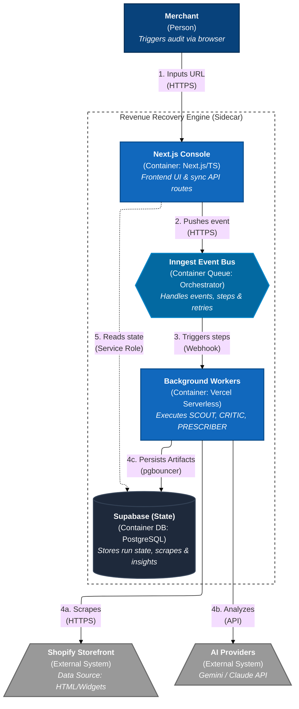
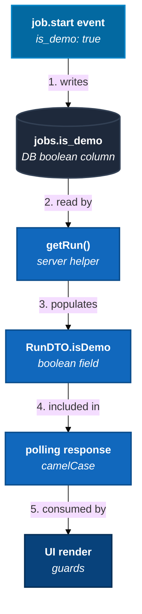
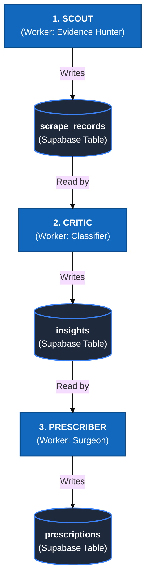
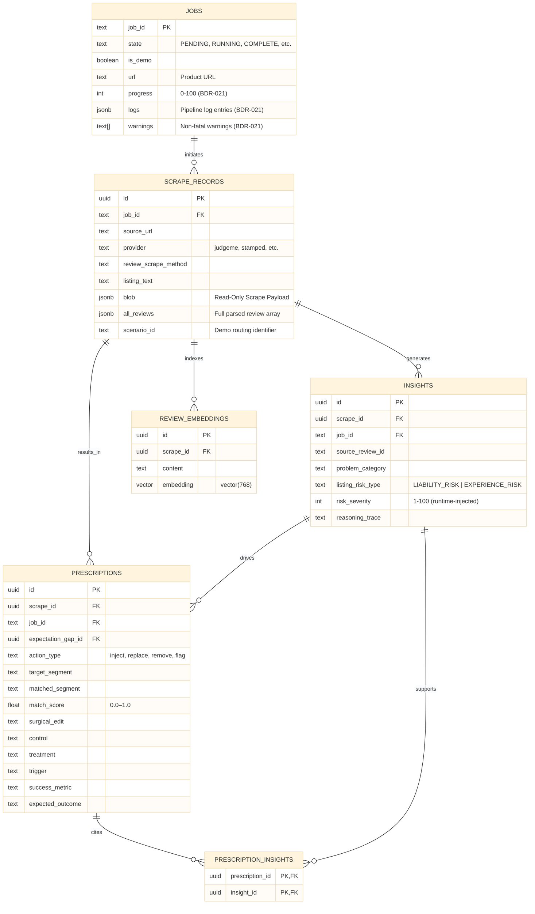
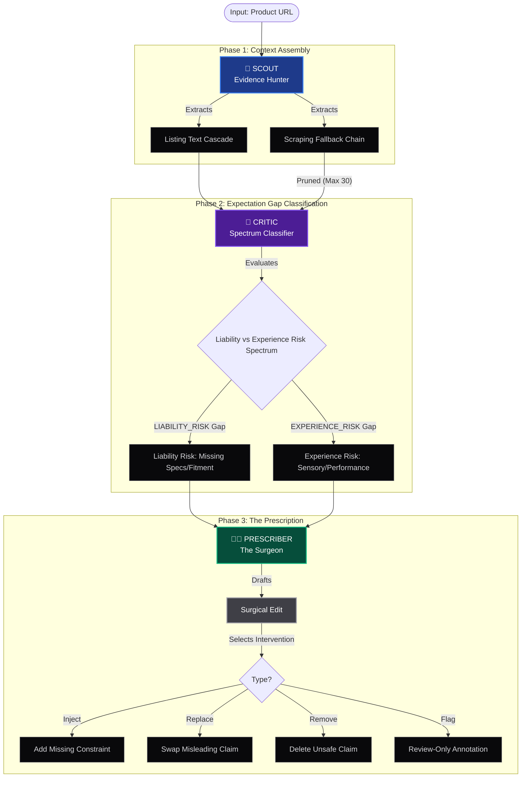
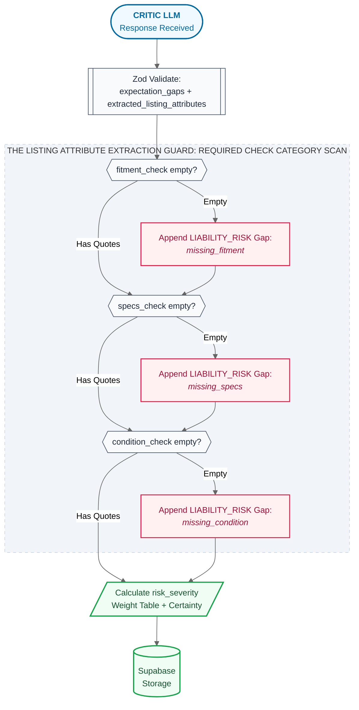

<aside>
🗺️

**Quick Navigation**

§1 [Stack & Architecture](#) · §2 [Environment Setup](#) · §3 [Demo Mode Firewall](#) · §4 [Core Data Schema](#) · §5 [Golden Dataset & Demo Seed Rules](#) · §6 [Contracts, Enums & Zod Schema](#) · §7 [Pipeline: SCOUT Ingestion](#) · §8 [Pipeline: Inngest Orchestration](#) · §9 [Frontend, UI & API Contracts](#) · §10 [PR Review Guardrails](#) · §11 [Blueprint-to-Code Mapping](#) · §12 [Anti-Regression Pre-Ship Gate](#) · §13 [PRESCRIBER Step: Wiring Dependencies](#)

</aside>

**DO NOT guess the architecture.**

***This*** is now our *abridged* source of truth. Code that contradicts these rules will not pass PR review.

# 1. Stack & Architecture (Sidecar Pattern)

🛑 **CRITICAL:** No separate Python server. All scraping, API routes, and AI orchestration run in **TypeScript inside the Next.js monorepo**.

### Tech Stack

- **Frontend & API:** Next.js (App Router) + TypeScript
- **Background Jobs:** Inngest
- **Database:** Supabase (PostgreSQL + pgvector)
- **Deployment:** Vercel

### Data Flow (canonical)

1. Next.js emits `job.start`
2. Inngest runs `SCOUT`
3. `SCOUT` writes `scrape_records`
4. Inngest runs `CRITIC` + `PRESCRIBER` → writes `insights` + `prescriptions`



# 2. Environment Setup & Local Dev Checklist

🛑 **CRITICAL:** Secrets never cross environment boundaries.

### Required Environment Variables

| **Variable** | **Where it lives** | **Rule** |
| --- | --- | --- |
| `SUPABASE_URL` | `.env.local`  • Vercel | Safe to expose to server code only |
| `SUPABASE_SERVICE_ROLE_KEY` | `.env.local`  • Vercel (server only) | **Never** ship to browser. Server routes only. |
| `SUPABASE_ANON_KEY` | `.env.local`  • Vercel | MVP default: not used client-side. Server reads only. |
| `DATABASE_URL` | `.env.local`  • Vercel | **Must be port 6543 (Supavisor pooler).** Port 5432 is banned from Vercel. |
| `INNGEST_EVENT_KEY` | `.env.local`  • Vercel (per environment) | **Never share Production key with Preview or Local.** |
| `INNGEST_SIGNING_KEY` | `.env.local`  • Vercel (per environment) | Used to verify webhook authenticity. Keep per-env. |
| `GEMINI_API_KEY` | `.env.local`  • Vercel (server only) | Server-side only. Never in client components. |
| `APIFY_API_KEY` | `.env.local`  • Vercel (server only) | Server-side only. $5/month free tier — do not loop scrapes. |

### Non-Negotiable Setup Rules

1. **Connection pooler:** Use port `6543` with `?pgbouncer=true`. Port `5432` banned on Vercel.
2. **Env isolation:** Production `INNGEST_EVENT_KEY` must never appear in Preview or local `.env`.
3. **`maxDuration` in code:** Dashboard setting does nothing. Declare in every long-running route:

```tsx
export const maxDuration = 60;
```

1. **Local Inngest dev:** Run `npx inngest-cli@latest dev` alongside `next dev`.
2. **RLS stance (MVP):** No anon `SELECT` policies. All reads via service role key, server-side only.

### Runtime Constraints (Vercel + LLM)

🛑 **Payload Discipline**

- Never pass raw HTML or large blobs between Inngest steps (step outputs are memoized; ~4MB limit).
- Persist blobs to `scrape_records.blob` immediately.
- Pass only `scrape_id` + cleaned fields to next steps.

🛑 **Global LLM Lock & Backoff**

- Gemini free tier: **2 RPM**. Use `throttle: { limit: 2, period: "1m", key: "global_gemini_lock" }` — see the Pipeline section for the full Inngest config shape.
- No synchronous `while` loops against the LLM API.
- Exponential backoff: initial 4s, max 60s, 3 retries.

# 3. Demo Mode Firewall Contract

🛑 **CRITICAL:** `demo=true` must never trigger external calls. A broken link = unsafe demo.

### The `isDemo` Propagation Chain

Every link is required. A missing link breaks demo safety.



### Firewall Rules

| **Rule** | **Behavior** |
| --- | --- |
| **`fetchWrapper`** | Checks `isDemo` before `SCOUT` outbound calls. If `true` → returns seeded data, no network call. |
| **`SCOUT` in demo** | Bypasses Scraping Fallback Chain entirely. Reads only `scrape_records` where `is_demo = true`. No Shopify, ZenRows, or Apify. |
| **Log Replay** | UI rehydrates from `jobs.logs` column on page load/refresh (BDR-021). For demo runs, replays the seeded Golden Run timeline. |
| **Seed source** | Part 4 → §4.3. Demo rows are read-only SELECTs — never re-seed during a run. |
| **Fail closed** | Missing `is_demo` in `job.start` payload → treat as `false`. Never default to demo silently. |

### Demo Performance Target

`demo=true` must render in **< 3 seconds** (retrieval + log replay only — zero external calls).

# 4. The Core Data Schema

🛑 **CRITICAL:** Never merge into one table. All tables linked by `job_id` and `scrape_id`.

<aside>
🔍

**Pre-Code Schema Verification (mandatory before writing any DB or Zod code)**

Before touching a table, run this check against Part 4 → §4.2:

1. Does the PK match? (`id uuid` with `gen_random_uuid()` — never `insight_id text`).
2. Are all required FK columns present? (`scrape_id uuid`, `job_id text NOT NULL`).
3. Are nullability rules correct? Cross-check every column against the DDL, not Supabase Studio.
4. Does your code use `scrape_id` — not `product_id`? They are **not** equivalent.
5. If you added a column not in Part 4, it must appear in the Approved Extra Fields table below — otherwise it is a schema violation.

</aside>

### New Table Checklist

**Run before creating any table not in Part 4:**

- [ ]  **Necessity:** Can data live in an existing table?
- [ ]  **PK:** Defined as `id uuid default gen_random_uuid()`?
- [ ]  **Job traceability:** Includes `job_id text NOT NULL`?
- [ ]  **Scrape linkage:** Derived rows have `scrape_id uuid` FK to `scrape_records(id)`?
- [ ]  **Blueprint sync:** Added to Part 4 → §4.2 *before* migration? (Schema canon = Blueprint, not codebase)

### Approved Extra Fields

These columns exist in Supabase but are **not** in the Part 4 DDL. They are explicitly sanctioned. Any other undocumented column is a violation.

| **Column** | **Table** | **Status** | **Why it exists** |
| --- | --- | --- | --- |
| `is_demo` | `scrape_records`, `jobs` | ✅ Approved | Demo Mode Firewall (§3). Required to gate live calls. |
| `expectation_gap_id` | `prescriptions` | ✅ Approved | FK to `insights.id` — canonical CRITIC→`PRESCRIBER` join key. Every `prescriptions` row must reference the insight that drove it. |
| `provenance_url` | `insights` | ❓ Needs decision | Not in Part 4. Keep, remove, or document — owner must decide before next sprint. |



### Tables

| **Table** | **Writer** | **Reader** | **Purpose** |
| --- | --- | --- | --- |
| `jobs` | API route | Console | Run state tracking |
| `scrape_records` | `SCOUT` | `CRITIC` | Immutable ingestion payload + `listing_text` (evidence source of truth; raw reviews remain un-normalized here for MVP) |
| `insights` | `CRITIC` | UI via`getRun()` | `CRITIC` output. Expectation mismatches, taxonomy, risk scoring, and reasoning only. No intervention fields. |
| `prescriptions` | `PRESCRIBER` | UI via`getRun()` | Exportable user-facing Surgical Edit Plan |
| `prescription_insights` | `PRESCRIBER` | — | Join table:`prescriptions`↔`insights` |
| `review_embeddings` | `SCOUT` | pgvector search | One row per embedded review text chunk, linked via `scrape_id` only (no `review_id` FK), `vector(768)` |



# 5. Golden Dataset & Demo Seed Rules

🛑 **CRITICAL:** Demo rows are read-only SELECTs. Never re-generated during a run.

### Golden Dataset Requirements

| **Requirement** | **Target** | **Notes** |
| --- | --- | --- |
| Minimum forensic pairs (demo-grade) | 20 manually-analyzed pairs | Each pair = one product listing + its labeled insights |
| Target forensic pairs (V1.1 productionization) | 100+ | Required before beta launch |
| Must include Vague Phrase Traps | At least 3 | e.g., "standard fit", vague size chart, unclear install requirements |
| Seeded demo scenarios | 3 named scenarios | `auto-parts-fixable`, `healthy`, `critical` |

### Demo Seed Rules

1. **Seed rows are immutable:** `is_demo = true` rows never overwritten by a pipeline run.
2. **Deterministic reuse:** Same `job_id` + `is_demo = true` always returns the same `RunDTO`.
3. **Seed SSOT:** Part 4 → §4.3. Do not duplicate seed logic here.
4. **DATA_DROUGHT:** `< 5` live reviews → log `DATA_DROUGHT`, proceed. Demo runs exempt.
5. **`viability_gap_detected`:** Set when `returned_reviews.length / expected_review_count` drops below threshold. Never report success on near-empty payloads.

### Acceptance Targets (demo-grade)

| **Metric** | **Target** |
| --- | --- |
| Pass rate on overlap score | ≥ 80% |
| Hallucination failures per 100 outputs | ≤ 2 |
| Demo mode render time | < 3 seconds |
| External calls in demo mode | 0 |

# 6. Contracts, Enums & Zod Schema

🛑 **CRITICAL:** Use `z.enum()`, never `z.string()`. Fail closed on violations. `temperature = 0` on all LLM calls. Schemas are generated from Supabase — DB is the single source of truth. Never hand-edit `schemas.ts`. `risk_severity` is never in the raw LLM Zod schema — the runtime appends Required Check Category gap surfaces under BDR-020 and then calculates `risk_severity` for all persisted surfaces.

### AI Invariants

1. **Temperature:** Set to `0` for all CRITIC and `PRESCRIBER` calls.
2. **No-Invented-Numbers Rule:** Output numeric values (e.g., `5mm`, `400 lumens`) only if verbatim in `evidence_quotes` or `listing_text`. If absent: `action_type = flag`, `surgical_edit = null`.

### System-wide Enums (Master Lookup)

Runtime validates and fails closed on anything unlisted.

| **Field** | **Allowed Values** | **Notes** |
| --- | --- | --- |
| `problem_category` | `compatibility_issue`, `dimensional_issue`, `sensory_issue`, `performance_issue` | Taxonomy bucket for the expectation mismatch |
| `listing_risk_type` | `LIABILITY_RISK`, `EXPERIENCE_RISK` | `LIABILITY_RISK` = liability risk; `EXPERIENCE_RISK` = experience mismatch |
| `action_type` | `inject`, `replace`, `remove`, `flag` | How the merchant acts and how the edit renders in UI |
| `placement` | `inline`, `top_block`, `bullet_summary`, `null` | Required only when `action_type = inject`; null otherwise |
| `provider` | `judgeme`, `stamped`, `okendo`, `yotpo`, `loox`, `unknown` | Review widget provider detected by SCOUT |
| `review_scrape_method` | `PUBLIC_PROVIDER_API`, `HTML_TOKEN_SCRAPE`, `HTML_SCRAPE`, `PAID_SCRAPE` | Which Scraping Fallback Chain tier succeeded |
| `listing_text_source` | `JSON_LD`, `DOM_SELECTOR`, `RULE_BASED_FALLBACK_SCRAPE` | Which Cascade path produced `listing_text` |
| `required_check_category` | `fitment_check`, `specs_check`, `condition_check` | Which Required Check Category gap is represented (`LIABILITY_RISK` only) |
| `jobs.state` | `PENDING`, `RUNNING`, `COMPLETE`, `COMPLETE_WITH_WARNINGS`, `FAILED` | Console run state |
| `classification_certainty` | `likely`, `possible`, `unlikely` | CRITIC LLM output only — used to calculate `risk_severity` |
| Warning codes | `MATCH_CONFIDENCE_TOO_LOW`, `JSON_REPAIR_FAILED`, `LIABILITY_FLAG_NO_VERBATIM_SPEC`, `DATA_DROUGHT`, `COMPLETE_WITH_WARNINGS` | Surfaced in `RunDTO.warnings[]` and as UI banners |

### Risk Severity Formula

LLM outputs `identified_keywords[]` + `classification_certainty` only. Unlisted keywords are silently dropped (not scored at 1).

```tsx
const risk_severity = Math.max(1, Math.min(100,
  identified_keywords
    .filter(kw => kw in KEYWORD_WEIGHT)   // unlisted terms dropped — NOT scored at 1
    .reduce((sum, kw) => sum + KEYWORD_WEIGHT[kw], 0)
  * CERTAINTY_MULTIPLIER[classification_certainty]
)); // floor at 1 per BDR-016: a validated expectation gap is real — never 0
```

**Keyword Weight Table (locked — changes require golden dataset re-run):**

| **Keyword(s)** | **Weight** |
| --- | --- |
| `doesn't fit` / `does not fit` / `return` | 15 |
| `broke` / `gap` / `hole` / `excludes` | 10 |
| `fit` / `install` / `quality` / `too wide` / `size` | 5 |
| Any unlisted term | 0 (dropped) |

**Certainty multiplier:** `"likely"` = 1.0 · `"possible"` = 0.5 · `"unlikely"` = 0.1

- Score ceiling: 100. No catch-all weight for unlisted terms.
- CRITIC prompt requests only keywords + certainty — never a numeric score.
- Weight table changes require a PR with a golden dataset eval diff.

### The SSOT Chain (follow this exact order — no shortcuts)

**Part 4 DDL (§4.2)** → apply migration in **Supabase** → run `supabase gen types typescript --linked > src/types/supabase.ts` → run `npx supabase-to-zod --input src/types/supabase.ts --output src/lib/schemas.ts` → commit both generated files.

> If Supabase diverges from Part 4, that is a schema violation — fix Supabase first, then regenerate. Never patch `schemas.ts` to paper over a DB mismatch.
>

### Schema Generation (non-negotiable)

```bash
# Step 1: generate TypeScript types from Supabase
supabase gen types typescript --linked > src/types/supabase.ts

# Step 2: generate Zod schemas from those types
npx supabase-to-zod --input src/types/supabase.ts --output src/lib/schemas.ts
```

Never edit `src/lib/schemas.ts` by hand. Re-run after any schema migration.

### Validation Rules

1. **`z.enum()` not `z.string()`** for any field with allowed values (see Enums table above). `z.string()` on `action_type` passes hallucinations silently.
2. **Fail closed:** Zod validation failure → step must throw. Never coerce or patch.
3. **Named constants (required):**

```tsx
export const LLM_INFERENCE_TEMPERATURE = 0;
export const LLM_MODEL_ID = "gemini-flash-lite-latest";
export const MAX_CRITIC_REVIEWS = 30;
export const MAX_PAGES = 5;
```

1. **Model pinning:** `LLM_MODEL_ID` in every LLM call. Disable SDK auto-upgrade. Unavailable model → fail closed.
2. **Locate and Repair Model Output parsing order:** Every model payload must go through this before Zod validation:

```tsx
// Step 1: cheap parse
try { return JSON.parse(raw); } catch {}
// Step 2: repair then parse
try { return JSON.parse(cleanAIOutput(raw)); } catch {}
// Step 3: fail closed
throw new Error("JSON_REPAIR_FAILED");
```

1. **`risk_severity` is never in the raw LLM Zod schema.** Under BDR-020, the CRITIC model emits a top-level `extracted_listing_attributes` object plus `expectation_gaps[]`. The TypeScript runtime then deterministically appends any missing Required Check Category `LIABILITY_RISK` surfaces and calculates `risk_severity` for all surfaces before persistence.

# 7. Pipeline: SCOUT Ingestion (Scraping Fallback Chain + Signal Filter)



🛑 **CRITICAL:** Fetch HTML once. Strip + extract inside the SCOUT step boundary. Persist blob to `scrape_records.blob`. Pass only `scrape_id` + cleaned fields forward — never raw HTML.

### The Scraping Fallback Chain (stop at first success)

| Tier | Name | What it does | Providers |
| --- | --- | --- | --- |
| **0** | Provider Detection | Scan HTML for widget signatures to identify provider | All |
| **1** | `PUBLIC_PROVIDER_API` | Extract public token from HTML → call widget API directly | JudgeMe, Okendo |
| **2** | `HTML_TOKEN_SCRAPE` | Regex-match API key from JS init scripts in HTML | Stamped, Yotpo |
| **3** | `PAID_SCRAPE` | JS-rendered capture via ZenRows or Firecrawl | Loox, unknown |

- **Tier 1 token patterns:** JudgeMe → `shop.metafields.judgeme.public_token`; Okendo → `<meta name="oke:subscriber_id">`
- **Tier 2 token patterns:** Stamped → `StampedFn.init({ apiKey: "..." })`; Yotpo → `staticw2.yotpo.com/{app_key}/widget.js`
- **Pagination hard limit:** `MAX_PAGES = 5` — never paginate beyond this.
- **Silent failure rule:** A 200 OK with empty/near-empty data is a failure. Track `expected_review_count` vs `returned_reviews.length`. If ratio is below threshold, mark the scrape as `viability_gap_detected`.

### Provider Viability Quick-Ref

- 🟢 **High** (start here): JudgeMe, Stamped
- 🟡 **Medium** (needs request discipline): Okendo
- 🔴 **Low / Fortress** (Tier 3 mandatory): Yotpo, Loox

### Signal Filter (pure TypeScript, no LLM — runs before CRITIC)

🛑 **Hard limit: `MAX_CRITIC_REVIEWS = 30`.** Never use an LLM to rank reviews.

1. **Discard** `rating == 4` and `text_length < 30`
2. **Score** remaining: +1 per keyword match (`fit`, `broke`, `return`, `gap`, `hole`, `quality`, `install`, `doesn't fit`, `too wide`, `size`)
3. **Sort** by score → text length; **truncate** to top 30 → pass to CRITIC

> `< 5` total reviews: proceed, log `DATA_DROUGHT`.
>

# 8. Pipeline: Inngest Orchestration



🛑 **CRITICAL:** Use `throttle` (lossless), never `rateLimit` (lossy drop).

### Canonical Event Names (do not deviate)

- `job.start` — triggers the full pipeline
- `scrape.completed` — emitted by SCOUT when scrape payload is persisted
- `analysis.completed` — emitted by `PRESCRIBER` when insights are written

### Function Config (copy this shape)

```tsx
export const rreFunction = inngest.createFunction(
  {
    id: "rre-pipeline",
    concurrency: { limit: 1, key: "event.data.job_id" }, // per-job isolation
    throttle:    { limit: 2, period: "1m", key: "global_gemini_lock" }, // Gemini 2 RPM
  },
  { event: "job.start" },
  handler
);
```

### Step Rules

- **Retry at the step boundary**, not the whole job. Exhausted retries → persist terminal `FAILED` record.
- **Idempotency:** `job_id` is the dedup key. `job.start` must be safe to send twice.
- **Micro-batch cap:** max **5 items per LLM call** per step.
- **Memoized outputs:** Never return raw HTML or large blobs from a step. See §2 Runtime Constraints (Payload Discipline).
- **Lean Gate (BDR-020):** CRITIC sends `extracted_listing_attributes + expectation_gaps[]` into the TypeScript gate. The gate evaluates pillars deterministically, appends any `LIABILITY_RISK` surfaces and never calls a secondary fallback LLM.

# 9. Frontend, UI & API Contracts

🛑 **CRITICAL:** No chained fetches. `/run/{job_id}` renders from a single `RunDTO` via `getRun(job_id)`. All API responses transform `snake_case` → `camelCase` — never expose raw Supabase column names to the frontend.

### `RunDTO` Shape

```tsx
type RunDTO = {
  job: { job_id: string; state: string; isDemo: boolean; url: string | null; progress: number; logs: object[] };
  scrape: {
    id: string; listing_text: string; provider: string;
    review_scrape_method: string; review_count: number;
  };
  insights: InsightDTO[];      // all insights for this run
  prescriptions: PrescriptionDTO[]; // all prescriptions for this run
  warnings: string[];          // COMPLETE_WITH_WARNINGS entries
  isDemo: boolean;             // propagated from job.isDemo — UI uses this
};
```

- **`isDemo` propagation:** every link is required. See §3 for the full chain diagram.

### UI Determinism & Rendering

- **Locate and Repair Model Output:** Backend resolves `target_segment` → `matched_segment` before writing to `prescriptions`. UI highlights `matched_segment` only.
- **Drop threshold:** `match_score < 0.80` → skip insight, return in `warnings[]` as `MATCH_CONFIDENCE_TOO_LOW`.

### Rendering Decision Table

| `action_type` | `placement` | Document Pane | Sidebar |
| --- | --- | --- | --- |
| `replace` | — | Colored underline on `matched_segment` | Replacement copy |
| `remove` | — | Red strikethrough on `matched_segment`  • left border | Justification; pre-expanded |
| `inject` | `top_block` | Prominent insertion banner **above** listing text | Edit copy |
| `inject` | `bullet_summary` | Ghost bullet at bottom of spec list | Edit copy |
| `inject` | `inline` | No document anchor | Card: "insert adjacent to relevant text" |
| `flag` | — | **No highlight** | ⚠️ LIABILITY WARNING badge only |

- **`flag` + `surgical_edit = null`:** render badge with message: *"High risk detected but no verbatim spec found. Manual verification required."* Do not render a diff.

### API Routes

| **Route** | **Method** | **What it does** | **Returns** |
| --- | --- | --- | --- |
| `/api/inngest` | POST | Inngest webhook receiver. Verifies signing key, acks fast (≤500ms), hands off to durable functions. | Inngest protocol response |
| `/api/runs/[id]/status` | GET | Polling endpoint. Returns current job state + `RunDTO`. UI polls until `state` is terminal. | `RunDTO` (camelCase) |
| `/api/runs` (start) | POST | Receives product URL + `isDemo` flag. Writes a `jobs` row, fires `job.start` to Inngest. | `{ job_id: string }` |
| `getRun(job_id)` | Server helper | Joins `jobs` , `scrape_records` , `insights` , `prescriptions` in one query. Used inside `/api/runs/[id]/status`. | `RunDTO` |
| `/api/webhooks/apify` | POST | (Track B) Receives Apify callback. Verifies shared secret, writes `scrape_records.blob`, emits `scrape.completed`. | `{ ok: true }` |

- Polling response must include `isDemo` on every tick.
- No direct Supabase reads from the browser — all reads via server routes + service role key.
- Idempotent job start: existing `job_id` → return existing record, no duplicate.

### Where does this live? (DB tables → RunDTO)

Use this to answer: “Which table owns this field?”

- **`jobs`** → `RunDTO.job`
  - Owns: `job_id`, `state`, `isDemo`, `url`, `progress`, `logs`, `warnings` (BDR-021)
- **`scrape_records`** → `RunDTO.scrape`
  - Owns: `id` (this is `scrape_id` elsewhere), `job_id`, `source_url`, `provider`, `review_scrape_method`, `listing_text`, `listing_text_source`, `blob`, `review_count`, `is_demo`
- **`insights`** (CRITIC-owned) → `RunDTO.insights[]`
  - Owns: `problem_category`, `listing_risk_type`, `risk_severity`, `confidence_score`, `reasoning_trace`, `evidence_quotes`, optional `required_check_category`, `fail_state`
  - Does **not** own: `action_type`, `placement`, `matched_segment`, `surgical_edit`
- **`prescriptions`** (`PRESCRIBER`-owned) → `RunDTO.prescriptions[]`
  - Owns: `expectation_gap_id`, `action_type`, `placement`, `target_segment`, `matched_segment`, `surgical_edit`, export fields (`control`, `treatment`, `trigger`, `success_metric`), `expected_outcome`

**Casing rule:** Supabase = `snake_case`. API/UI = `camelCase`. Never expose raw Supabase column names directly to client components.

# 10. PR Review Guardrails

🛑 **CRITICAL:** PR-Agent or CodeRabbit must be active, configured against `pr-reviewer-rules.md`. Violations auto-block.

### Auto-Block Checklist

- [ ]  No `z.string()` on enum fields (§6) — use `z.enum()`.
- [ ]  No uppercase `action_type` values (`"inject"` not `"INJECT"`).
- [ ]  No raw HTML returned from Inngest step outputs — IDs + cleaned fields only.
- [ ]  No `rateLimit` in Inngest config — use `throttle`.
- [ ]  No `DATABASE_URL` on port `5432` from Vercel — must be `6543` with `?pgbouncer=true`.
- [ ]  `maxDuration` declared in every API route calling Inngest or LLM.
- [ ]  No hardcoded model strings — use `LLM_MODEL_ID`.
- [ ]  No hardcoded temperature values — use `LLM_INFERENCE_TEMPERATURE`.
- [ ]  No LLM call that outputs `risk_severity` as a number.
- [ ]  No `supabase.from(...).select(...)` in client components — server routes only.
- [ ]  `src/lib/schemas.ts` never hand-edited — regenerate via `supabase-to-zod`.
- [ ]  No new `fail_state` or `problem_category` values without a golden dataset re-run.
- [ ]  No `insight_id` as the primary key on `insights` — must be `id (uuid)` with `gen_random_uuid()`.
- [ ]  No `product_id` column on `insights` — must be `scrape_id (uuid)` referencing `scrape_records(id)`.
- [ ]  No `insights` row inserted without a valid `job_id (text NOT NULL)` — check before any insert.

# 11. Blueprint-to-Code Mapping

Use this table to answer: "Which file implements which blueprint section?" Every normative section must have a corresponding code artifact. If a section has no file yet, it is an open implementation gap.

> **Rule:** Part 4 is the SSOT for schema. If the code file diverges from the blueprint section listed here, fix the code — not the blueprint.
>

| **Blueprint Section** | **What it defines** | **Canonical code artifact** |
| --- | --- | --- |
| Part 4 §4.2.1 `scrape_records` DDL | Immutable ingestion table | `supabase/migrations/XXX_scrape_records.sql` |
| Part 4 §4.2.2 `insights` DDL | `CRITIC` output table | `supabase/migrations/XXX_insights.sql` |
| Part 4 §4.2.3 `prescriptions` DDL | `PRESCRIBER` output table + DB-level guardrails | `supabase/migrations/XXX_prescriptions.sql` |
| Part 4 §4.2.4 `jobs` DDL | Run state table | `supabase/migrations/XXX_jobs.sql` |
| Part 4 §4.2.5 `review_embeddings` DDL | Semantic index table | `supabase/migrations/XXX_review_embeddings.sql` |
| Part 4 §4.4.3 Insight JSON Schema | Canonical CRITIC output contract (Zod) | `src/schemas/insightSchema.ts` |
| Part 3 §3.2.2 `risk_severity` formula + weight table | Runtime-only risk scoring (No-Invented-Numbers Rule) | `src/pipeline/riskScorer.ts` |
| Part 3 §3.6.5 Signal Filter | Pre-`CRITIC` review pruning (pure TS, no LLM) | `src/pipeline/signalFilter.ts` |
| Part 4 §4.5 RLS policies | Row Level Security posture for all 5 tables | `supabase/migrations/XXX_rls_policies.sql` |
| Part 4 §4.5.1 AI Agent Schema Safety Protocol | Pre-migration human review protocol | `docs/ai-schema-safety.md` (or pinned in repo README) |
| Part 4 §4.6.2 `SCOUT` I/O contract | `SCOUT` inputs, waterfall, write target | `src/pipeline/scoutStep.ts` |
| Part 4 §4.6.3 `CRITIC` I/O contract | `CRITIC` inputs, two-phase pillar detection, output shape | `src/pipeline/criticStep.ts` |
| Part 4 §4.6.4 `PRESCRIBER` I/O contract | `PRESCRIBER` inputs, numeric firewall, write target | `src/pipeline/prescriberStep.ts` |
| Part 3 §3.4.2 `PRESCRIBER` input constraint (no raw reviews) | Between-step payload discipline | `src/pipeline/prescriberStep.ts` (input validation block) |
| Part 4 §4.3 Golden Dataset seed protocol | Minimum seeded rows + determinism contract | `supabase/seed.sql` |
| Part 3 §3.12.7 PII Redaction Utility | CC → Email → Phone redaction order | `src/lib/piiRedactor.ts` |
| Part 4 §4.6.6 `CRITIC` prompt artifact | Versioned `CRITIC` prompt | `prompts/critic_agent.md` |
| Part 3 §3.2.2 Named constants | `MAX_CRITIC_REVIEWS`, `LLM_MODEL_ID`, `LLM_INFERENCE_TEMPERATURE`, etc. | `src/lib/constants.ts` |

# 12. Anti-Regression Pre-Ship Gate

🛑 **CRITICAL:** Run this checklist before every sprint demo, every migration, and every PR that touches schema, pipeline steps, or the data layer. It encodes all non-negotiables established across the blueprint.

<aside>
🔒

If any item below fails, the change does **not** ship. No exceptions, no "we'll fix it post-demo."

</aside>

### A. Security & Schema Integrity

- [ ]  **RLS is enabled** on all 5 normative tables: `scrape_records`, `insights`, `prescriptions`, `jobs`, `review_embeddings` — confirm in Supabase dashboard before every deploy (Part 4 §4.5, BDR-009).
- [ ]  **AI agent schema safety protocol** followed before any migration was applied: schema snapshotted, every line reviewed, Sahal approved, golden dataset verified post-migration (Part 4 §4.5.1, BDR-010).
- [ ]  **PII redacted** before any `scrape_records` insert: Credit Card → Email → Phone in that order (`src/lib/piiRedactor.ts`).
- [ ]  **`SUPABASE_SERVICE_ROLE_KEY`** is not present in any client bundle, component, or browser-accessible route.
- [ ]  **No ad-hoc SQL** executed directly against production — all schema changes live in migration files.

### B. Pipeline Invariants

- [ ]  **Pipeline shape preserved:** `SCOUT` → `CRITIC` → `PRESCRIBER`. No steps merged. No shortcutting CRITIC.
- [ ]  **CRITIC never emits `risk_severity`** as a number. Under BDR-020, raw `CRITIC` model output contains `extracted_listing_attributes` + `expectation_gaps[]`; the runtime appends any missing Required Check Category gap surfaces and then calculates `risk_severity` via the locked formula (Part 3 §3.2.2).
- [ ]  **Pillar detection uses `listing_text` only** — reviews may inform review-driven mismatches, but they must not be used for the Lean Gate Required Check Category extraction path.
- [ ]  **No secondary LLM fallback exists** for pillar detection — the TypeScript logic gate is the only authority for present/missing evaluation after extraction (BDR-020).
- [ ]  **`risk_severity` absent from raw LLM Zod schema** (`required[]` in `insightSchema.ts`) — runtime injects it after validation.
- [ ]  **Runtime appends LIABILITY_RISK pillar-gap surfaces** from `extracted_listing_attributes` before persistence and before the `PRESCRIBER` handoff.
- [ ]  **`reasoning_trace` is non-nullable** — a null or empty value is a schema validation failure. Fail closed, do not retry with null (Part 4 §4.4.3).
- [ ]  **`MAX_CRITIC_REVIEWS = 30` enforced** — Signal Filter truncates to top 30 before `CRITIC` call. Never pass unpruned array.
- [ ]  **Micro-batch cap of 5 items** enforced per `PRESCRIBER` Inngest step (Part 3 §3.2.2 / BDR-006).
- [ ]  **`PRESCRIBER` never receives raw reviews or `blob`** — only `expectation_gaps[]` + `listing_text` (Part 3 §3.4.2 / BDR-004).

### C. Demo Firewall

- [ ]  `is_demo = true` → **zero external calls** (Shopify, LLM, ZenRows, Apify). SCOUT reads seeded `scrape_records` only.
- [ ]  Demo renders in **< 3 seconds** (retrieval + log replay only).
- [ ]  `is_demo` propagation chain complete: `job.start` → `jobs.is_demo` → `getRun()` → `RunDTO.isDemo` → UI guard.

### D. Data Integrity & Traceability

- [ ]  **Golden dataset seed runs cleanly** after any migration: `supabase db reset && supabase seed` completes without errors.
- [ ]  **No normalized `reviews` table** introduced for MVP — raw reviews remain inside `scrape_records.blob` / `all_reviews` by design (BDR-017).
- [ ]  **`source_review_id` preserved** from `scrape_records.blob` through to `insights.source_review_id` — no pipeline step drops or overwrites it (BDR-003).
- [ ]  **`review_embeddings` has no per-review FK** — rows link only via `scrape_id`; any granular review traceability uses `source_review_id` strings, not relational constraints (BDR-018).
- [ ]  **`expectation_gap_id` FK present** on every new `prescriptions` row — must reference the `insights.id` that drove it.
- [ ]  **`scrape_id` used correctly** — not `product_id`. They are not equivalent (Part 4 §4.2.2 ID Semantics table).

### E. Vocabulary & Contract Conformance

- [ ]  `problem_category` values match locked enum: `compatibility_issue | dimensional_issue | sensory_issue | performance_issue` (Part 4 §4.4.2.1).
- [ ]  `action_type` values are lowercase: `inject | replace | remove | flag`.
- [ ]  `listing_risk_type` values are UPPERCASE: `LIABILITY_RISK | EXPERIENCE_RISK`.
- [ ]  `provider` values match locked enum: `judgeme | stamped | okendo | yotpo | loox | unknown` (Part 4 §4.2.1).
- [ ]  Field casing conforms to Sprint 1 lock — no new field names added without a BDR entry.
- [ ]  `reasoning_trace` is absent from `prescriptions` and remains CRITIC-owned on `insights` (BDR-019).
- [ ]  `expected_outcome` nullable contract enforced — `string | null`; `null` allowed only when `action_type = flag` and no defensible outcome claim exists; never empty string (BDR-015 / BDR-019).
- [ ]  `match_score ≥ 0.80` enforced — prescriptions below threshold must not render as edit anchors; returned in `warnings[]` as `MATCH_CONFIDENCE_TOO_LOW`.
- [ ]  `placement` is non-null if and only if `action_type = inject` — DB-level `CHECK` constraint must be present.

### F. Schema Generation & Code Quality

- [ ]  `src/lib/schemas.ts` regenerated via `supabase-to-zod` after any migration — never hand-edited.
- [ ]  All enum fields use `z.enum()` not `z.string()` — `z.string()` on `action_type` silently passes hallucinations.
- [ ]  `LLM_MODEL_ID` used in every LLM call — no hardcoded model strings.
- [ ]  `LLM_INFERENCE_TEMPERATURE = 0` on all CRITIC and `PRESCRIBER` calls.

### G. BDR Compliance

- [ ]  No new normative fields added to `insights` or `prescriptions` without an open BDR entry and Sahal sign-off.
- [x]  **BDR-008** ✅ Resolved — canonical SCOUT→CRITIC payload shape locked in Part 4 §4.6.2 and BDR-008.
- [x]  **BDR-011** ✅ Resolved — `target_context` does not exist and must never be created. See BDR-011 and Cheatsheet §13.

# 13. `PRESCRIBER` Step: Wiring Dependencies & Boundary Enforcement

**Who this is for:** Whoever is currently implementing `prescriberStep.ts`. Read this before writing a single line.

<aside>
⏱️

**The `matched_segment` Temporal Paradox (BDR-011, closed):** The field `matched_segment` does not exist until *after* the `PRESCRIBER` LLM has run. You therefore cannot feed a context window around it *into* the `PRESCRIBER`. The execution order is: `PRESCRIBER` LLM proposes `target_segment` (dirty) → `findFuzzyIndices` resolves it → backend persists `matched_segment` + `match_score` to `prescriptions`. Any field that wraps `matched_segment` belongs to the backend post-processing layer — not the LLM input contract.

</aside>

### Step dependency chain

| **Layer** | **What you implement** | **Blocked by** | **Blocking** |
| --- | --- | --- | --- |
| LLM Step | `PRESCRIBER` Input/Output (`prescriberStep.ts`) | `CRITIC` step must be complete — must produce valid `expectation_gaps[]` with non-null `reasoning_trace` on every surface | Locate and Repair Model Output backend (`enforceMatchThreshold` → `findFuzzyIndices`) |
| Backend Post-Processing | `enforceMatchThreshold` → `findFuzzyIndices` → resolve `matched_segment` | `PRESCRIBER` LLM payload received (must have `target_segment` before fuzzy resolution can run) | `prescriptions` table write (persisting `matched_segment`  • `match_score`) |
| DB Write | Persist to `prescriptions` with all guardrail checks | `matched_segment`  • `match_score` resolved; `expectation_gap_id` FK present | UI edit anchor rendering + §12 anti-regression gate |

### `PRESCRIBER` input contract (what to pass in — non-negotiable)

- ✅ `expectation_gaps[]` — full hydrated CRITIC output array, including runtime-injected `risk_severity` and non-null `reasoning_trace` per surface
- ✅ `listing_text` — full canonical product description passed in-memory from CRITIC step; do **not** re-query from DB
- ❌ `target_context` — **does not exist. Must not be created.** (BDR-011)
- ❌ Raw reviews, `blob`, or any other `scrape_records` fields — contract violation (BDR-004)
- ❌ Truncated excerpts of `listing_text` — truncation destroys the No-Invented-Numbers Rule

### Contextual Anchors ≠ `PRESCRIBER` input (Appendix A.10 clarification)

Appendix A.10 mentions `prefix3` and `suffix3` **Contextual Anchors**. These are **backend TypeScript only** — used by `findFuzzyIndices` to disambiguate identical substrings (the "Apple collision" problem). They are not DB columns. They are not fed into the `PRESCRIBER` LLM prompt. If a developer is asking about `target_context`, they are almost certainly conflating these backend disambiguation inputs with an LLM input wrapper.

### Common wiring mistakes

- **Do not pass `target_context` to** `PRESCRIBER`**.** The field does not exist anywhere in the schema.
- **Do not re-query `scrape_records` from inside `prescriberStep.ts`.** `listing_text` arrives in-memory from the CRITIC step.
- **Do not write `matched_segment` inside the** `PRESCRIBER` **LLM step.** It must be written by the backend post-processing layer after `findFuzzyIndices` resolves it.
- **Do not skip `enforceMatchThreshold`.** A `match_score < 0.80` prescription goes into `warnings[]` as `MATCH_CONFIDENCE_TOO_LOW` — it never writes to `prescriptions`.
