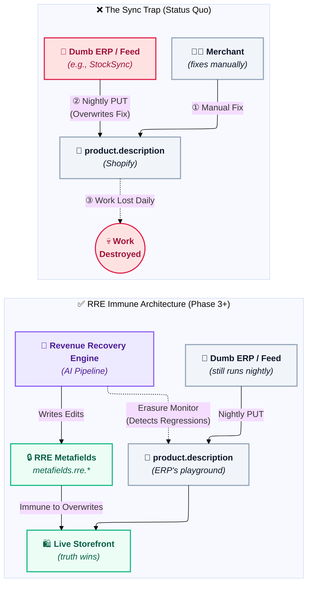
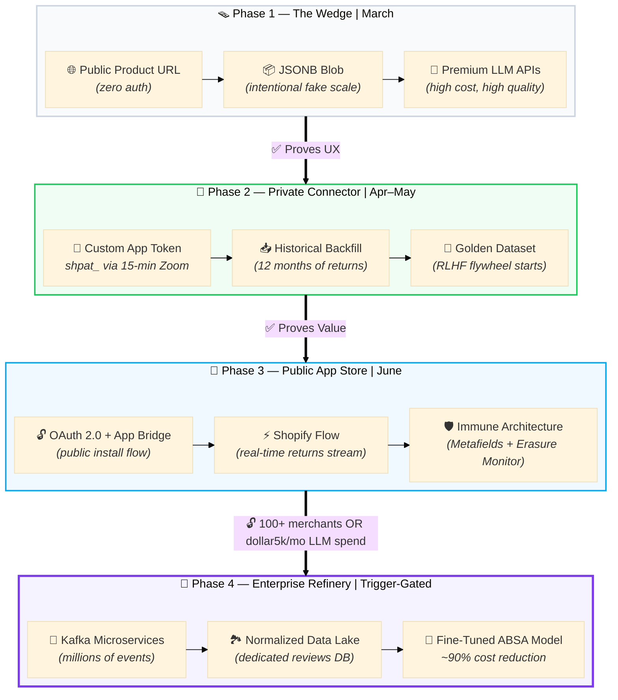

## 🌐 The Strategic Vision

<aside>
🩸

<aside>

### The Crisis: "Data Amnesia"

**The $850B Problem:** E-commerce returns stem from one-way data flow (Manufacturer → Merchant) that's static, generic, and blind.

**Lost Intelligence:** Customer feedback (*"missing port," "sheer fabric," "thread pitch is wrong"*) dies in return logs—never reaches product descriptions.

**Root Cause:** Merchants are locked in the **Sync Trap**—unable to fix descriptions without breaking inventory accuracy.

</aside>

</aside>

<aside>
👹

### The Villain: The "Sync Trap"

- **The Problem:** Manual description fixes are overwritten nightly by automated distributor syncs.
- **The Binary Lock:** Merchants must choose accurate inventory *or* accurate descriptions — never both.
- **Result:** Data stagnation across Fashion, Electronics, Auto Parts, Home Decor.
- **Root Cause:** Sync tools are "dumb pipes" enforcing a single source of truth not designed for merchandising intelligence.

</aside>

<aside>
🛡️

**The Solution: Persistent Intelligence Layer**

RRE sits between supply chain feeds and storefronts as a **Data Firewall**. AI reads "Dark Data" (returns, reviews, support tickets) to detect promise-reality gaps.

**Architecture: Sidecar Design**

- **Phase 1–2 (Read-Only):** Clipboard delivery. Zero write footprint. Builds trust.
- **Phase 3 (Immune):** Edits written to isolated `metafields.rre.*` namespace invisible to sync tools. ERP runs nightly `PUT` requests—RRE layer untouched.
- **Phase 3+ (State-Aware):** **Erasure Monitor** detects when sync restores removed dangerous claims. Fires **Regression Alert** before liability re-exposure.

</aside>

<aside>
🚀

**The Beachhead & End State**

**Launch vertical:** Aftermarket Auto Parts — the hardest sector. 1mm fitment errors cost $50 in returns and warranty claims. If RRE works here, it works everywhere.

**Global vision:** Every dropshipper, marketplace, and multi-brand retailer faces the Sync Trap.

**End state:** RRE becomes the **Feedback Intelligence Engine for the Internet** — ensuring product promises match reality at global scale.

</aside>

---

## 🏆 Competitive Landscape

<aside>
💡

**The Gap RRE fills:**

- Enterprise PIMs cost $100k+/year, take months to configure, and rely on rules engines — not generative AI.
- Mid-market sync tools are dumb pipes.
- Nobody in between offers lightweight, AI-native, semantic monitoring that detects *what changed and why it matters*.

### Competitive Positioning Matrix

| **Category** | **Solution** | **Pitch** | **Reality** | **RRE Edge** |
| --- | --- | --- | --- | --- |
| Enterprise PIM | Salsify, Akeneo | "Golden Record," "AI Insights" | Rule-based if/then engines. Not generative AI. Requires manual governance. $100k+/year. | Ships in weeks. AI-native semantic detection vs. configuration-dependent rules. |
| Mid-Market Sync | SyncLogic, Syncio | "Seamless Connection" | Binary lock: "Sync Description: Yes/No." No understanding of semantic changes. | Detects meaning, not field diffs. Alerts on semantic regressions. |
| Data Feed Tools | Stock Sync, Matrixify | "Smart Mapping," "Automated Feeds" | Dumb pipes. Execute files exactly as provided. Blank column = silent data wipe. | Monitors for regressions. Sync tools don't log what they destroyed. |

### Key Differentiators

- **Lightweight deployment:** Weeks vs. quarters for enterprise PIM setup
- **Generative AI-native:** Semantic understanding vs. rule engines
- **Regression detection:** Monitors what changed and why it matters
- **Mid-market positioning:** Fills gap between dumb pipes ($50/mo) and enterprise PIM ($100k+/year)

### Unique Value Proposition

<aside>

**Nobody offers:** Lightweight, AI-native, semantic monitoring that detects *what changed and why it matters* without enterprise complexity or dumb-pipe limitations.

</aside>

</aside>

**Enterprise PIM (Salsify, Akeneo)**

- *Marketing claim:* "Golden Record," "AI Insights"
- *Reality:* Rule-based "if/then" engines. Not generative AI. Require rigorous manual governance setup. $100k+/year.
- *RRE's edge:* Ships in weeks, not quarters. AI-native semantic detection, not configuration-dependent rules.

**Mid-Market Sync Tools (SyncLogic, Syncio)**

- *Marketing claim:* "Seamless Connection"
- *Reality:* Binary lock — "Sync Description: Yes/No." No understanding of *what* changed or *why it matters*.
- *RRE's edge:* Detects meaning, not just field-level diffs. Alerts on semantic regressions.

**Data Feed Tools (Stock Sync, Matrixify)**

- *Marketing claim:* "Smart Mapping," "Automated Feeds"
- *Reality:* Dumb pipes. Execute files exactly as provided. Blank column mapped to live field = silent data wipe.
- *RRE's edge:* Monitors for regressions. Sync tools don't even log what they destroyed.

---

## ❓ Pitch FAQ & Objection Handling

**Objection: "My ERP wipes my manual description edits every night. How do your edits survive?"**

> *"We know the Sync Trap destroys manual work. That's why RRE writes Surgical Edits to isolated RRE Metafields — a custom namespace your sync tools cannot see or touch. We never rewrite the vulnerable `product.description` block your ERP overwrites. We inject our warnings into `metafields.rre.liability_warning`, which lives completely outside the sync pipeline. Your ERP runs its nightly `PUT` requests. The RRE layer is immune."*
>

**Objection: "We already have Salsify / Akeneo."**

> *"Excellent tools for large catalog governance. RRE solves a different problem: detecting when a dumb vendor feed just restored a dangerous claim your PIM removed last week. Salsify's rules engine can't do semantic regression detection. Our Erasure Monitor can. Think of RRE as the intelligence layer that makes your existing sync infrastructure self-aware."*
>

**Objection: "What data do you actually need access to?"**

> *(Use the Symptoms Pitch from RRE-132-B — see Phase 2 section.)*
>

---

## Phase 1: The Value Prop Engine — "The Wedge"

March 10, 2026 → March 31, 2026

<aside>
🎯

**Goal:** Prove the *Value Proposition* — get a merchant to say, *"This is incredibly valuable. How do I connect it to my store?"*

</aside>

### Deliverables

- **Public Website:** Accepts product URL input
- **Zero-Auth:** Reads public data only—no Shopify credentials needed
- **AI Pipeline:** Analyzes reviews, generates Surgical Edit suggestions (client-visible)
- **Email Gate (Track B):** Captures leads before live URL scans
  - Logs every merchant as warm pipeline contact
  - Auto-survey at 7 days: "Did you apply changes? Did returns improve?"
  - Converts product into GTM motion

<aside>
📍

<aside>

**Sync Trap Awareness — Phase 1 Pitch Track**

**Context:** RRE is read-only in Phase 1. The Sync Trap objection (*"My ERP wipes my edits every night"*) will surface in every demo.

**Response Strategy:** Address with narrative, not code. Reference the Metafield Persistence / Immune Architecture (Phase 3). See Pitch FAQ above.

**Requirement:** Mandatory talking point — zero new code needed.

</aside>

</aside>

### Technical Reality

- We are **optimizing for zero-latency Time-to-Value (TTV).** By utilizing stateless processing and intelligent truncation (max 30 high-signal reviews), we eliminate database write-bloat and prove ROI to the merchant in under 60 seconds.
- **No `reviews` table yet.** If we normalized reviews now, SCOUT would execute ~5,000 database inserts every time it scraped a popular product — Supabase would crash and the sprint would be lost to index optimization.
- The tradeoff is intentional: we are selling the *UX*, not the infrastructure.

### Engineering Tickets

#### [GTM-LEAD] — Email Gate & Lead Capture *(Track B)*

- Add an email input field + consent checkbox on the Track B scan initiation screen (live product URL scan).
- Store submitted emails in a `leads` table in Supabase: columns `email`, `store_url`, `created_at`, `survey_sent_at`.
- Trigger an Inngest scheduled job 7 days after scan: send a survey email asking (1) did you apply the changes? (2) did returns/conversions improve? (3) open feedback.
- Follow-up tooling: Resend or Loops (TBD). Keep the pipeline simple — an Inngest job calling a transactional email API is sufficient.
- **GTM logic:** Every live scan = one qualified merchant lead + one future RLHF data signal. Do not skip this.
- **Note:** Not required for March 31 PoC. Prioritize immediately after Demo Day.

### Status

- [ ]  UI Snap — merchant-facing product demo live at public URL
- [ ]  SCOUT → CRITIC → PRESCRIBER pipeline running end-to-end on public data
- [ ]  Surgical Edit cards rendering correctly in the UI
- [ ]  [GTM-LEAD] — Email Gate live on Track B scan screen, `leads` table in Supabase

### Phase 1 Summary

> *March: Prove the UX (The UI Snap).*
>

---

## Phase 2: The "Private Connector" Beta

April 1, 2026 → May 31, 2026

<aside>
🚀

**Goal:** Ingest historical Returns + Reviews data for 5–10 beta partners with zero software installation friction.

</aside>

<aside>
⚠️

**The Pivot:** `RRE-131` (OAuth) and `RRE-132` (App Shell) are cancelled for this phase. We are not building a public app. We are building a **Custom App (Private Token)** connector. OAuth and App Bridge are deferred to Phase 3, where they belong — after we've proven the business model.

</aside>

### Deliverables

- **Node.js Agentic Connector** — ingests historical Returns + Reviews via Shopify GraphQL Admin API 2026-01.
- **Zoom-based onboarding protocol** — 15-min call where merchant generates `shpat_` token (replaces OAuth).
- **"Vision" Extension** — internal demo tool for investor/prospect calls showing future Health Badge UX. Not for merchant distribution.
- **Concierge CSV Bridge** — fallback path for merchants hesitant to generate tokens. They export returns data from Shopify as CSV.
- **Golden Dataset flywheel launch** — merchant interactions with Surgical Edits logged for training.
  - Surgical Edit cards gain **Approve / Reject / Edit** states.
  - All interactions saved to `merchant_feedback` table (Phase 4 training data).

<aside>
🚫

**Shopify Flow is explicitly NOT used in Phase 2.** Flow is event-driven — it only captures *new* returns going forward. It has zero backfill capability. A merchant with 12 months of returns history installs our tool and Flow gives us: nothing. The only path to Day 1 value is `bulkOperationRunQuery` via the Agentic Connector. Flow belongs in Phase 3 (real-time monitoring after the initial audit is done). Do not reach for it here.

</aside>

### Engineering Tickets

#### [DATA-BULK] (Linear: RRE-136) — The Agentic Connector Script *(replaces RRE-131)*

- Build a Node.js script using the **2026-01 GraphQL Admin API**.
- Execute a `bulkOperationRunQuery` to ingest historical `ReturnLineItem` data: `returnReason` (Enum) and `customerNote` (string).
- Separately fetch `Metaobjects` of type `product_review` for ratings and review body.
- Stream results to Supabase (`raw_returns` and `raw_reviews` tables).
- Auth: `X-Shopify-Access-Token` header using the `shpat_` token from onboarding. No OAuth code required.

#### [OPS-ONBOARD] — The "Logistics-Only" Onboarding Protocol *(replaces RRE-132)*

- Write a standard operating procedure (SOP) for a **15-minute Zoom call** with the merchant.
- Script guides the merchant through: Settings → Apps → Develop apps → Create app → Configure scopes → Install → Copy token.
- **Strictly request three scopes only:** `read_returns`, `read_products`, `read_metaobjects`.
- Do **not** request `read_all_orders`, `read_analytics`, `read_customers`, or any financial/customer PII scopes. These are the exact scopes that trigger a merchant's "Security Veto" — requesting them signals data extraction intent, not logistics diagnosis.
- **Output:** A reusable SOP doc the team can run without Sahal present.

**🎙️ Merchant Script — The "Symptoms" Pitch**

Use this verbatim when a merchant asks *"What data do you need access to?"*:

> *"We use a Logistics-Only integration. We don't want your money data — no revenue figures, no customer PII, no order totals. We only want your Symptoms data: what was returned and why, and what customers said in their reviews. That's it. Two read-only scopes. You can revoke the token in 30 seconds from your Shopify Admin."*
>

**Why this framing works:**

- **"Symptoms data"** vs. **"your data"** — reframes the ask as medical-grade diagnosis, not surveillance.
- **"We don't want your money data"** — preemptively kills the #1 objection before it's raised.
- **"Revoke in 30 seconds"** — removes the feeling of a permanent commitment.
- Avoids technical jargon (`read_returns`, `read_metaobjects`) entirely — merchants don't read scope names, they read intent.

#### [OPS-CSV] — The Concierge CSV Bridge *(fallback onboarding path)*

- For merchants who won't do the Zoom call or are uncomfortable generating a `shpat_` token: send them a **one-page CSV export guide**.
- They export their last 90 days of Returns from Shopify Admin (Orders → Returns → Export) and email/upload the CSV to us.
- Backend uses a **Python/Pandas parser on AWS Lambda** to fuzzy-match columns (`Reason`, `Return Reason`, `Comments`, etc.) to the `raw_returns` schema.
- **"Wizard of Oz" clause:** If parsing fails, a developer manually fixes the mapping within 2 hours. Ensures 100% success rate for early beta partners.
- Output: Same `raw_returns` table rows as the API path — downstream pipeline is identical.
- **This is not a long-term solution.** It exists to eliminate the "Security Veto" as a blocker for signing the first 5 design partners.

#### [SCOUT-AUTH] — The Authenticated SCOUT *(updated)*

- SCOUT switches from scraping public URLs to using the merchant's `shpat_` token.
- Before: `fetch('https://public-url.com')`
- After: Shopify GraphQL query fetching `product.bodyHtml` and `product.reviews` via Admin API.
- **Note:** In Phase 3, when OAuth is implemented, SCOUT will switch again from `shpat_` tokens to session tokens.
- **Benefit:** 100% reliable ingestion, no Cloudflare blocks, full catalog access.

#### [UI-VISION] — The "Vision" Extension *(Internal Only — Weeks 4–6)*

- **Constraint: NOT for merchant distribution.** Never pushed to the Chrome Web Store. Never installed on a beta merchant's browser.
- Build a lightweight **Manifest V3 Chrome extension** with `hostPermissions` for `admin.shopify.com`.
- Detect navigation to the Shopify Admin **Returns** tab. Inject a **Health Badge** (🔴 Red / 🟡 Yellow / 🟢 Green) next to SKUs based on RRE return rate analysis.
- Clicking the badge deep-links to the RRE Sidecar Report for that product.
- **Purpose 1:** Founder uses this on shared-screen investor demos and beta prospect calls to prove the point-of-action value proposition live.
- **Purpose 2:** Generate "Future Vision" marketing videos showing what the product will feel like once Phase 3 (App Bridge) is complete.
- **Why internal-only:** Manifest V3 `hostPermissions` trigger a browser permission prompt reading *"This extension can read and change all your data on [admin.shopify.com](http://admin.shopify.com)"* — the exact trust anxiety the Symptoms Pitch is designed to defuse. This tool is for the Founder's screen only.
- **Migration path:** RRE-139 is retired and replaced entirely by native **App Bridge UI Blocks** (RRE-132, Phase 3). Same UX. No DOM hacks. No CSP fights. No Chrome permissions prompt.

#### [DB-TENANT] (Linear: RRE-138) — Data Isolation / Multi-Tenancy *(kept)*

- Add `merchant_id` column to `jobs`, `scrape_records`, `insights`, and `prescriptions` tables.
- Implement Supabase **Row Level Security (RLS)**: a user can only see rows where `merchant_id` matches their own.
- Foundation of a real, secure SaaS.

### Status

- [ ]  [DATA-BULK] (Linear: RRE-136 — In Progress) — Agentic Connector script ingesting `ReturnLineItem` + `Metaobjects`
- [ ]  [OPS-ONBOARD] — Logistics-Only Onboarding SOP written and tested on first beta merchant
- [ ]  [OPS-CSV] — Concierge CSV Bridge parser handling Shopify returns CSV export
- [ ]  [SCOUT-AUTH] — Authenticated SCOUT via `shpat_` token
- [ ]  [DB-TENANT] (Linear: RRE-138 — Backlog) — Multi-tenancy + RLS in Supabase
- [ ]  [UI-VISION] — Vision Extension demo-ready (Health Badge injecting on Returns tab)
- [ ]  Golden Dataset logging live (`merchant_feedback` table capturing Approve/Reject/Edit interactions)

### Phase 2 Summary

> *April/May: Skip the Public App Tax. Onboard 5–10 design partners via a 15-minute Zoom call + Custom App token. Ingest real returns and reviews data. Build the flywheel.*
>

---

## Phase 3: The Public App Store Launch

June 1, 2026 → June 30, 2026

<aside>
💰

**Goal:** Acquire the first 100 paying customers. Go from private beta to a publicly listed app on the Shopify App Store with real recurring billing.

</aside>

<aside>
💡

**Why now?** This is where the "Public App Tax" must finally be paid — but only after Phase 2 has proven the business model and tuned the AI on real private beta data. We are building OAuth and App Bridge as a scaling mechanism, not a discovery mechanism.

</aside>

### What We're Shipping

- A **public, listed Shopify App** on the Shopify App Store.
- **Full OAuth 2.0 authentication** replacing the `shpat_` Custom App flow.
- **Shopify App Bridge UI** wrapping the existing UI components — including a native **Health Badge** (🔴/🟡/🟢) UI Block replacing the Vision Extension (RRE-139). Same UX. No DOM hacks. No Chrome permissions prompt.
- **Recurring billing** via the Shopify Billing API.
- A polished **onboarding flow and App Store listing** for cold traffic.
- **Shopify Flow real-time monitoring** — new returns from public-app merchants stream automatically into `raw_returns` via webhook (no manual script, no CSV).
- **MapReduce Semantic Aggregation (V1.1)** — handle merchants with 5,000+ reviews without blowing up the LLM context window or API budget. *This is when you first need it: cold public traffic means unknown catalog sizes.*
- **The Metafield Persistence Layer ("Immune" Architecture)** — 1-Click Apply that writes Surgical Edits to isolated RRE Metafields. The ERP can run all day. The RRE layer is immune.
- **The Erasure Monitor ("State-Aware" Architecture)** — detects when a sync tool restores a dangerous claim RRE previously removed, fires a Regression Alert.

### Technical Architecture: MapReduce

- **V1.1 MapReduce Semantic Aggregation** as defined in Blueprint Part 3 §3.6.9.
- New `review_embeddings` table (pgvector). Run **K-Means clustering** over vectors to group complaints semantically (e.g., all "too tight" reviews form one cluster).
- Use cheap LLMs to summarize clusters — not the full raw review set.

### Engineering Tickets

#### [CORE-AUTH] — Shopify OAuth 2.0

- Implement the full Shopify OAuth 2.0 authorization code grant flow.
- Minimal, non-scary scopes: `read_products`, `read_returns`, `read_metaobjects`.
- **Output:** Merchant clicks "Install App" → you receive a valid session token.
- Replace all `shpat_` token usage with OAuth session tokens app-wide.

#### [UI-APPBRIDGE] — The App Shell

- Wrap existing UI inside **Shopify App Bridge UI** so the app feels native inside Shopify Admin.
- `SurgicalEditCard`, `DocumentPane`, and `Live Process View` port directly — no UI rebuild.
- **Strategic value:** Reduces merchant churn. Feels like native Shopify, not an external tool.

#### [SCOUT-OAUTH] — SCOUT OAuth Migration

- SCOUT migrates from `shpat_` tokens (Phase 2) to OAuth session tokens (Phase 3).
- This is the final auth upgrade: Phase 1 (public scrape) → Phase 2 (`shpat_`) → Phase 3 (OAuth session).
- Ensure backwards compatibility for any Phase 2 merchants still using Custom App tokens during transition.

#### [BIZ-BILLING] — Shopify Billing API

- Integrate the Shopify Billing API using the `RecurringApplicationCharge` object.
- After a merchant installs and completes a trial, the app triggers a charge request. Merchant approves once — Shopify handles recurring monthly billing and payouts.
- **Result:** This is how you charge real money and build a real business on the platform.

#### [GTM-LISTING] — App Store Listing & Onboarding

- Write marketing copy and take screenshots of the polished UI.
- Build a simple "Welcome" onboarding flow for new installs.
- Submit the app for Shopify App Store review.

#### [UI-IMMUNE] — The Metafield Persistence Layer *("Immune" Architecture)*

- When the merchant clicks "1-Click Apply" on a Surgical Edit, RRE writes the edit to a custom metafield namespace — **not** `product.description`.
- Metafield namespace: `metafields.rre.liability_warning` (for injected safety/fitment warnings) and `metafields.rre.clarification` (for clarifying edits).
- Specifically applies to `inject` interventions (e.g., `top_block` liability warnings). The `replace` and `remove` interventions continue to target `product.description` and are monitored by the Erasure Monitor (RRE-141).
- The merchant drops one **Shopify App Block** into their Theme once. All RRE Metafield values render automatically through the block — no re-configuration needed.
- **The Benefit:** The merchant's ERP can run its nightly `PUT` requests all day, overwriting price, inventory, and `product.description`. The `metafields.rre.*` namespace is completely outside the sync pipeline and remains untouched and immune.
- Requires `write_products` scope (added to Phase 3 OAuth scopes — safe now that the merchant has chosen to install a public App Store app).

#### [WATCH-ERASURE] — The Erasure Monitor *("State-Aware" Architecture)*

- For interventions that must alter the main product text (`replace` or `remove` types), RRE logs the **approved state hash** of the product description after applying the edit.
- On every subsequent SCOUT scan, RRE compares the live `product.description` hash against the stored approved state.
- If a dumb ERP sync has run and restored a previously removed claim (e.g., "Fits all models" re-appears after RRE removed it), SCOUT detects the regression.
- RRE fires a **Regression Alert**: *"Warning: Your vendor feed just restored an unsafe fitment claim we removed last week. Liability risk is exposed again."*
- Alert is surfaced in the merchant's RRE dashboard and optionally delivered via email.
- **The Moat:** This is the exact problem $100k/year PIM tools (Salsify, Akeneo) fail to solve — they manage state, but they don't detect semantic regressions caused by upstream sync tools. RRE does.
- Schema: add `approved_state_hash`, `approved_at`, `last_regression_detected_at` to the `prescriptions` table.

#### [PIPE-FLOW] — Shopify Flow: Real-Time Returns Monitoring *(Flow's correct role)*

- Now that OAuth is live and merchants have installed via the App Store, wire up the **Shopify Flow webhook** for real-time returns streaming.
- Register the `Return created` webhook trigger → POST to `/api/webhooks/return-created`.
- Verify HMAC-SHA256 signature on every payload.
- Insert new `ReturnLineItem` rows into `raw_returns` with `merchant_id` scoping (RLS enforced).
- **This is Flow's correct, permanent role:** Day 2+ monitoring — not backfill, not onboarding. Every new return from a public-app merchant flows in automatically, no manual script required.
- Note: Phase 2 (`shpat_`) merchants will NOT have this live yet. They continue on the Agentic Connector script until they migrate to OAuth in Phase 3.

### Status

- [ ]  [CORE-AUTH] — Shopify OAuth 2.0 flow implemented
- [ ]  [UI-APPBRIDGE] — App Shell + Health Badge App Bridge UI Block replacing [UI-VISION]
- [ ]  [SCOUT-OAUTH] — SCOUT migrated from `shpat_` to OAuth session tokens
- [ ]  [BIZ-BILLING] — Shopify Billing API integrated and tested
- [ ]  [GTM-LISTING] — App Store listing copy, screenshots, and onboarding flow done
- [ ]  [PIPE-FLOW] — Shopify Flow webhook live and streaming new returns to `raw_returns`
- [ ]  [UI-IMMUNE] — Metafield Persistence Layer live; 1-Click Apply writing to `metafields.rre.*`
- [ ]  [WATCH-ERASURE] — Erasure Monitor live; Regression Alerts firing on description rollbacks
- [ ]  App submitted and approved on Shopify App Store
- [ ]  First paying merchant converted
- [ ]  `review_embeddings` table and pgvector pipeline live
- [ ]  K-Means clustering handling merchants with 5,000+ reviews

### Phase 3 Summary

> *June: Pay the Public App Tax. OAuth, App Bridge, Billing API, Health Badge UI Block. Go public. Flip on billing. Activate the Immune Architecture — Metafield Persistence + Erasure Monitor. This is when RRE becomes a data governance engine, not just an audit tool.*
>

---

## Phase 4: The Enterprise Refinery — "The Moat"

<aside>
🏭

**Goal:** Margin expansion. Replace expensive LLM API calls with cheap, proprietary machine learning. This is where the Archived Blueprint (Part III) comes back to life.

</aside>

<aside>
🔒

**This phase does NOT start on a calendar date.** It unlocks only when one of two triggers fires (as defined in Archive §3.1.9):

1. **100+ paying merchants** on the platform, OR
2. **LLM API costs exceed $5,000/month**

Do not build this until a trigger is hit. Use Phase 3 time to accumulate the data, not to pre-build the infrastructure.

</aside>

### Deliverables

- **Core Infrastructure**
  - **Normalized `reviews` table** — transitions from JSONB "Sidecar" to true Data Lake
  - **Kafka microservice** — handles millions of incoming data points asynchronously
  - **Self-hosted fine-tuned ABSA model** — Llama 3 8B or DistilBERT trained on Golden Dataset
  - **Three-stage pipeline rebuild** — Facts → Feelings → Themes for 90% cost reduction
- **Advanced Features**
  - **Forensic Adjudication Engine** — auto-generates INAD chargeback evidence using prescription history and regression logs
  - **True-Cost Attribution** — warehouse labor + Grade B devaluation integrated into ROI Victory Report
  - **Image-to-Sentiment Analysis** — ingests JudgeMe photos to detect visual mismatches (color, fabric, fitment)
  - **RLHF "Tinder for Data" Refinery** — free-tier users validate Surgical Edits, creating proprietary labeled dataset for continuous model improvement

### Technical Architecture

#### The `reviews` Table is Born

- At this scale, raw reviews graduate out of the JSONB blob and into a dedicated, normalized `reviews` table.
- A dedicated microservice with **Kafka queues** handles ingestion of millions of incoming review data points reliably and asynchronously.

#### True ABSA Returns

- Take the thousands of validated Surgical Edits gathered in Phase 2 and use them to **fine-tune a self-hosted ABSA model** (Llama 3 8B or DistilBERT).
- Break the pipeline back into the highly efficient three-stage architecture:
    1. **Facts Stage** — extract raw aspect mentions
    2. **Feelings Stage** — assign sentiment per aspect
    3. **Themes Stage** — cluster and rank by business impact
- **Target unit cost reduction: ~90%** vs. the LLM-heavy Phase 1 approach.

### Status

- [ ]  Trigger confirmed (100+ merchants OR $5k/month LLM spend)
- [ ]  `reviews` table schema designed and migrated
- [ ]  Kafka ingestion microservice deployed
- [ ]  Golden Dataset exported and prepared for fine-tuning
- [ ]  ABSA model fine-tuned and benchmarked against LLM baseline
- [ ]  Three-stage pipeline (Facts → Feelings → Themes) live in production
- [ ]  Forensic Adjudication Engine — INAD evidence package generation live
- [ ]  True-Cost Attribution — warehouse labor + Grade B devaluation in ROI Victory Report
- [ ]  Image-to-Sentiment — JudgeMe photo ingestion pipeline live
- [ ]  RLHF Refinery — "Tinder for Data" swiping interface live for free-tier users

### Phase 4 Summary

> *Q3/Q4 (trigger-gated): Build the Moat. Normalized Data Lake — Fine-tuned ABSA — 90% cost reduction — Forensic Adjudication — Image Sentiment — RLHF Refinery. This is where RRE becomes a defensible, proprietary intelligence platform.*
>

---

## 🔭 Future Vision Backlog

<aside>
📋

**These items are non-canonical.** They are directionally important but not scheduled. Do not build any of this until a Phase unlocks it. This section exists so we never lose the vision — and never have to go back to the research reports to find it.

</aside>

### Intelligent Change Detection — "The Glove Logic"

- **Core Shift:** From static Metafield persistence to active catalog monitoring
- **Detection Trigger:** RRE flags when distributor changes SKU structure (e.g., 4 color variants → 3)
- **Re-validation Logic:** If product structure changes materially, AI's previous reasoning becomes stale. Merchant receives notification before Surgical Edit applies to mismatched context
- **Value:** Prevents false confidence. A "Safe" edit badge on a discontinued variant is a liability, not an asset

### Supply Chain Firewall (Platform Expansion)

- **Expansion Scope:** Beyond Shopify to BigCommerce, WooCommerce, and Amazon Seller Central. All platforms face the same Sync Trap
- **Infrastructure Readiness:** Persistent Intelligence Layer is platform-agnostic. Phase 4's normalized `reviews` table and fine-tuned ABSA model enable this
- **Sequencing Constraint:** Only pursue after 100+ paying Shopify merchants. Validate model on one platform first

### Richer Signals & Semantic Clustering

- **PII Enhancement:** Optional stronger redaction (AWS Comprehend) for enterprise requirements
- **AI Transparency Logs in Live Process View:**
  - `&gt; [SYSTEM] PII Redaction complete via AWS Comprehend`
  - `&gt; [CRITIC] CLUSTERING: Identified 3 semantic patterns via cosine similarity`
  - `&gt; [PRESCRIBER] F1-Score Check: Accuracy 94% against Golden Dataset`
- **Value:** Builds trust with technical buyers and enterprise procurement reviewers

### Function Calling vs. RAG (Active Research)

- **Research Question:** When should PRESCRIBER use structured function calls vs. RAG over Golden Dataset for agentic workflows?
- **Scope:** Architecture decision affecting Phase 4 fine-tuning strategy, not a product feature
- **Status:** Non-canonical. Research ongoing. Does not block any Phase

---

## Master Summary

| **Phase** | **Timeline** | **Goal** | **Key additions** | **Unlock condition** |
| --- | --- | --- | --- | --- |
| 1 — The Wedge | Now → Mar 31 | Prove the UX | Email Gate (RRE-130), Sync Trap pitch narrative | Ship it |
| 2 — The Private Connector | April – May | Prove the scale (5–10 beta partners) | Agentic Connector, Concierge CSV Bridge, Vision Extension, Golden Dataset flywheel | Demo Day ✅ |
| 3 — App Store Launch | June | Acquire 100 paying merchants + activate Immune Architecture | OAuth, App Bridge, Billing API, Metafield Persistence (RRE-140), Erasure Monitor (RRE-141), Health Badge UI Block | Private beta ✅ |
| 4 — The Enterprise Refinery | Post-PMF (trigger-gated) | Build the Moat: proprietary intelligence platform | Fine-tuned ABSA, Forensic Adjudication, True-Cost Attribution, Image Sentiment, RLHF Refinery | 100+ merchants OR $5k/mo LLM spend |
