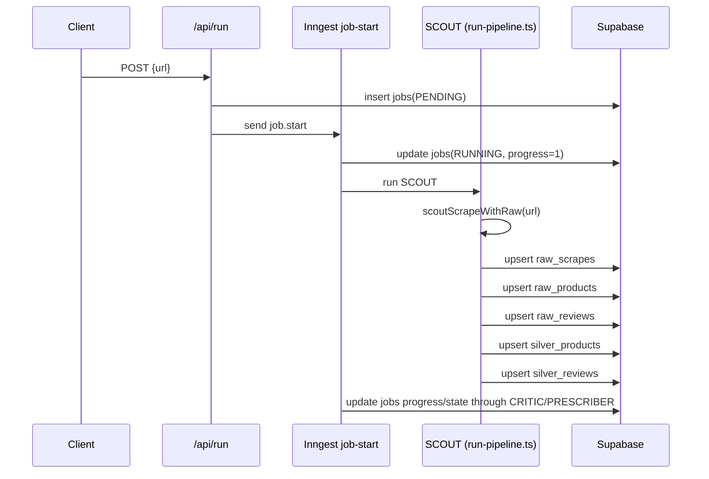

# Scraping Pipeline (Shopify + Review Providers)

Last verified from repository code: **2026-03-04**

## Table of Contents
1. [Overview](#1-overview)
2. [Entrypoints and Runtime Modes](#2-entrypoints-and-runtime-modes)
3. [End-to-End Flow (SCOUT -> Supabase)](#3-end-to-end-flow-scout---supabase)
4. [Architecture Diagram](#4-architecture-diagram)
5. [Folder Map and Responsibilities](#5-folder-map-and-responsibilities)
6. [Provider Adapters](#6-provider-adapters)
7. [Canonical Data Model](#7-canonical-data-model)
8. [Database Schema (Supabase)](#8-database-schema-supabase)
9. [Waterfalls, Filtering, and Fixtures](#9-waterfalls-filtering-and-fixtures)
10. [Error Handling and Observability](#10-error-handling-and-observability)
11. [Run Locally](#11-run-locally)
12. [Security and Compliance Notes](#12-security-and-compliance-notes)
13. [Appendices](#13-appendices)

## 1) Overview

This system scrapes Shopify product pages, detects the active review provider, pulls raw reviews, normalizes review/product data, and writes raw + Silver tables in Supabase.

Core responsibilities and code owners:
- Detect provider + extract provider hints from HTML (`lib/scout/detect.ts` -> `detectProvider`; `lib/scrape/shopify/detect.ts` -> `detectProvider`).
- Fetch product metadata (`lib/scout/product.ts` -> `fetchProductMeta`; `lib/scrape/shopify/product.ts` -> `fetchProductMeta`).
- Fetch provider-specific reviews (`lib/scout/providers/*.ts` -> `fetchReviews`; `lib/scrape/shopify/providers/*.ts` -> `fetchReviews`).
- Normalize/canonicalize (`lib/scout/normalize.ts` -> `normalizeReviews`; `lib/scrape/shopify/ingest.ts` -> `ingestJob`).
- Persist to Supabase (`src/inngest/functions/run-pipeline.ts` -> `scout`; `lib/scrape/shopify/supabase_insert.ts` -> `insertScoutResults`; `lib/scrape/shopify/ingest.ts` -> `ingestJob`).

Supported inputs:
- Shopify product URL (`/api/run`, `/api/scout-scrape`, `/api/scrape-reviews`) (`app/api/run/route.ts` -> `POST`; `app/api/scout-scrape/route.ts` -> `POST`; `app/api/scrape-reviews/route.ts` -> `POST`).
- Job IDs / run IDs for status polling and pipeline context (`app/api/runs/[run_id]/status/route.ts` -> `GET`; `src/inngest/middleware/withRunContext.ts` -> `withRunContext`).
- Demo fixture scenario IDs (`src/scout/scout.ts` -> `scoutRun`; `src/scout/loadFixture.ts` -> `loadDemoFixtureOrThrow`).

Supported outputs:
- Raw scrape payloads: `raw_scrapes`.
- raw product + review rows: `raw_products`, `raw_reviews`.
- Silver normalized product + review rows: `silver_products`, `silver_reviews`.
- Job state/progress/warnings/logs: `jobs`, `job_logs` (via RPC append) (`src/inngest/middleware/dbForRun.ts` -> `appendLog`).

## 2) Entrypoints and Runtime Modes

There are multiple runnable scraping flows in this repo.

### 2.1 Inngest run pipeline (active via `/api/run`)
- Start: `POST /api/run` inserts `jobs` row and emits `job.start` (`app/api/run/route.ts` -> `POST`).
- Inngest handler registration: `app/api/inngest/route.ts` serves `src/inngest/functions.ts`.
- Active function list: only `legacyJobStartPipeline` is exported (`src/inngest/functions.ts` -> `functions`).
- `legacyJobStartPipeline` executes `SCOUT -> CRITIC -> PRESCRIBER` (`src/inngest/functions.ts` -> `legacyJobStartPipeline`).
- SCOUT phase writes both raw and Silver in the same phase (`src/inngest/functions/run-pipeline.ts` -> `scout`, `normalizeAndUpsert`).

### 2.2 Direct scrape route (`/api/scrape-reviews`)
- `POST /api/scrape-reviews` runs `scrape`, writes raw/Raw, then asynchronously runs ingest to Silver (`app/api/scrape-reviews/route.ts` -> `POST`).
- Uses `lib/scrape/shopify/*` stack (`lib/scrape/shopify/scrape.ts` -> `scrape`, `lib/scrape/shopify/supabase_insert.ts` -> `insertScoutResults`, `lib/scrape/shopify/ingest.ts` -> `ingestJob`).

### 2.3 SCOUT payload-only route (`/api/scout-scrape`)
- `POST /api/scout-scrape` returns `CriticInput` payload and does not persist (`app/api/scout-scrape/route.ts` -> `POST`; `lib/scout/scrape.ts` -> `scoutScrape`).

### 2.4 Not currently wired into Inngest registration
- `src/inngest/functions/scout-raw.ts` (`scoutraw`) and `src/inngest/functions/normalize-silver.ts` (`normalizeSilver`) exist but are not exported from `src/inngest/functions.ts`.
- They are alternate modular pipeline pieces, but not active through `app/api/inngest/route.ts` in current code.

## 3) End-to-End Flow (SCOUT -> Supabase)

This section documents the **active `/api/run` + Inngest path** first, then the direct route variant.

### 3.1 Active `/api/run` + Inngest flow (numbered sequence)

1. API receives URL and creates `jobs` row (`state=PENDING`, `progress=0`) (`app/api/run/route.ts` -> `POST`).
2. API emits `job.start` event to Inngest (`app/api/run/route.ts` -> `POST`).
3. Inngest function starts and sets `jobs.state=RUNNING`, `progress=1` (`src/inngest/functions.ts` -> `legacyJobStartPipeline`).
4. SCOUT phase begins (`src/inngest/functions/run-pipeline.ts` -> `scout`).
5. SCOUT calls `scoutScrapeWithRaw(url)` to:
   - parse URL (`lib/scout/product.ts` -> `parseProductUrl`),
   - fetch HTML (`lib/scout/http.ts` -> `fetchText`),
   - detect provider + hints (`lib/scout/detect.ts` -> `detectProvider`),
   - fetch product metadata (`lib/scout/product.ts` -> `fetchProductMeta`),
   - run provider fetchers in fallback order (`lib/scout/scrape.ts` -> `providerOrder`, `providerFetchers`),
   - normalize review payloads for canonical payload stats (`lib/scout/normalize.ts` -> `normalizeReviews`).
6. SCOUT flags low-data runs with `DATA_DROUGHT` when raw reviews < 5 (`src/inngest/functions/run-pipeline.ts` -> `appendJobWarningUnique`; `lib/constants.ts` -> `DATA_DROUGHT`).
7. SCOUT applies review filtering/ranking (drop 4-star, min length, forensic keyword score, cap to 30) (`lib/reviews/filterReviews.ts` -> `filterReviews`).
8. SCOUT writes:
   - `jobs` progress update (`run-pipeline.ts` -> `scout`),
   - `raw_scrapes` upsert,
   - `raw_products` upsert,
   - `raw_reviews` batched upserts.
9. SCOUT immediately normalizes and upserts Silver:
   - `silver_products` upsert,
   - `silver_reviews` batched upsert (`run-pipeline.ts` -> `normalizeAndUpsert`).
10. SCOUT advances `jobs.progress` to 40 and logs completion (`run-pipeline.ts` -> `scout`).
11. CRITIC phase updates progress 60->80 and upserts/reads `insights` (`run-pipeline.ts` -> `critic`, `upsertInsightsSchemaSafe`).
12. PRESCRIBER phase updates progress 90->100 and marks `jobs.state=COMPLETE` (`run-pipeline.ts` -> `prescriber`).
13. Logs are appended through `append_job_log_jsonb` RPC wrapper (`src/inngest/middleware/dbForRun.ts` -> `appendLog`, `dbForRun`).

### 3.2 Direct `/api/scrape-reviews` flow (parallel stack)

1. Route validates product URL (`app/api/scrape-reviews/route.ts` -> `POST`).
2. Runs `lib/scrape/shopify/scrape.ts` -> `scrape` (fetch HTML, detect provider, fetch raw reviews).
3. Writes `jobs`, `raw_scrapes`, `raw_products`, `raw_reviews` (`lib/scrape/shopify/supabase_insert.ts` -> `insertScoutResults`).
4. Asynchronously triggers ingest from raw to Silver (`app/api/scrape-reviews/route.ts` -> `POST`; `lib/scrape/shopify/ingest.ts` -> `ingestJob`).
5. `ingestJob` reads raw rows and writes `silver_products` + `silver_reviews`, then marks job complete.

## 4) Architecture Diagram

```mermaid
flowchart TD
    A[SCOUT Start\n/api/run or /api/scrape-reviews] --> B[Fetch Product HTML\nfetchText]
    B --> C[Detect Provider + Hints\ndetectProvider]
    C --> D[Fetch Product Meta\n/products/handle.json + JSON-LD fallback]
    D --> E[Provider Fetcher\njudgeme|okendo|loox|yotpo|junip|stamped|shopify_spr]
    E --> F[Normalize + Filter\nnormalizeReviews/filterReviews]
    F --> G[Upsert Raw/raw\nraw_scrapes + raw_products + raw_reviews]
    G --> H[Upsert Silver\nsilver_products + silver_reviews]
    H --> I[Job Progress + Logs\njobs + job_logs RPC]
```

## 5) Folder Map and Responsibilities

### 5.1 Requested scraping folders

| Path | Responsibility | Key functions |
|---|---|---|
| `lib/scrape/shopify/detect.ts` | Provider marker/hint extraction from HTML (route stack) | `detectProvider` |
| `lib/scrape/shopify/http.ts` | Fetch + retry + timeout + block detection | `fetchText`, `fetchJson`, `looksLikeBotBlock` |
| `lib/scrape/shopify/product.ts` | Parse Shopify URL + metadata lookup (`.json` then JSON-LD) | `parseProductUrl`, `fetchProductMeta` |
| `lib/scrape/shopify/scrape.ts` | Orchestrate fetch/detect/provider calls; return raw reviews | `scrape` |
| `lib/scrape/shopify/hash.ts` | ID + hash helpers for product/review/dedupe | `productKey`, `reviewUid`, `dedupeHash`, `sha256` |
| `lib/scrape/shopify/supabase_insert.ts` | raw/raw persistence for route flow | `insertScoutResults` |
| `lib/scrape/shopify/ingest.ts` | raw -> Silver normalization/persistence | `ingestJob` |
| `lib/scrape/shopify/providers/*.ts` | Provider adapters for route flow | `fetchReviews` per provider |
| `lib/scout/detect.ts` | Provider detection (SCOUT stack, richer Yotpo hints) | `detectProvider` |
| `lib/scout/http.ts` | Node+fetch HTTP client with fallback and retry | `fetchText`, `fetchJson`, `looksLikeBlockedHtml` |
| `lib/scout/product.ts` | Product URL/meta extraction with robust fallbacks | `parseProductUrl`, `fetchProductMeta` |
| `lib/scout/normalize.ts` | Raw provider payload -> canonical `CriticInput.reviews[]` | `normalizeReviews` |
| `lib/scout/scrape.ts` | Main SCOUT orchestrator used by Inngest SCOUT phase | `scoutScrapeWithRaw`, `scoutScrape` |
| `lib/scout/providers/*.ts` | Active provider adapters used by SCOUT | `fetchReviews` per provider |
| `lib/scout/types.ts` | Canonical payload types | `CriticInput`, `ProviderFetchContext`, `ProviderFetchResult` |
| `lib/reviews/filterReviews.ts` | Forensic ranking and hard filtering for CRITIC input | `filterReviews`, `scoreReviewForensics` |
| `lib/forensics/keywords.ts` | Keyword scoring lexicon | `CANONICAL_FORENSIC_KEYWORDS` |
| `types/supabase.ts` | Generated DB row/insert/update typing | `Database` type |
| `lib/types/contracts.ts` | Zod schemas for DB tables + client compatibility | `*_RowSchema`, `InsightSchema`, `PrescriptionSchema` |
| `src/scout/reviews/waterfall.ts` | Legacy/manual waterfall for JudgeMe/Stamped + generic fallback | `ingestReviewsWaterfall` |
| `src/scout/loadFixture.ts` | Demo fixture loading/validation | `loadDemoFixtureOrThrow` |
| `src/scout/scout.ts` | Demo-only SCOUT fixture ingest to `raw_scrapes` | `scoutRun` |
| `supabase/migrations/*.sql` | Partial DDL/constraints/indexes in repo | migration scripts |

### 5.2 Path mismatches vs requested prompt

These requested paths are not present exactly as named:
- `scout/reviews/waterfalls.ts` -> actual file is `src/scout/reviews/waterfall.ts`.
- `scout/reviews/loadFixture.ts` -> actual file is `src/scout/loadFixture.ts`.
- `scout/reviews/scout.ts` -> actual file is `src/scout/scout.ts`.
- `lib/scrape/shopify/constants.ts` and `lib/scrape/shopify/utils.ts` -> not present; nearest equivalents are `lib/constants.ts` and `lib/utils.ts`.
- `lib/scrape/shopify/types/**` -> no folder present in this snapshot.

## 6) Provider Adapters

Notes:
- Active SCOUT provider adapters are under `lib/scout/providers/*` (called by `lib/scout/scrape.ts` -> `providerFetchers`).
- Route stack adapters under `lib/scrape/shopify/providers/*` are similar, but generally simpler.
- Normalization to canonical review shape is provider-agnostic (`lib/scout/normalize.ts` -> `normalizeReviews`).
- Provider file parity in route stack: `lib/scrape/shopify/providers/judgeme.ts`, `junip.ts`, `loox.ts`, `okendo.ts`, `shopify_spr.ts`, `stamped.ts`, `yotpo.ts` (all expose `fetchReviews`).

### 6.1 Judge.me

Detection:
- Marker signals: `jdgm`, `judge.me`, `judgeme` (`lib/scout/detect.ts` -> `PROVIDER_MARKERS`, `detectProvider`).
- Extracted hints: `shopDomain`, `apiToken`, `myshopifyDomain`, `productId`, `externalId` (`lib/scout/detect.ts` -> `extractHints`).
- Route-stack file uses same 4-strategy model with lower caps (`lib/scrape/shopify/providers/judgeme.ts` -> `fetchReviews`, `strategyA/B/C/D`, `MAX_PAGES=100`).

Endpoints called:
- Strategy A: `GET https://judge.me/api/v1/widgets/product_review?shop_domain=...&api_token=...&handle=...&page=...` (`lib/scout/providers/judgeme.ts` -> `strategyWidgetApi`).
- Strategy B: `GET https://cache.judge.me/widgets/shopify/{domain}?review_widget_product_ids={productId}` (`strategyCacheApi`).
- Strategy C: `GET https://judge.me/reviews/reviews_for_widget?shop_domain=...&product_id|handle=...&page=...` (`strategyWidgetFetch`).
- Strategy D: parse existing page HTML (`strategyDom`).

Pagination:
- `MAX_PAGES = 300` in active SCOUT adapter (`judgeme.ts`).
- Concurrency batches by `ctx.concurrency` using `p-limit` (`lib/scout/providers/common.ts` -> `createLimiter`).

Rate limiting/retries/timeouts:
- Provider calls use `fetchJson`/`fetchText` with `timeoutMs=12000`, `maxRetries=3` (`judgeme.ts` strategies).
- Retry/backoff logic in HTTP layer (`lib/scout/http.ts` -> `requestWithRetry`).

Normalization:
- Provider raw records are mapped via generic selector order body/text/title/author/rating/date (`lib/scout/normalize.ts` -> `pickText`, `pickAuthor`, `pickRating`, `pickCreatedAt`).

Edge cases handled:
- Missing token/domain/product ID warnings and strategy skipping.
- Blocked responses and auth failures.
- HTML widget fallback parsing.
- Deduping by id/external id/body-author composite (`judgeme.ts` -> `dedupeByKey`).

Example normalized review:
```json
{
  "review_uid": "judgeme:123456789",
  "rating": 5,
  "title": "Great fit",
  "text": "Installed quickly and it fits perfectly.",
  "author": "Alex",
  "verified": true,
  "created_at": "2026-02-14",
  "language": null,
  "media": [],
  "review_length": 41,
  "dedupe_hash": "sha256(...)",
  "raw": { "id": 123456789, "body": "Installed quickly and it fits perfectly." }
}
```

### 6.2 Junip

Detection:
- Markers: `junip`, `junip-store-key`, `junip-product-review` (`lib/scout/detect.ts` -> `detectProvider`).
- Hints: `storeKey`, `productId` (`extractHints`).
- Route-stack mirror exists with same endpoint/header model (`lib/scrape/shopify/providers/junip.ts` -> `fetchReviews`, `PER_PAGE=50`, `MAX_PAGES=100`).

Endpoints called:
- `GET https://api.junip.co/v1/products/{productId}/reviews?page={page}&per_page=50` with headers `Junip-Store-Key`, `Referer`, `Origin` (`lib/scout/providers/junip.ts` -> `buildUrl`, `fetchReviews`).

Pagination:
- `PER_PAGE=50`, `MAX_PAGES=300`; stop when page empty or short page (`junip.ts`).

Retries/timeouts:
- `timeoutMs=15000`, `maxRetries=3` via `fetchJson` (`junip.ts`).

Normalization:
- Generic canonical mapping (`lib/scout/normalize.ts` -> `normalizeReviews`).

Edge cases:
- Missing `storeKey` or `productId` returns warning and empty reviews.
- 401/403 stop with auth warning.
- Blocked responses stop.

Example normalized review:
```json
{
  "review_uid": "junip:rev_987",
  "rating": 4,
  "title": "Solid quality",
  "text": "Good build quality and clear instructions.",
  "author": "Sam",
  "verified": false,
  "created_at": "2026-01-09",
  "language": "en",
  "media": [],
  "review_length": 41,
  "dedupe_hash": "sha256(...)",
  "raw": { "reviewId": "rev_987", "body": "Good build quality and clear instructions." }
}
```

### 6.3 Loox

Detection:
- Markers: `loox`, `loox.io`, `loox-reviews` (`lib/scout/detect.ts` -> `detectProvider`).
- Hints: `shopId`, `productId` (`extractHints`).
- Route-stack mirror exists (`lib/scrape/shopify/providers/loox.ts` -> `fetchReviews`, `MAX_PAGES=100`).

Endpoints called:
- `GET https://loox.io/widget/reviews/{shopId}?product_id={productId}&page={page}` (`lib/scout/providers/loox.ts` -> `fetchReviews`).

Pagination:
- `MAX_PAGES=300`; stop on empty page or `has_more/hasMore=false`.

Retries/timeouts:
- `timeoutMs=15000`, `maxRetries=3` (`loox.ts` + `lib/scout/http.ts`).

Normalization:
- Generic canonical mapping (`lib/scout/normalize.ts` -> `normalizeReviews`).

Edge cases:
- Missing `shopId` or `productId` warning.
- 401/403/404 auth/unavailable warnings.
- Block detection warning.

Example normalized review:
```json
{
  "review_uid": "loox:445566",
  "rating": 5,
  "title": "Love it",
  "text": "Exactly as described.",
  "author": "Mina",
  "verified": null,
  "created_at": "2026-02-01",
  "language": null,
  "media": [],
  "review_length": 21,
  "dedupe_hash": "sha256(...)",
  "raw": { "id": 445566, "content": "Exactly as described." }
}
```

### 6.4 Okendo

Detection:
- Markers: `okendo`, `okeReviews`, `okendo-reviews` (`lib/scout/detect.ts` -> `detectProvider`).
- Hints: `subscriberId`, `productId` (`extractHints`).
- Route-stack mirror exists (`lib/scrape/shopify/providers/okendo.ts` -> `fetchReviews`, `PER_PAGE=50`, `MAX_PAGES=100`).

Endpoints called:
- `GET https://api.okendo.io/v1/stores/{subscriberId}/products/{productId}/reviews?limit=50&orderBy=date%20desc` (`lib/scout/providers/okendo.ts` -> `fetchReviews`).
- Follows provider `nextUrl` through normalization helper (`lib/scout/providers/common.ts` -> `normalizeNextUrl`).

Pagination:
- Cursor/URL based (`nextUrl`) until empty/duplicate `nextUrl`/max pages (`okendo.ts`).
- `MAX_PAGES=300`.

Retries/timeouts:
- `timeoutMs=15000`, `maxRetries=3` via `fetchJson`.

Normalization:
- Generic canonical mapping (`lib/scout/normalize.ts` -> `normalizeReviews`).

Edge cases:
- Product ID normalization to `shopify-{id}`.
- Missing subscriber/product warnings.
- Duplicate review suppression within fetch (`seen` set).

Example normalized review:
```json
{
  "review_uid": "okendo:rvw_abc",
  "rating": 2,
  "title": "Did not fit",
  "text": "Does not fit my model even though listing says it should.",
  "author": "Jordan",
  "verified": true,
  "created_at": "2025-12-10",
  "language": "en",
  "media": [],
  "review_length": 56,
  "dedupe_hash": "sha256(...)",
  "raw": { "reviewId": "rvw_abc", "body": "Does not fit my model even though listing says it should." }
}
```

### 6.5 Shopify Product Reviews (SPR)

Detection:
- Markers: `spr-container`, `spr-reviews`, `shopify-product-reviews`, `spr-badge` (`lib/scout/detect.ts` -> `detectProvider`).
- Hint: `productId`.
- Route-stack mirror parser exists (`lib/scrape/shopify/providers/shopify_spr.ts` -> `fetchReviews`).

Endpoints called:
- No remote provider API call.
- Parses current product HTML `.spr-review` blocks (`lib/scout/providers/shopify_spr.ts` -> `fetchReviews`).

Pagination:
- Not applicable (single page parse).

Retries/timeouts:
- Uses previously fetched page HTML from SCOUT orchestrator.

Normalization:
- Generic canonical mapping (`lib/scout/normalize.ts` -> `normalizeReviews`) after provider extraction.

Edge cases:
- Warns when no `.spr-review` nodes found (`spr_no_reviews_found_in_html`).

Example normalized review:
```json
{
  "review_uid": "shopify_spr:spr-review-123",
  "rating": 5,
  "title": "Great product!",
  "text": "Amazing product and fast shipping.",
  "author": "John",
  "verified": null,
  "created_at": "2026-01-20",
  "language": null,
  "media": [],
  "review_length": 34,
  "dedupe_hash": "sha256(...)",
  "raw": { "id": "spr-review-123", "body": "Amazing product and fast shipping." }
}
```

### 6.6 Stamped

Detection:
- Markers: `stamped.io`, `stamped-product-reviews`, `stamped-reviews-widget`.
- Hints: `sId`, `apiKey`, `productId` (`lib/scout/detect.ts` -> `extractHints`).
- Route-stack mirror exists (`lib/scrape/shopify/providers/stamped.ts` -> `fetchReviews`, `MAX_PAGES=100`).

Endpoints called:
- `GET https://stamped.io/api/widget/reviews?sId={sId}&apiKey={apiKey}&productId={productId}&page={page}` (`lib/scout/providers/stamped.ts` -> `buildUrl`, `fetchReviews`).

Pagination:
- Reads `total_pages`/`totalPages` when available.
- Else continues up to `MAX_PAGES=300` until empty page.

Retries/timeouts:
- `timeoutMs=15000`, `maxRetries=3`.

Normalization:
- Generic canonical mapping (`lib/scout/normalize.ts` -> `normalizeReviews`).

Edge cases:
- Missing `sId`, `apiKey`, `productId` warnings.
- 401/403/404 availability warnings.

Example normalized review:
```json
{
  "review_uid": "stamped:112233",
  "rating": 3,
  "title": "Works but has issues",
  "text": "Part worked for a week then started leaking.",
  "author": "Pat",
  "verified": true,
  "created_at": "2026-02-03",
  "language": null,
  "media": [],
  "review_length": 41,
  "dedupe_hash": "sha256(...)",
  "raw": { "id": 112233, "review": "Part worked for a week then started leaking." }
}
```

### 6.7 Yotpo

Detection:
- Markers: `yotpo`, `yotpo-main-widget`, `yotpo-widget`.
- Hints: `appKey`, `productId`, `storeProductId` (`lib/scout/detect.ts` -> `extractHints`).
- Route-stack mirror exists but only uses legacy widget endpoint (`lib/scrape/shopify/providers/yotpo.ts` -> `fetchReviews`, `PER_PAGE=150`, `MAX_PAGES=100`).

Endpoints called (active SCOUT adapter):
- Legacy widget API:
  - `GET https://api.yotpo.com/v1/widget/{appKey}/products/{productId}/reviews.json?per_page=150&page={page}&star=` (`lib/scout/providers/yotpo.ts` -> `buildLegacyUrl`, `fetchViaLegacyWidget`).
- Storefront API fallback:
  - `GET {store-origin}/api/products/reviews/{storefrontProductId}?page={page}&perPage=150&sort={sort}[&star={star}]` (`buildStorefrontUrl`, `fetchViaStorefrontApi`).

Pagination:
- Legacy: page-based, bounded by `MAX_PAGES=1000`, `PER_PAGE=150`.
- Storefront: page-based with partitioning by star bucket and sort when totals exceed window (`fetchViaStorefrontApi`).

Retries/timeouts:
- `timeoutMs=15000`, `maxRetries=3`.

Normalization:
- Generic canonical mapping (`lib/scout/normalize.ts` -> `normalizeReviews`).

Edge cases:
- Missing app key/product ID warnings.
- Pair attempts bounded (`MAX_PAIR_ATTEMPTS=16`), storefront IDs bounded (`MAX_STOREFRONT_IDS=8`).
- Merges and dedupes storefront partitions by synthetic identity (`reviewIdentity`).

Example normalized review:
```json
{
  "review_uid": "yotpo:987654321",
  "rating": 1,
  "title": "Unsafe wiring",
  "text": "Started smoking after installation, not safe.",
  "author": "Chris",
  "verified": null,
  "created_at": "2026-02-22",
  "language": "en",
  "media": [],
  "review_length": 44,
  "dedupe_hash": "sha256(...)",
  "raw": { "id": 987654321, "content": "Started smoking after installation, not safe." }
}
```

## 7) Canonical Data Model

### 7.1 Core in-memory canonical types

Primary SCOUT payload:
- `lib/scout/types.ts` -> `CriticInput`.

`CriticInput` shape:
- Top-level: `job_id`, `scrape_id`, `source_url`, `shop_domain`, `handle`, `provider`.
- `product`: canonical product block with `product_id`, title/vendor/price/currency/description, arrays (`images`, `variants`, `tags`, `collections`), source URL, optional Shopify numeric ID.
- `reviews[]`: canonical normalized reviews with `review_uid`, `rating`, `title`, `text`, `author`, `verified`, `created_at`, `language`, `media`, `review_length`, `dedupe_hash`, `raw`.
- `stats`: fetched count, deduped count, pages, warnings, markers, blocked.

Normalization function:
- `lib/scout/normalize.ts` -> `normalizeReviews`.

### 7.2 Raw vs normalized

Raw:
- Provider-native payloads (`any[]`) returned by provider modules (`lib/scout/providers/*` -> `fetchReviews`; `lib/scrape/shopify/providers/*` -> `fetchReviews`).
- Persisted into `raw_reviews.raw_json` and partially in `raw_products.raw_json.reviews_raw`/`raw_scrapes.raw_json` (depending on path).

Normalized:
- `CriticInput.reviews[]` for SCOUT in-memory canonical form (`normalizeReviews`).
- `silver_reviews` row shape in DB (`types/supabase.ts` -> `Database.public.Tables.silver_reviews`).

### 7.3 ID generation and dedupe keys

| Identifier | How computed | Source |
|---|---|---|
| `job_id` / `run_id` | Generated as `run_${uuid}` in `/api/run`, or `scrape_${uuid}` in direct insert path | `app/api/run/route.ts` -> `makeRunId`; `lib/scrape/shopify/supabase_insert.ts` -> `insertScoutResults` |
| `scrape_id` | `scrape_${runId}` in Inngest SCOUT; `scr_${uuid}` in direct route flow | `run-pipeline.ts` -> `makeScrapeId`; `supabase_insert.ts` -> `insertScoutResults` |
| `product_id` | Canonical `shop_domain:handle` (`productKey`) | `lib/scout/hash.ts` -> `productKey`; `lib/scrape/shopify/hash.ts` -> `productKey` |
| `review_uid` (SCOUT normalize) | `provider:externalId` else `sha256(provider|product|author|date|rating|text)` | `lib/scout/normalize.ts` -> `normalizeReviews` |
| `review_uid` (direct route raw) | `provider:externalId` else `provider:${sha256(...).slice(0,24)}` | `lib/scrape/shopify/hash.ts` -> `reviewUid` |
| `dedupe_hash` (SCOUT normalize) | `sha256(product_id|text|rating|author|created_at)` | `lib/scout/normalize.ts` -> `normalizeReviews` |
| `dedupe_hash` (direct ingest Silver) | `sha256(provider|product|author|created_at|rating|text)` | `lib/scrape/shopify/hash.ts` -> `dedupeHash`; `lib/scrape/shopify/ingest.ts` -> `ingestJob` |

## 8) Database Schema (Supabase)

Schema sources used:
- Generated TypeScript DB model (`types/supabase.ts` -> `Database`).
- Migrations in repo (`supabase/migrations/*.sql`).
- Insert/upsert code in SCOUT and route stacks.

Important: base `CREATE TABLE` DDL for `jobs/raw_scrapes/raw_*/silver_*` and RPC function body for `append_job_log_jsonb` are **not included** in migrations in this repo snapshot. Those parts are inferred from generated types and write paths.

### 8.1 Scraping pipeline tables

| Table | Key columns | Constraints/keys | Written by |
|---|---|---|---|
| `jobs` | `job_id`, `url`, `state`, `progress`, `warnings`, `error` | Logical PK on `job_id` inferred from FK usage and upserts; `warnings text[]` non-null/default from migration | `/api/run`, SCOUT/PRESCRIBER/ingest updates |
| `raw_scrapes` | `scrape_id`, `job_id`, `source_url`, `provider`, `raw_json`, `raw_html`, `blob`, `warnings`, `extraction_tier` | FK `job_id -> jobs.job_id` | SCOUT (`run-pipeline.ts`), direct route insert |
| `raw_products` | `product_id`, `job_id`, `shop_domain`, `handle`, `source_url`, `raw_json`, `raw_html` | FK `job_id -> jobs.job_id`; index `(product_id, job_id)` | SCOUT and direct route insert |
| `raw_reviews` | `review_uid`, `product_id`, `job_id`, `source`, `raw_json` | FK `product_id -> raw_products.product_id`; FK `job_id -> jobs.job_id`; index `(product_id, job_id)` | SCOUT and direct route insert |
| `silver_products` | `product_id`, product metadata columns | `UNIQUE(product_id)` explicit migration | SCOUT normalize step, direct ingest |
| `silver_reviews` | `review_uid`, `product_id`, normalized review fields | `UNIQUE(review_uid)` explicit migration; FK `product_id -> silver_products.product_id` | SCOUT normalize step, direct ingest |
| `job_logs` | `id`, `job_id`, `seq`, `ts`, `agent`, `level`, `message`, `meta` | FK `job_id -> jobs.job_id`; append via RPC | `dbForRun.log` / `src/lib/logging/log.ts` |

References:
- `types/supabase.ts` -> table row types + relationships.
- `supabase/migrations/202602280001_raw_silver_idempotency.sql`.
- `supabase/migrations/20260301103000_rre_91_add_jobs_warnings_array.sql`.
- `src/inngest/functions/run-pipeline.ts` -> `scout`, `normalizeAndUpsert`.
- `lib/scrape/shopify/supabase_insert.ts` -> `insertScoutResults`.
- `lib/scrape/shopify/ingest.ts` -> `ingestJob`.

### 8.2 Downstream analytics/action tables in same DB

These are touched by `CRITIC`/`PRESCRIBER` or API read routes:
- `insights` (`run-pipeline.ts` -> `critic`; `upsertInsightsSchemaSafe`).
- `prescriptions` + `prescription_insights` (schema/migrations exist, route reads exist).

Explicit DDL/constraints present in migrations:
- `insights` table rebuild + indexes/checks (`20260228112000_rre_89_rebuild_insights.sql`).
- `prescriptions` + `prescription_insights` creation/checks (`20260228100932_rre_90_rebuild_prescriptions_and_join.sql`).
- `prescriptions.friction_surface_id` FK to insights (`20260228195205_rre_90b_add_friction_surface_id.sql`).
- `prescriptions.surgical_edit` column (`20260301072413_rre_90c_add_surgical_edit_column.sql`).
- Realignment migration moving segment fields from insights to prescriptions and lowercase intervention check (`20260301120000_rre_95_realign_insights_table.sql`).

### 8.3 Example rows (scraping tables)

`jobs`:
```json
{
  "job_id": "run_2e438d6f-0db3-4f72-bdb2-b51f5da5f6c8",
  "url": "https://example.com/products/widget",
  "state": "RUNNING",
  "progress": 40,
  "product_id": "example.com:widget",
  "warnings": ["DATA_DROUGHT"],
  "error": null
}
```

`raw_scrapes`:
```json
{
  "scrape_id": "scrape_run_2e438d6f-0db3-4f72-bdb2-b51f5da5f6c8",
  "job_id": "run_2e438d6f-0db3-4f72-bdb2-b51f5da5f6c8",
  "provider": "judgeme",
  "source_url": "https://example.com/products/widget",
  "extraction_tier": 1,
  "warnings": ["provider_fallback:unknown->judgeme"],
  "raw_json": { "product_id": "example.com:widget", "review_count": 17, "critic_review_count": 12 }
}
```

`raw_products`:
```json
{
  "product_id": "example.com:widget",
  "job_id": "run_2e438d6f-0db3-4f72-bdb2-b51f5da5f6c8",
  "shop_domain": "example.com",
  "handle": "widget",
  "source_url": "https://example.com/products/widget",
  "raw_json": { "provider": "judgeme", "listing_text_source": "meta_description" }
}
```

`raw_reviews`:
```json
{
  "review_uid": "judgeme:123456",
  "product_id": "example.com:widget",
  "job_id": "run_2e438d6f-0db3-4f72-bdb2-b51f5da5f6c8",
  "source": "judgeme",
  "raw_json": { "id": 123456, "rating": 5, "body": "Great fit." }
}
```

`silver_products`:
```json
{
  "product_id": "example.com:widget",
  "shop_domain": "example.com",
  "handle": "widget",
  "title": "Widget",
  "vendor": "Acme",
  "price": 19.99,
  "currency": "USD",
  "description_text": "Product description text",
  "images": [],
  "variants": []
}
```

`silver_reviews`:
```json
{
  "review_uid": "judgeme:123456",
  "product_id": "example.com:widget",
  "rating": 5,
  "review_title": "Great fit",
  "review_text": "Installed quickly and it fits perfectly.",
  "review_length": 41,
  "author": "Alex",
  "verified": true,
  "created_at": "2026-02-14",
  "dedupe_hash": "5bc1..."
}
```

## 9) Waterfalls, Filtering, and Fixtures

### 9.1 Waterfall logic

The legacy/manual waterfall is in:
- `src/scout/reviews/waterfall.ts` -> `ingestReviewsWaterfall`.

Selection and fallback order:
1. Optional step-0 HTML fetch for hints/block detection.
2. Judge.me cascade:
   - Strategy A Widget API.
   - Strategy B Cache Widget API.
   - Strategy C `reviews_for_widget`.
   - Strategy D DOM extraction from product page.
3. Stamped API path.
4. Generic Shopify provider fallback by calling `lib/scrape/shopify/scrape.ts` -> `scrape`.
5. Tier-2 fallback: Cheerio description extraction with no reviews.

Tiers:
- `extraction_tier=1`: provider path succeeded.
- `extraction_tier=2`: fallback/cheerio/blocked path.

### 9.2 Filtering rules (CRITIC input curation)

`lib/reviews/filterReviews.ts` -> `filterReviews`:
- Drops all 4-star reviews.
- Drops reviews with trimmed text length <= 30.
- Scores reviews by forensic keyword hits (`lib/forensics/keywords.ts` -> `CANONICAL_FORENSIC_KEYWORDS`).
- Sorts by score desc, then rating asc (lower rating first), then text length desc.
- Caps output at `MAX_CRITIC_REVIEWS=30` (`lib/constants.ts` -> `MAX_CRITIC_REVIEWS`).

### 9.3 Fixture usage

Demo fixture loader:
- `src/scout/loadFixture.ts` -> `loadDemoFixtureOrThrow`.
- Reads `fixtures/{scenario_id}.json`, validates required fields (`scenario_id`, `listing_text`, `vehicle_anchor`).

Demo SCOUT runner:
- `src/scout/scout.ts` -> `scoutRun`.
- Reuses existing `raw_scrapes` by `scenario_id`; otherwise inserts deterministic `scrape-{scenario_id}`.

## 10) Error Handling and Observability

### 10.1 HTTP/network resilience
- Exponential backoff retries with jitter for retryable statuses and network errors (`lib/scout/http.ts` -> `requestWithRetry`; `lib/scrape/shopify/http.ts` -> `fetchWithRetry`).
- Block detection via status (403/429/503) plus challenge text signatures (`looksLikeBlockedHtml` / `looksLikeBotBlock`).
- Node HTTP fallback when fetch fails with header overflow (`lib/scout/http.ts` -> `requestWithNode`).

### 10.2 Supabase write resilience
- Retry wrapper for transient Supabase/network failures (`src/inngest/functions/run-pipeline.ts` -> `runSupabaseWriteWithRetry`).
- Schema mismatch hardening for evolving table definitions (`upsertInsightsSchemaSafe`, `upsertPrescriptionSchemaSafe`).

### 10.3 Logging and progress
- Console logs via run logger (`src/inngest/middleware/runLogger.ts` -> `runLogger`).
- Persistent job log append via RPC (`src/inngest/middleware/dbForRun.ts` -> `appendLog`).
- Job status/progress/state updates in `jobs` table across phases (`run-pipeline.ts` -> `scout`, `critic`, `prescriber`; direct path uses `supabase_insert.ts` + `ingest.ts`).

### 10.4 Common failure modes
- `provider_unknown`: no markers in HTML (`lib/scout/scrape.ts` -> `scoutScrapeWithRaw`).
- Missing provider keys (`*_no_app_key`, `*_no_product_id`, etc.) from adapters.
- Bot block warnings (`blocked_*`).
- Product meta unavailable (`product_json_unavailable_status_*`, JSON-LD fallback warnings).
- Inngest job stuck/fail: check `jobs.error_message`, `job_logs`, and `/api/runs/{run_id}/status`.

### 10.5 Required environment variables

Required for Supabase write paths:
- `NEXT_PUBLIC_SUPABASE_URL`
- `SUPABASE_SERVICE_ROLE_KEY`
References: `src/lib/serverEnv.ts` -> `getServerSupabaseEnv`; `src/lib/supabaseAdmin.ts` -> `supabaseAdmin`.

Required/used for Inngest runtime:
- `INNGEST_EVENT_KEY`
- `INNGEST_SIGNING_KEY`
- optional `INNGEST_SERVE_HOST`, `INNGEST_BASE_URL`, `INNGEST_DEV`
References: `.env.example`; `app/api/inngest/route.ts`.

Optional dev/test vars:
- `BASE_URL` (`scripts/test-run.ts`)
- `TEST_SHOPIFY_URL` (`lib/scrape/shopify/__tests__/integration.test.ts`)

## 11) Run Locally

### 11.1 Install

```bash
pnpm install
```

### 11.2 Configure environment

1. Copy `.env.example` to `.env.local`.
2. Set valid Supabase credentials.
3. Set Inngest keys for event-driven runs.

### 11.3 Start app + Inngest (event-driven path)

```bash
pnpm dev
pnpm inngest-dev
```

Trigger:
```bash
curl -X POST http://127.0.0.1:3000/api/run \
  -H "Content-Type: application/json" \
  -d "{\"url\":\"https://www.rhodeskin.com/products/peptide-lip-boost-sugarmint\"}"
```

Poll:
```bash
curl http://127.0.0.1:3000/api/runs/<run_id>/status
```

### 11.4 Run direct scraping route (route stack)

```bash
curl -X POST http://127.0.0.1:3000/api/scrape-reviews \
  -H "Content-Type: application/json" \
  -d "{\"url\":\"https://www.allbirds.com/products/mens-tree-runners\"}"
```

Poll:
```bash
curl http://127.0.0.1:3000/api/scrape-reviews/<job_id>/status
```

### 11.5 CLI runs

Full scrape + raw/Silver write (direct stack):
```bash
pnpm scrape "https://shop.com/products/slug"
```

SCOUT payload-only:
```bash
pnpm scout:scrape "https://shop.com/products/slug"
```

Batch scout smoke runner:
```bash
pnpm scout:test
```

### 11.6 Single-provider scrape

What exists in repo:
- Judge.me focused live script: `pnpm tsx scripts/test-live-judgeme.ts`.
- Waterfall mock tests (provider-specific mocked flows): `pnpm tsx scripts/test-waterfall.ts`.

Current limitation:
- There is no generic committed CLI flag like `--provider yotpo` for all providers. Provider forcing is done by adapter-specific scripts or by invoking provider modules directly from a custom script.

### 11.7 Tests

```bash
pnpm test
pnpm tsx scripts/verify_scraper.ts
pnpm tsx scripts/test-waterfall.ts
```

### 11.8 Verify rows in Supabase

```sql
select job_id, state, progress, product_id, warnings
from jobs
order by updated_at desc
limit 5;
```

```sql
select scrape_id, job_id, provider, extraction_tier, scraped_at
from raw_scrapes
order by scraped_at desc
limit 5;
```

```sql
select count(*) from raw_reviews where job_id = '<job_id>';
select count(*) from silver_reviews where product_id = '<product_id>';
```

## 12) Security and Compliance Notes

Observed from code:
- Scraping is limited to public product pages and public provider/widget APIs (`lib/scout/providers/*`, `lib/scrape/shopify/providers/*`).
- No provider secret keys are loaded from environment; keys/tokens are extracted from page HTML hints where available (`lib/scout/detect.ts` -> `extractHints`).
- Stored data includes raw HTML snippets and raw review payloads, including review text and author display names (`raw_scrapes.raw_html/raw_json`, `raw_reviews.raw_json`).
- System does not intentionally collect payment/account/private customer records from authenticated endpoints in the current adapter code.

Unknown/not in repo:
- Explicit data retention policy.
- Legal/ToS compliance policy per provider/domain.
- Full SQL definition for logging RPC function (`append_job_log_jsonb`) and any RLS policies.

## 13) Appendices

### A) Additional Mermaid sequence



### B) JSON examples

Canonical `CriticInput.product` example (`lib/scout/types.ts` -> `CriticInput`):
```json
{
  "product_id": "example.com:widget",
  "title": "Widget",
  "vendor": "Acme",
  "price": 19.99,
  "currency": "USD",
  "description_text": "Clear product description.",
  "images": [],
  "variants": [],
  "tags": [],
  "collections": [],
  "url": "https://example.com/products/widget",
  "shopify_numeric_id": "1234567890"
}
```

Canonical `CriticInput.reviews[]` example (`lib/scout/normalize.ts` -> `normalizeReviews`):
```json
{
  "review_uid": "yotpo:999",
  "rating": 1,
  "title": "Did not fit",
  "text": "Does not fit my vehicle model.",
  "author": "Taylor",
  "verified": true,
  "created_at": "2026-02-10",
  "language": "en",
  "media": [],
  "review_length": 30,
  "dedupe_hash": "7a5d...",
  "raw": { "id": 999, "content": "Does not fit my vehicle model." }
}
```

Job log entry example (persisted through RPC append) (`src/inngest/middleware/dbForRun.ts` -> `appendLog`):
```json
{
  "ts": "2026-03-04T12:34:56.000Z",
  "agent": "SCOUT",
  "level": "INFO",
  "message": "SCOUT completed",
  "meta": { "product_id": "example.com:widget" },
  "run_id": "run_2e438d6f-0db3-4f72-bdb2-b51f5da5f6c8"
}
```

### C) Glossary

- **SCOUT**: scraping phase that fetches product page + provider reviews and writes raw/raw (and in current run-pipeline path also silver).
- **Provider**: review platform adapter (Judge.me, Junip, Loox, Okendo, Shopify SPR, Stamped, Yotpo).
- **raw**: minimally transformed persistence (`raw_products`, `raw_reviews`).
- **Silver**: normalized analytics-ready rows (`silver_products`, `silver_reviews`).
- **`review_uid`**: stable review identifier for idempotent upserts.
- **`product_id`**: canonical `shop_domain:handle`.
- **`DATA_DROUGHT`**: warning flag when review volume is below threshold in SCOUT phase.
